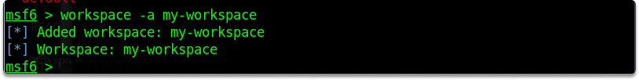

:orphan:
(metasploit-introduction-to-databases-and-workspaces)=

# Metasploit Introduction to Databases and Workspaces

It is critical to keep all data secure and organized so that you can reuse your findings effectively and easily when you need them. In this blog post, we are going to take a look at how we can achieve this with msfconsole databases and workspaces.

## Introduction

Databases are utilized in Metasploit Framework to keep track of your findings. Dealing with so many search results, access points, identified problems, and revealed passwords may become tedious. Databases come into play in this situation.

## Starting the Database

Msfconsole has PostgreSQL database system functionality. The Metasploit Framework, by default, stores and retrieves all essential information using a PostgreSQL database on the backend.

To begin, execute the following command to ensure that the database is correctly configured:

`service postgresql status`

Now, before we run msfconsole, let's start PostgreSQL. The PostgreSQL database service will start when you run the command below:

`systemctl start postgresql`

You must create and initialize the MSF database after running PostgreSQL. You can launch the Metasploit Framework database instance with the following command:

`msfdb init`

After you've built the database and started the PostgreSQL service, you may launch msfconsole and connect to it by running the following command:

`msfdb run`

The following command returns if the backend database was properly initialized and properly connected with msfconsole.

`db_status`

We can handle many distinct categories and remote servers/hosts that we have examined with the assistance of the database. These databases are exportable and importable. This is extremely beneficial when we have a large number of hosts, payloads, remarks, and weaknesses tracked for these hosts. We may organize our Workspaces after ensuring that the database is correctly linked.

## What are Workspaces?

Workspaces assist you in creating logical partitions for storing information for each project such as folders. You can sort the scan findings, host details, and retrieved data by the target IP, subnet, network, or domain.

Let’s take a look at how we can achieve some simple tasks with the workspace.

**Task 1-** What is the name of your current workspace?

You can use the following command to display the current Workspace list.

`workspace`

As you can see in the output, our current workspace is `default`.

**Task 2-** Add a new workspace named `my-workspace`

You can create a new workspace with the following command:

`workspace -a my-workspace`

**Task 1-** Switch to this newly created workspace.

We can switch to a specific workspace with the help of the following command:

`workspace my-workspace`

**Task 3-** Delete `my-workspace`.
You can achieve this task by running the following command:

`workspace -d my-workspace`

Let's make a final verification.

## Final Words

Upon completion of this blog page, now you have gained a general understanding of what are databases and workspaces in Metasploit Framework.

> **Looking to expand your knowledge of penetration testing? Check out our online course, [MPT - Certified Penetration Tester](https://www.mosse-institute.com/certifications/mpt-certified-penetration-tester.html)**
