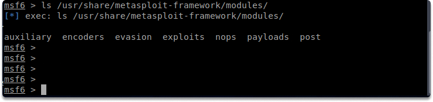
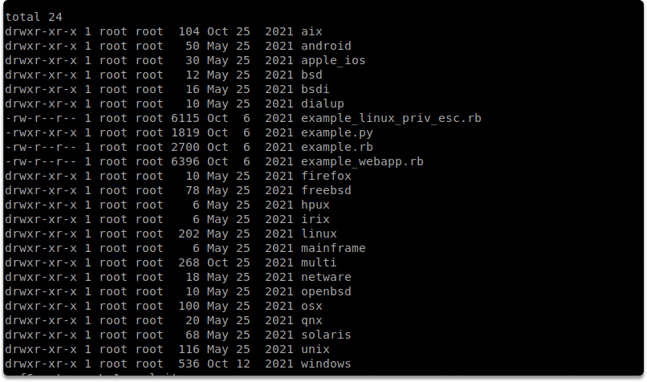
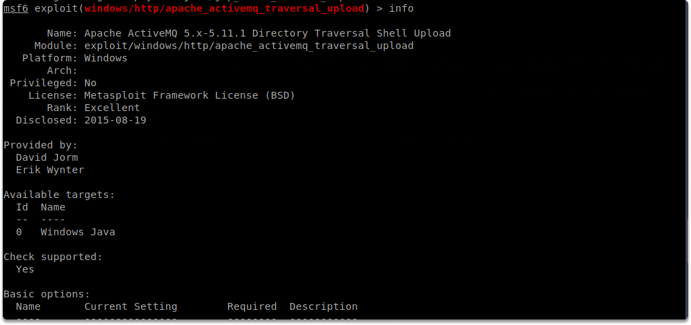
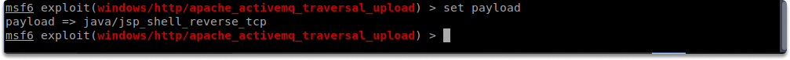
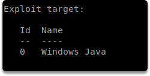
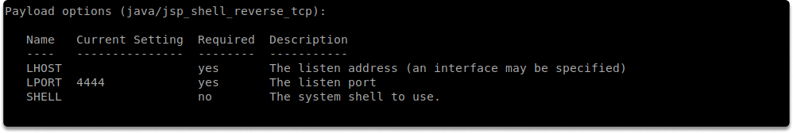
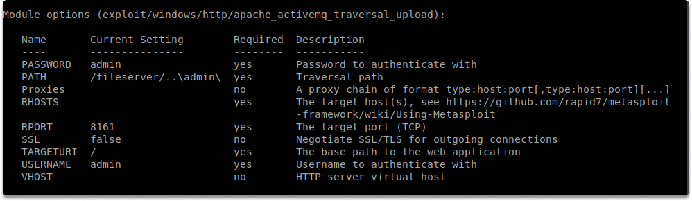

:orphan:
(metasploit-introduction-to-exploit-modules)=

# Metasploit Introduction to Exploit Modules

This blog page will give you a general understanding of exploit modules in the Metasploit Framework.

## Exploits

An exploit is simply a code that provides you entry to the target system. Only after comprehensive scanning and vulnerability analysis of your target can you make the decision to employ a specific exploit against it. The primary module is on the following path:

`/usr/share/metasploit-framework/modules/`

## How to decide which exploit to use?

A thorough scanning and vulnerability analysis of the subject will provide you with the following details from which we may select the appropriate exploit:

- Exact version and architecture of the target OS.

- Open ports on the target system (both TCP and UDP).

- Services and versions operating on the target system

- Potentially vulnerable services.

After you collect all the details outlined above, you can get more information about the exploit you want to use by typing the following command:

`info`

We selected the `windows/http/apache_activemq_traversal_upload` exploit and displayed additional information with `info` command.

You can display the available exploits by running the following command:

`search`

You can launch the exploit using the following command exploit.

`exploit`

Keep in mind that a good result is dependent on a comprehensive understanding of the operating services on the target system we outlined above.

The majority of exploits will have a predefined default payload. You may, however, use the display payloads command to see a list of alternative commands that can be used with that exact vulnerability.

You can select the payload with the following command.

`set payload`

Working with a payload is constrained by several factors such as the environment or operating system, firewall settings, and anti-virus. After you set the payload you can check the required parameters by running the following command:

`show options`

You can find useful details as shown in the above screenshots with the options command.

Some payloads require new variables that you need to configure; executing the show options command again will reveal these parameters.

You can background a session when working on multiple targets concurrently, as well as while working on the same target host with multiple exploits and shells.

## Conclusion

Upon completion of this blog page, you have gained a general understanding of how Metasploit exploit modules work in relation to payloads. We have also learned a thorough understanding of the target host(s) is a vital requirement for exploitation to operate.

**Practice**

What is the name of the `nginx_chunked_size` exploit?

On what targets you can use it?

> **Looking to expand your knowledge of penetration testing? Check out our online course, [MPT - Certified Penetration Tester](https://www.mosse-institute.com/certifications/mpt-certified-penetration-tester.html)**
