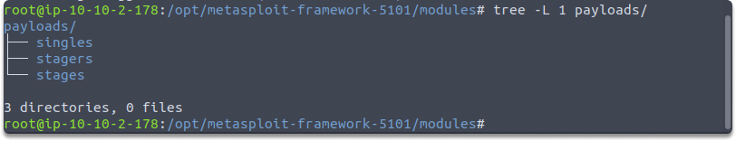
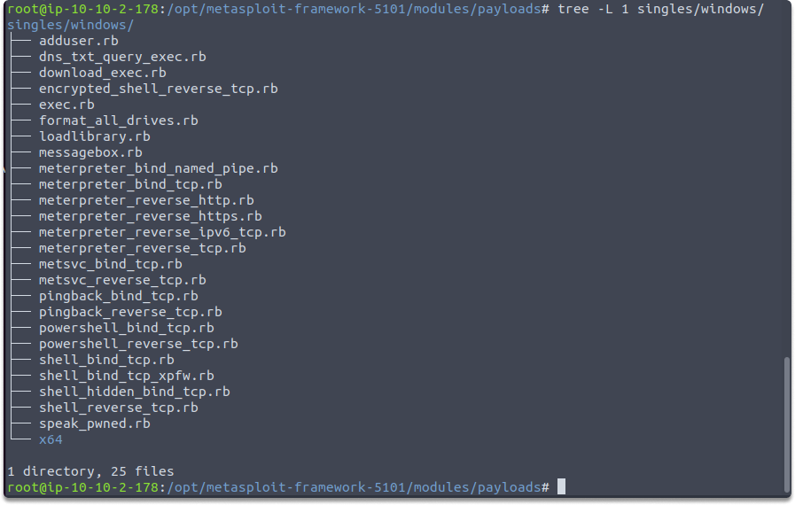
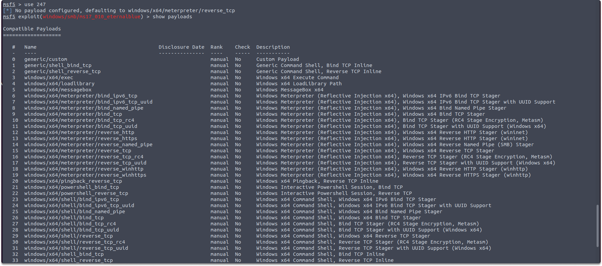

:orphan:
(metasploit-introduction-to-payloads)=

# Metasploit: Introduction to Payloads

What do you want to accomplish on the target machine with your initial payload? This blog page will give you a general understanding of Metasploit Framework’s payloads.

## What are payloads?

Payload is a Metasploit component that helps the exploit. The payloads are supplied along with the exploit to evade the vulnerable service's usual operating procedures and are then executed on the target system to generally return a reverse connection to you and create a foothold. When you use an exploit module to abuse a vulnerability on the target system, you will require a payload to perform a specific operation, such as loading malware or executing a command. That’s where we utilize payloads.

The presence of a backslash (/) in the payload title specifies whether or not the payload is staged.

- windows/shell_bind_tcp: single payload (exploit and the whole shellcode)
- windows/shell/bind_tcp: a stager (bind tcp) and a stage (shell).

Under payloads, you'll find three separate directories: singles, stagers, and stages. Each has different benefits and drawbacks. Let’s have a look at them.

**Singles**: Single payloads are also known as inline or non-staged payloads. Singles are autonomous components of the module that does not need shellcode, which implies they include everything you need to manipulate the vulnerability. The size of such payloads is a drawback. Because they include the whole exploit and shellcode, they can be fairly large at times. This makes them no longer an option in environments where you have a restricted space.

**Stagers**: In some cases, the size of the payload may be quite important. A payload with even one additional byte may not operate properly on the destination machine. In this case, the stager's payload comes in helpful.

A Stager waits on your system, to communicate with the target once the stage has finished running on the remote host. Stagers are compact and dependable modules that are often used to establish a connection between you and the target.

It doesn't contain the shellcode required to exploit the target system's flaw. Because of its compact size, it works well in a variety of settings.

**Stages**: Following the establishment of a link between the attacking and target systems by the stager payload, the stages payloads are uploaded to the target system. They include the necessary shellcode to exploit the target system's vulnerabilities.

To display the compatible payloads which you can use with a specific exploit, select an exploit and run the following command:

`show payloads`

In the above screenshot, you can see the compatible payloads you can use with the ms17-010 Eternalblue exploit.

### What is a staged payload?

A staged payload is a payload in which the exploitation process is divided into modules to help isolate the various operations into several code blocks. Each block accomplishes its duty autonomously while the attack is carried out as a whole.

Aside from granting shell access to the target system, the purpose of staged payloads is to be as tiny in space and undetectable as possible in order to aid in antivirus and intrusion prevention systems evasion.

### What is a reverse connection and Stage0?

The initial shellcode, known as Stage0, is delivered to the target system's exploitable service with one goal in mind: to start a connection back to you. This is known as a reverse connection. This has several benefits we will explain in a minute. The following are some common names for reverse connections:

- reverse_tcp,
- reverse_https,
- and bind_tcp

## Benefits of Stage0 code

What is the relationship between a reverse connection and a security trust zone?

Reverse connections are much less likely to activate protection systems since they often exist in a security trust zone. However, because network security devices and staff may not obey this trust policy all the time, you must proceed cautiously even with this step.

## Conclusion

Upon completion of this page, now you’ve gained a general idea about the Metasploit framework’s payloads which will help in determining what to accomplish on the target machine.

**Test your knowledge**

Who initiates the first connection in the reverse connection?

- the target host
- your attack machine

:::{seealso}
Looking to expand your knowledge of penetration testing? Check out our online course, [MPT - Certified Penetration Tester](https://www.mosse-institute.com/certifications/mpt-certified-penetration-tester.html)
:::
