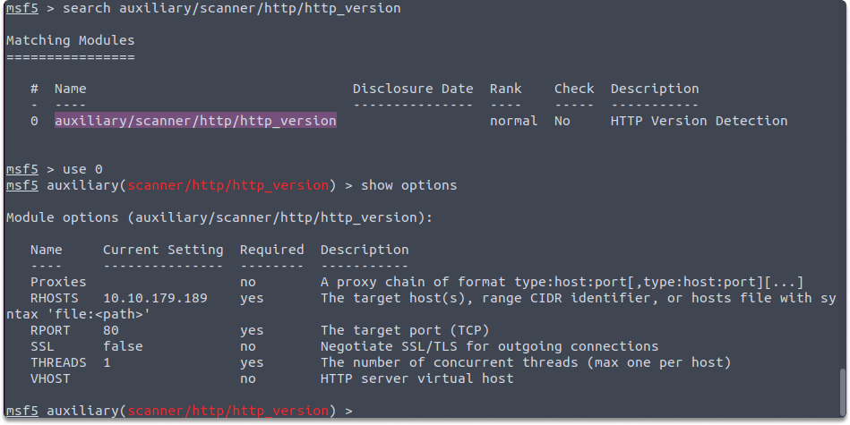
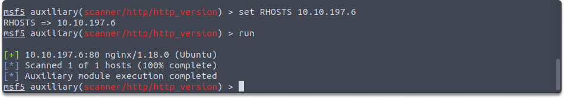
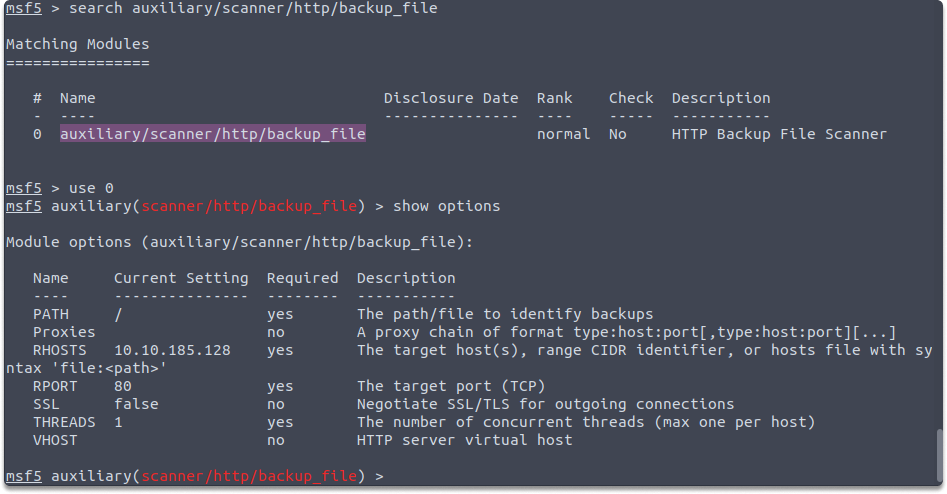
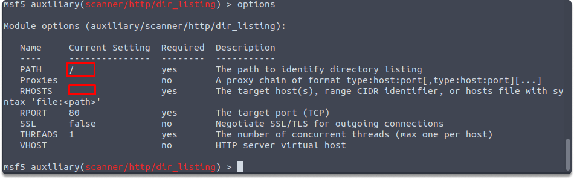
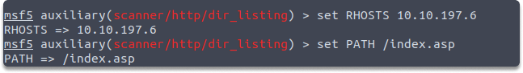
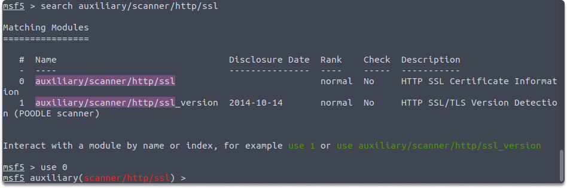
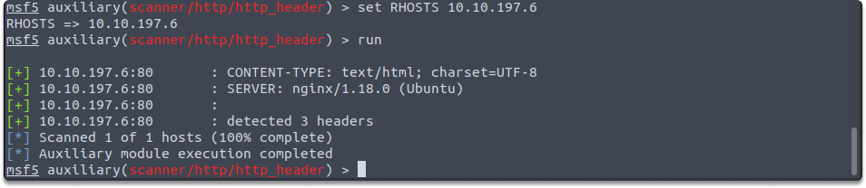
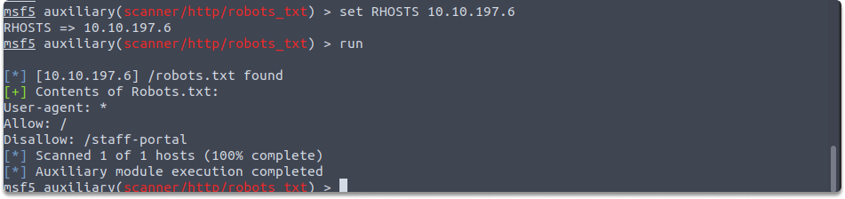

:orphan:
(metasploit-working-with-http-auxiliaries)=

# Metasploit Working with HTTP Auxiliaries

In this blog post, we’ll explore HTTP auxiliary modules within the Metasploit Framework that you can utilize for information gathering and enumeration purposes.

Let’s start with `http_version` and the required variables.

## HTTP auxiliaries in Metasploit Framework:

**auxiliary/scanner/http/http_version**

You can use `auxiliary/scanner/http/http_version` module to probe and find out the version of the web server operating on the remote device you target. You can also gather details on what OS and web framework the remote system is using. While working with `http_version`, you need to set the RHOSTS variable as you can see in the example below:

`set RHOSTS 10.10.197.6`

As you can see the RHOSTS variable is empty and you need to specify the target IP address which is preceded by the `set` command.

**auxiliary/scanner/http/backup_file**

`auxiliary/scanner/http/backup_file` module scans the remote device if there are any forgotten backup files on the server. Backup files may provide extra information about the target device and aid in further exploiting the system. You need to set only RHOSTS variables as shown in the example:

`set RHOSTS 10.10.197.6`

`run`

Let's look at another HTTP auxiliary module `dir_listing`.

**auxiliary/scanner/http/dir_listing**

The web servers may be misconfigured in a way to display a list of files in the root directory. If that’s the case, the directory may include files that are not normally accessible via website links which may leak sensitive data. `auxiliary/scanner/http/dir_listing` module scans if the target web server is susceptible to the directory listing. You need to set the RHOSTS and the PATH variables as you can see in the below examples:

`set RHOSTS 10.10.197.6`

You can also specify another path other than `/index.asp`

`run`

**auxiliary/scanner/http/ssl**

Although SSL certificates are widely used to encrypt data in transit, they are frequently found to be mismanaged or to employ inadequate cryptographic techniques. This auxiliary module examines the SSL certificate placed on the target machine for any flaws.

You need to set the RHOSTS variable as shown in the example:

`set RHOSTS 10.10.197.6`

**auxiliary/scanner/http/http_header**

Most web servers are not adequately protected. As a result, HTTP headers provide server and operating system version information. auxiliary/scanner/http/http_header module determines if the remote server is transmitting version details through headers. You need to set the RHOSTS variable as shown in the example:

`set RHOSTS 10.10.197.6`
`run`

**auxiliary/scanner/http/robots_txt**

Most search engines rely on bots to scan websites and index pages. In this scenario, they employ the `robots.txt` file to instruct search spiders to avoid crawling specific areas of the site. This module scans the target network to see if there are any `robots.txt` file. You need to set only the RHOSTS variable as shown in the example:

`set RHOSTS 10.10.197.6`

`run`

## Summary

Upon completion of this blog page, now you've gained an insight into how to work with HTTP auxiliary modules in Metasploit Framework.

> **Looking to expand your knowledge of penetration testing? Check out our online course, [MPT - Certified Penetration Tester](https://www.mosse-institute.com/certifications/mpt-certified-penetration-tester.html)**
