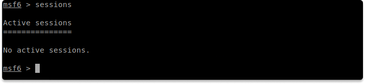
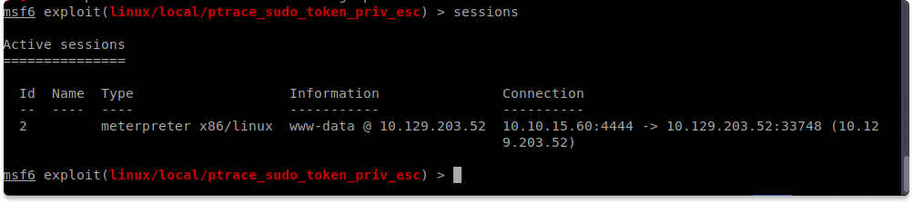
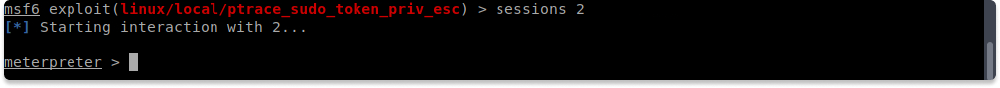
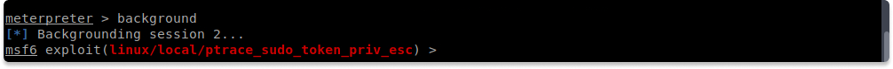
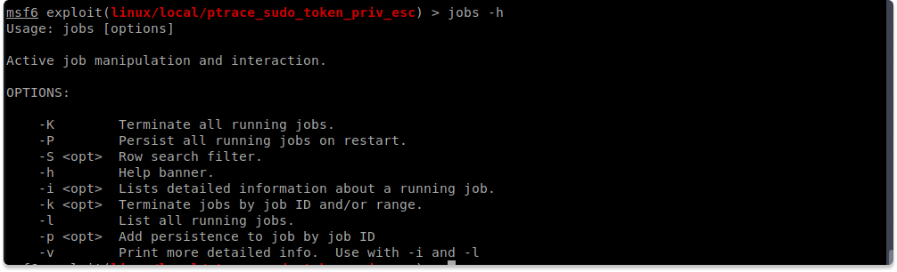
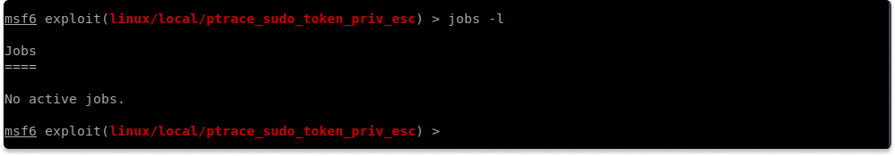

:orphan:
(metasploit-working-with-sessions)=

# Metasploit Working with Sessions

In this blog post, we are going to cover sessions in the Metasploit Framework.

## What are sessions?

Each Metasploit connection you make to the target system will be assigned a session ID. After you've generated numerous sessions, you may want to shift between them and attach a separate module to one of the backgrounded sessions to execute on it, or you can transform them into jobs, which we'll discuss after this section.

Sessions, on the other hand, can expire if something bad happens during the payload execution, forcing the connection to fail.

### Interacting with Sessions

You can background the session while performing an exploit or running auxiliary modules as long as they provide a line of communication with the target machine. You can accomplish this by the following methods:

- pressing the `Ctrl + Z`
- running the `background` command.

After accepting the confirmation prompt, you will be returned to the msfconsole prompt and will be able to run a new module right away.

### Putting a session in the background

When you put a session in the background, it will continue to run and your link to the destination host will remain active.

Alternatively, the `exploit -z` command will execute the exploit and put the session in the background as soon as it opens.

How can you see a list of active sessions?

You can use the following command to view your currently active sessions.

`sessions`

In the above screenshot, we don't have any running sessions. However, if you look at the screenshot you will see that we have an active session with the ID value 2. When you interact with a specific session you will use this value.

### How to interact with a session?

You might need to launch an extra module on a system that has already been exploited. So how can you do this?

You can achieve this by following these steps:

1- Background your current session,

2- Search for the additional module you want to operate,

3- Type the name of the module

4- And choose the session number of the module you want to execute.

Now lastly, let’s explore Jobs.

## What are Jobs in Metasploit Framework?

In some cases, you may require a port occupied by an active exploit for an additional module. What should you do? Instead of terminating the session, use the jobs command to examine the active tasks running in the background and end the older ones to release the port.

Even if the session is ended you can turn various sorts of activities into jobs that run in the background smoothly.

### How to list/terminate active jobs?

You may use the following command to display a list of all currently executing tasks.

`jobs -l`

You can use the following command to terminate a particular job:

`kill [indexNo]`

**Test your knowledge**

- How can you run an exploit as a job?

- Which flag kills all actively running jobs in Metasploit?

> **Looking to expand your knowledge of penetration testing? Check out our online course, [MPT - Certified Penetration Tester](https://www.mosse-institute.com/certifications/mpt-certified-penetration-tester.html)**
