:orphan:
(meterpreter-for-pentesters)=
# Meterpreter for Pentesters
 
Metasploit is a complete framework that provides data about security vulnerabilities and helps with penetration testing. It is a Ruby-based, modular penetration testing platform that enables you to write, test, and execute exploit code. To run metasploit on Linux, open up a terminal and type `msfconsole` command. The shell code that executes after an exploit successfully compromises a system is known as a payload. The payload enables you to define how you want to connect to the shell and what you want to do to the target system after you take control of it. A payload can launch a command shell or meterpreter. 

Meterpreter is a sophisticated payload that can be dynamically extended at runtime and leverages in-memory DLL injection stagers. The stager socket is used for communication, and it offers a thorough client-side Ruby API. 

*Working of Meterpreter*
- The target executes the initial stager 

- The DLL with Reflective prefixed is loaded by the stager. The `DLL` is loaded and injected by the reflective stub.

- After initializing, the Metepreter core creates a `TLS/1.0` link across the socket and sends a `GET.` After receiving this `GET`, Metasploit sets up the client. 

- Lastly, Meterpreter loads extensions. It will always load stdapi and will load priv if the module gives administrative rights. All of these extensions are loaded over `TLS/1.0` using a `TLV` protocol. 
  
Source : `https://www.offensive-security.com/metasploit-unleashed/about-meterpreter/` 

Some of the functionalities of the meterpreter are, Encrypted communication can be setup using the Meterpreter or obtain or dump password hashes from the target system. Locate files on the filesystem and download or upload files. 

*Lets look at some of the useful meterpreter commands*

## Sysinfo

This command will provide the target’s system information. This command will display the victim pc architecture, operating system used and the number of users logged in to the machine.

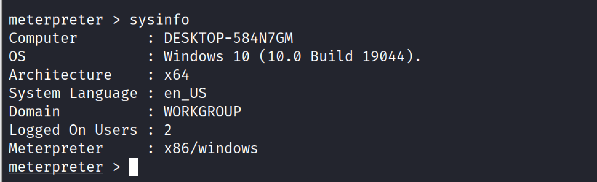

## Getprivs

This command will attempt to enable all privileges available to the current process. 

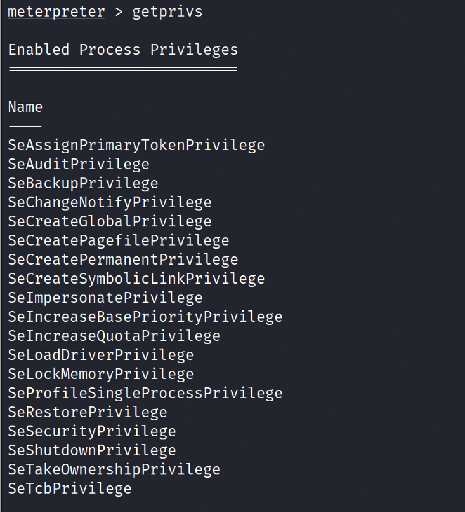

## Getuid

The getuid command will get the user identification that the server is currently running on a remote system.

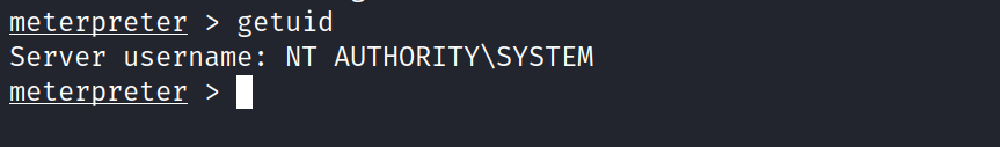

## Pwd 

PWD stands for present working directory. This command will display the current working directory on the remote pc. 

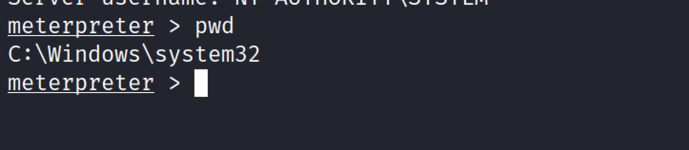

## Upload

The upload command allows you to upload a file to the remote system. 
To upload a file to a remote PC, we must include the file's path, filename, and extension in addition to the location where we wish to upload.

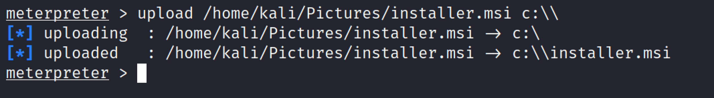

## Download

The download command allows you to download a file from the remote system. 
In order to download a file, we must first specify the path from which we want to download it, then the file's name and extension. We must include the path where we wish to save the downloaded file in the final section. 

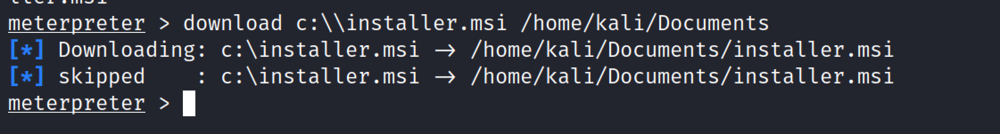

## Shell 

This command will give the command prompt access on the remote system. 

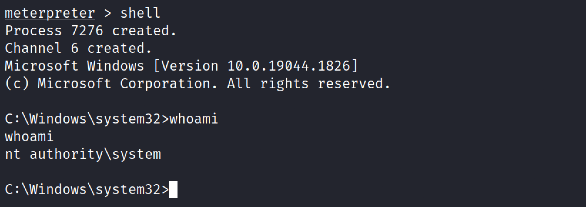

## Ps

Ps command stands for process, this command shows a list of processes the remote device is running. 

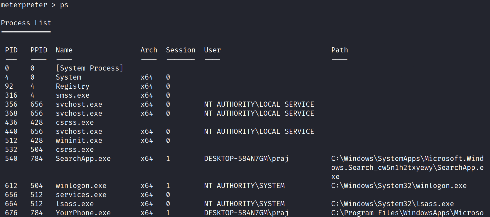

## Migrate

This command helps move an active process from one port to another.

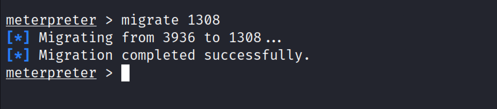

From the above screenshot, we have migrated from current process from prot 3936 to 1308. 

## Background

Background command is used to send the current active meterpreter session to the background. To check all the active sessions type sessions and to go back to any of session type session <id>. 

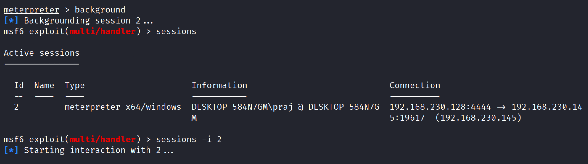

## Screenshot

Using this command penetration tester/attacker can take a screenshot of the remote pc. 

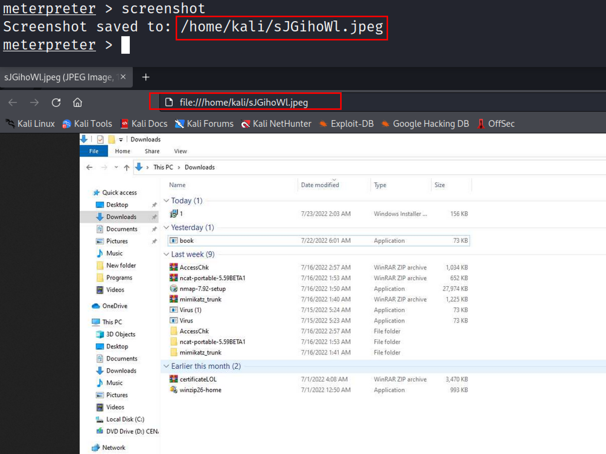

## Record_mic 

This command is used Record audio from the default microphone for X seconds

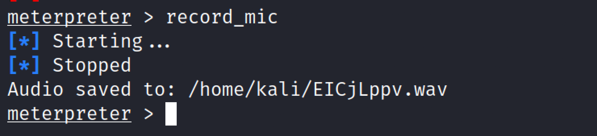

## Keyloger

Meterperter also provides the keylogind funcitonality.Keyscan_start command is used to start the capturing of keystrokes from victim machine. Keyscan_stop is used stop capturing keystrokes. The keyscan_dump command is used to dump the keystroke buffer.

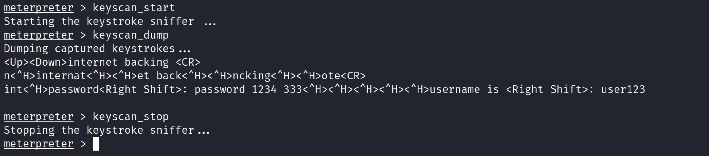

## Conclusion

The Meterprerter is a very advanced dynamically extensible payload. One of the advantages of using metepreter is being stealthy as it resides entirely in memory and writes nothing to disk. type help in meterpreter session to learn more about advanced meterpreter commands. 

:::{seealso}
Looking to expand your knowledge of penetration testing? Check out our online course, [MPT - Certified Penetration Tester](https://www.mosse-institute.com/certifications/mpt-certified-penetration-tester.html)
:::