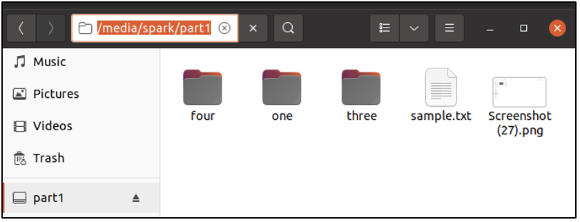

:orphan:
(mounting-forensic-images-on-linux)=

# Mounting Forensic Images on Linux

In the _[previous](acquiring-a-forensic-image-on-linux)_ blog post, we saw how a Linux computer can be used to acquire forensic images. Once an image has been acquired, how do we view and process the contents of the forensic image? It can be done using the various tools available and also using existing Linux commands. In this blog post, we will explore how the `mount` command can be used to view the contents of a forensic image.

It's demo time!

## Acquiring a Forensic Image

User _spark_ is currently logged into an Ubuntu machine. A USB drive with the following contents has been connected to the computer.

The forensic image of the first partition _sdb1_ on the USB drive has been acquired using `dd` command as shown below.

We can even use `file` command to get details about the forensic image, as shown below.

## Viewing the contents of the Forensic Image

As seen before, `fsstat` command in _The Sleuth Kit_ tool suite can be used to view the file system on the partition. This partition has been formatted as ext4.

There is another tool called `fls` in _The Sleuth Kit_ tool suite to view the list of files in the forensic image. It can be used as shown below:

`fls [forensic-image]`

However, without any switches, `fls` displays only the files/folders at the top level. To view the sub-folders and files within them _-r_ switch can be used with the syntax.

`fls -r [forensic-image]`

Try it out!

Is it possible to browse through the contents of the forensic image, like we do in the file explorer? Yes, once the forensic image is mounted. This can be done using the `mount` command.

Within the _[directory structure](linux-command-line-101-basic-file-and-directory-operations)_ of Linux, there is a folder called _/mnt_ that contains temporary mounts created by the user. We will mount the forensic image in read only mode in this _/mnt_ directory.

First, let’s create a separate directory within the _/mnt_ folder to mount our forensic image in. This task requires _[root user permissions](root-login-vs-sudo)_, hence _sudo_ is used.

We can confirm that this operation was successful, in the GUI.

Now, let’s proceed to mount the forensic image within this directory using `mount` command. The syntax is as follows:

`mount -t [filesystem-type] -o ro,loop,norecovery [forensic-image-name] [directory-to-mount-in]`

Let’s discuss the various switches used with `mount`:

- _-t_ is used to refer to the type of file system on the forensic image. This information can be found using `fsstat` or `file` commands.
- _-o_ is used to specify mount options.
  Once we mount a forensic image, to preserve its integrity, we want to ensure that no data is written to it. This is why it is mounted using the read-only _ro_ mount option.
  _loop_ indicates that a virtual disk drive must be used to mount the forensic image. Imagine you have a CD-ROM. You would insert a disk within the CD-drive to view its contents. Likewise, _loop_ creates a pseudo drive (a software drive, one that does not exist physically) to mount the forensic image in.
  _norecovery_ informs mount to process the forensic image as it exists, and not process any existing file system journal. This helps to view the contents of the forensic image as it was, when it was being acquired.

The following screenshot shows how the forensic image has been mounted successfully in _/mnt/part1_. This command also requires root user permissions.

Now, we can view the contents of the forensic image in the file explorer.

It is not possible to create/delete/modify any files/folders within the forensic image, either via the GUI or the terminal – because it has been mounted as read-only.

After working with the forensic image, it can be unmounted using `umount` command as shown below.

We can also clean up the _/mnt_ directory after finishing our work with the forensic image.

## Why is this useful?

- When we mount a forensic image, we can view the contents of the drive in the same way it would have appeared on the source machine. It provides perspective on how the file/folders may have appeared to a user.
- Forensic images acquired from any operating system (Windows, Linux or Mac OS) can be mounted on a Linux computer.
- Using Linux commands, we can perform various operations on the mounted forensic image like: searching for files/folders that were created after a specific time, searching for files/folders that were modified within a specific time range, searching for the existence of specific types of files, etc.
- Even if you have the physical image of a volume, it is possible to extract the forensic image of a specific partition and view its contents after mounting it.
- Even if you have split parts of a forensic image, you can combine them all into one unit and view its contents.

## Project Idea

Here is a project idea for you:

- Use a Linux computer or create a Linux virtual machine for this task
- Create a 1GB partition on a USB drive and format it as FAT
- Create some files and folders on this partition
- Acquire the forensic image of this partition using `dd` command
- Mount the forensic image as a read-only loop device and view its contents in the terminal

Congratulations! You have successfully mounted a forensic image on a Linux computer.

:::{seealso}
Want to learn practical Digital Forensics and Incident Response skills? Enrol in [MDFIR - Certified DFIR Specialist](https://www.mosse-institute.com/certifications/mdfir-certified-dfir-specialist.html)
:::
