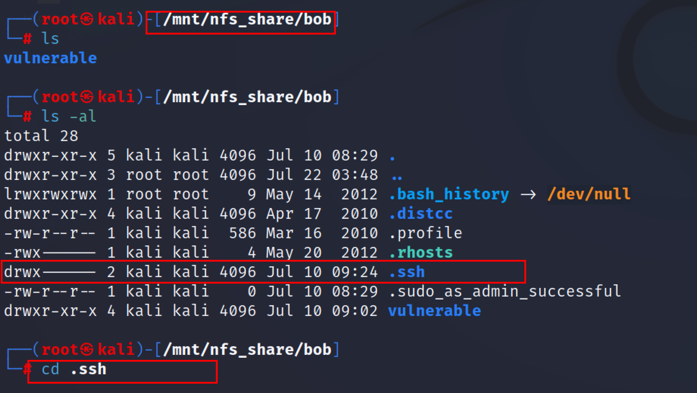

:orphan:
(nfs-enumeration-for-low-privilege-access)=
# NFS Enumeration for low privilege access
 
Network File System (NFS) - remote filesystem access *[RFC 1813] [RFC5665]*. The users can access, read, store, and update files via a remote server using the NFS file system type. The client can access these remote data in the same way that they can be accessed on a local machine. Clients can either read-only or read and write data, depending on the access granted to them. 

An NFS system is typically used on a computer network where data centralization for important resources is required. The **Remote procedure call** (RPC) is used to route and handle client and server requests.

To share files and directories across a network, the client first attempts to make the file available for sharing via the "mounting" process. On the NFS server, the /etc/exports directory provides a list of clients who are permitted to share files with the server.

## Enumeration of NFS 

Penetration testers/Attackers usually scan the target first and check if there is an nfs service running on it. The goal is to identify the NFS shares that attackers can anonymously mount into their systems.  

Start with a Nmap service scan on the IP address of our target machine. The following command can be used for the Nmap scan of `port 2049`.
`nmap -A -p 2049 <IP_address>`


The above screenshot shows that `port 2049` is open and the NFS service is running on it. Also, an attacker can use the `rpcinfo` command to scan the target IP address for an open NFS port and services running on it. 
The following command can be used for the enumeration of NFS using rpcinfo tool. 
`rpcinfo -p <IP_address>`


To Check if any share is available for the mount, an attacker can use the showmount tool in Kali:

The Syntax for showmount is shown below. 
```
showmount -h
Usage: showmount [-adehv]
[--all] [--directories] [--exports]
[--no-headers] [--help] [--version] [host]
```
`showmount -e 10.10.10.16`


Now the security professionals/attacker can check if the share can be mounted into their system. If the share is mountable then the penetration tester will look for ssh keys or any saved credentials. The penetration tester may also try to pivot into other machines from this particular share. 

## Mounting the share

Create a new directory inise the /tmp directory. 

`mkdir /tmp/nfsshare`

The following is the syntax for mounting the share 
`sudo mount -t nfs IP:/share /tmp/mount_folder/` 
```
-t  flag to define the type of device to be mounted
IP: share — IP of the target computer where the NFS share is, followed by the name of the share 
```

Initially, we created a folder called share_nfs and specified the IP and NFS share /home, followed by the mount point. Once mounted, change the directory to the mounting point and list the contents of the directory.  


From the above screenshot, Enumeration is successful now we can look for the ssh keys or any saved credentials in the bob folder. Navigate to the bob directory and type the ls -al command to list the contents of the bob directory and .ssh folder is of particular interest because the .ssh directory usually holds a user’s SSH keys. 



Copy the RSA file locally, now change the permission to allow them to be accessible. Use the chmod 600 id_rsa command, this command will grant read/write permission to the file. 


Then try to ssh with bob’s id_rsa file.  


Now the attacker has gained low-privilege user access to the target machine By enumerating the NFS share and copying the id_rsa file locally. This type of attack is very to perform by just enumerating the Nfs, can be exploited easily if the permission and shares are not configured correctly.  

## Conclusion

NFS shares can be commonly found open on internal Linux-based servers or workstations and NFS can be easily exploited to gain initial access to the system and lead to privilege escalation. Some of the countermeasures against NFS enumeration and attacks are to implement firewall rules to block NFS port 2049 and implement proper permission in exported file systems. 

