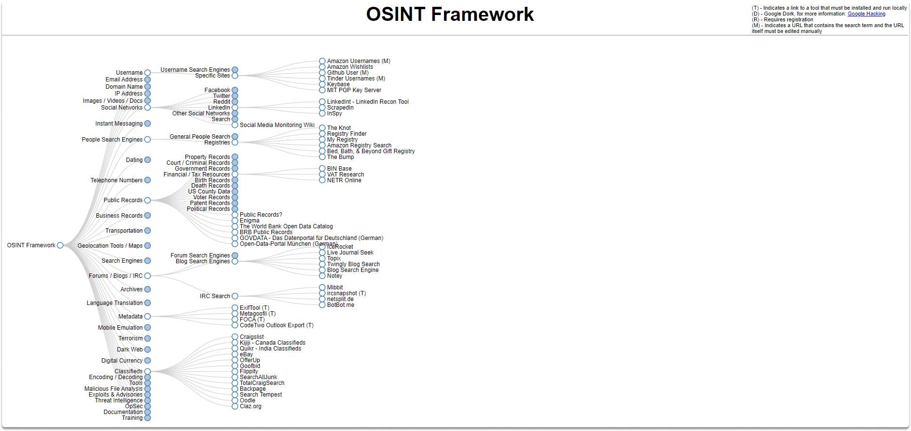

:orphan:
(osint-performing-mindset)=

# OSINT Performing Mindset

In this blog article, we will go through the fundamental phases of OSINT research.

## Getting started with your research: What do you have?

You start with an OSINT study with what information you already have or know. You may have various details of your person of interest at hand such as:

- an email address,
- a last or first name or a full name,
- a phone number
- a social media user name and so on.

If you're looking for someone, you need to know at least the basics, so that you can decide on which tools or framework to use to gather crucial information.

## How you can benefit from the OSINT framework?

You may gather a variety of information on your subjects, such as the POI’s name, photographs, and other data from search engines. You can also discover personal and business blogs, and user activity on forums. Additionally, you can explore cached data, email addresses, cell phone numbers, photos, and videos which you can leverage in geospatial analysis.

The above website may be found at the following address: https://osintframework.com/

**What are your specifications?**: After reviewing the material at hand, you must decide how you will describe your requirements. In this step, you address yourself the following question: what do I want to gain from this research?

**Making use of your OSINT toolbox**: During this phase, you begin obtaining data by employing OSINT tools and procedures. Many OSINT tools are publicly accessible for a variety of uses. While you are gathering the necessary tools, bear in mind that open-source is at the heart of OSINT.

**Analyzing, and cross-checking your findings**: You have specified your needs, gathered data, and analyzed your findings up until this point. In this step, you must validate/check your assumptions. Because you have achieved situational and contextual awareness, you should be free of bias. You should analyze all theories and look at the overall picture of everything you've gathered so far. You might question yourself if you have acquired all conceivable facts or if you can demonstrate how you arrived at your findings.

You should also cross-check your findings at this point.

**Reporting your OSINT research**: In the final stage, you create a report of your POI results. Let's say that you are preparing a report for Xmas company. How will you translate all these steps we have discussed so far? You can start by ensuring that you have clearly stated your report's goals in the executive summary section. Before displaying your findings, make an overview of Xmas company, such as its industry, web page, locations, financial overview, job listings, and so on. You can display your findings, detections, and discoveries along with supporting digital media.

## Final Words

You have now learned that doing OSINT research is a methodical process that demands the deployment of an effective roadmap. It is easy to get overwhelmed by the vast number of information available while doing OSINT analysis. Before you begin your research, bear in mind that the goal of OSINT is to uncover answers to your queries about your POI.

> **Want to learn practical Open-Source Intelligence skills? Enrol in MCSI’s [MOIS - Certified OSINT Expert Program](https://www.mosse-institute.com/certifications/mois-certified-osint-expert.html)**
