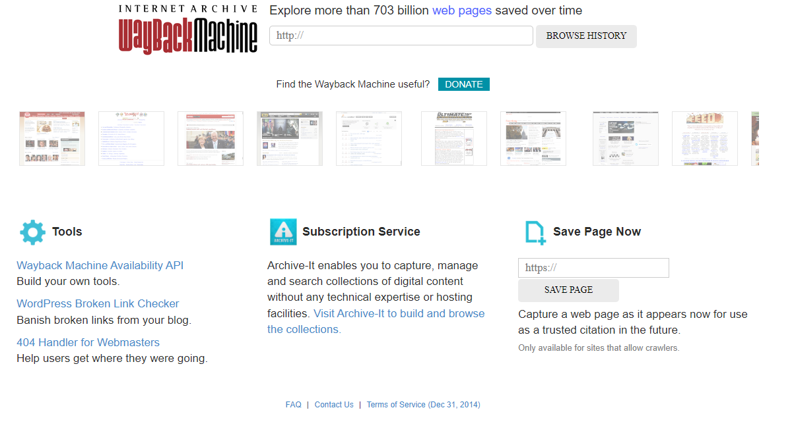
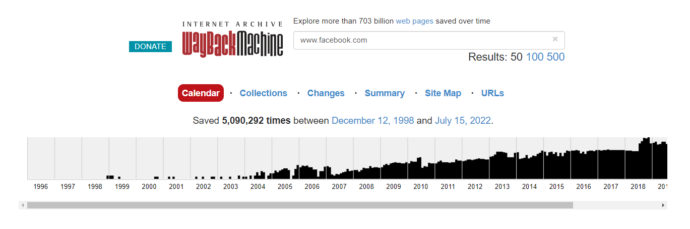
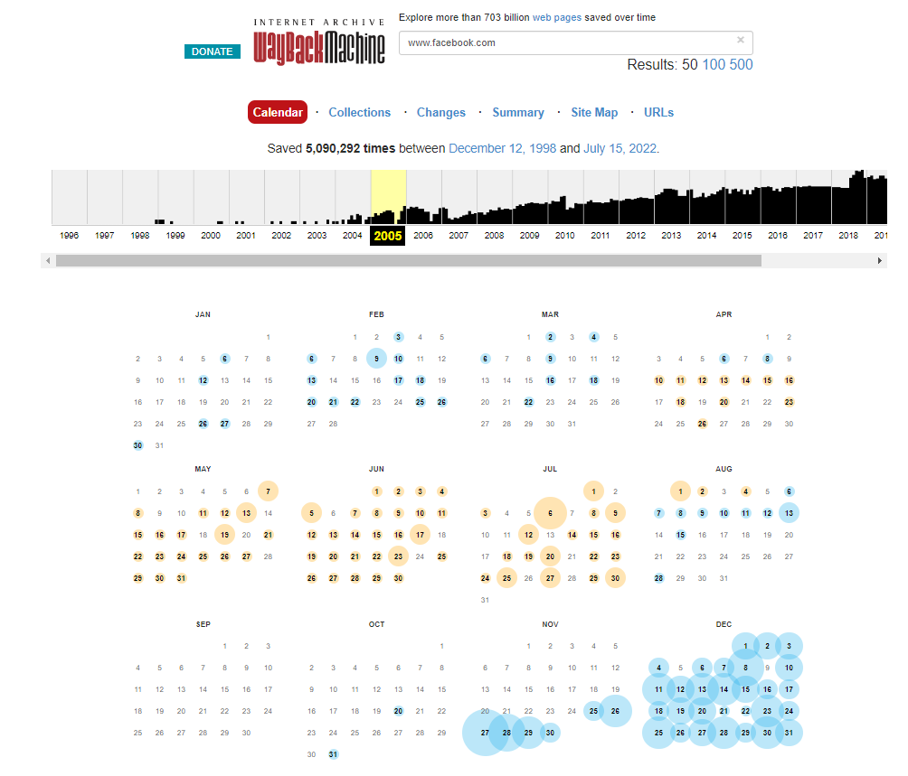
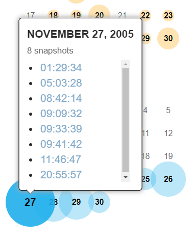
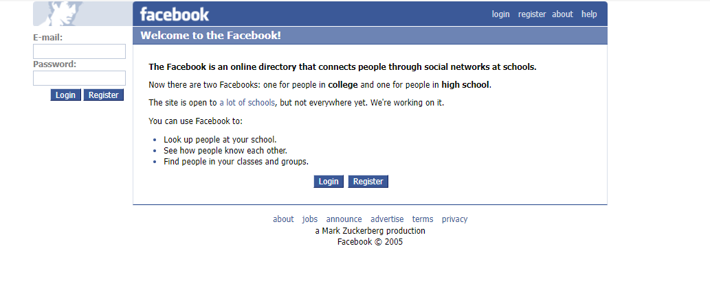
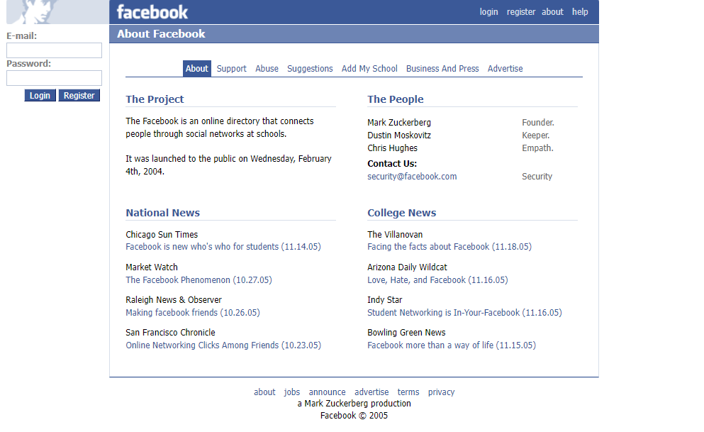
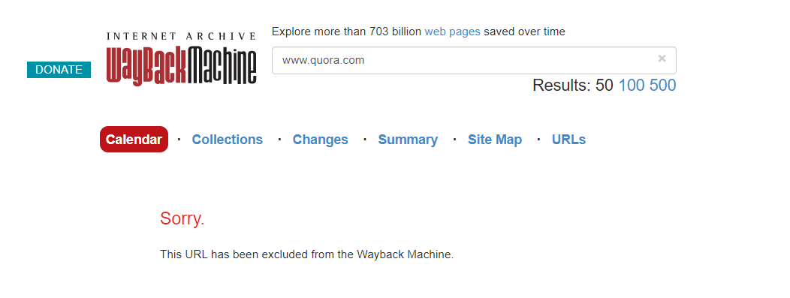

:orphan:
(osint-sources-and-tools-the-internet-archive-and-the-wayback-machine)=
# OSINT sources and tools The Internet Archive and The Wayback Machine
 
The Wayback Machine is a free online digital archive of the internet. The archive was created in 1996 and launched in 2001 by the Californian non-profit organization Internet Archive. Internet Archive provides public access to various digitized materials for free. Apart from websites, their collection includes articles, books, images, software applications, games, music, videos, and much more. Currently, the Wayback Machine has more than 704 billion web pages archived.

## What is the Wayback Machine?

Wayback Machine takes snapshots of websites. Users can access these snapshots through the search engine of Wayback Machine. Why is this useful for cyber security? Reconnaissance for example. The Wayback Machine enables you to find old(er) information on previous versions of websites or archived websites. This information could be anything that was stored. For example, information about organizations, or about people who worked at these organizations. Much of this older information is not available when you try to access it through an organization’s current website. The Wayback Machine can also assist in forensic activities as it may enable you to discover connections between different websites, and uncover old files and cached images.

The Wayback Machine not only lets you look up older versions of websites, but you can also take snapshots of websites of your choice. When you go to the Wayback Machine on https://archive.org/web/, the option Save Page Now can be used by entering a specific URL. This option enables you to create a snapshot of a website of your choice and thus save its current state. That can be convenient as Wayback Machine does not store the state of every website at every moment.

If you sign up for a user account at the Internet Archive, you can create your own web archive by collecting snapshots of websites of your choice. Just be aware that the Wayback Machine only takes a snapshot of that page and not of all the other links in the snapshot.

## The Wayback Machine: an example

Let’s take a look at the web archive of a very well-known website: www.facebook.com. Type in the URL of Facebook in the search bar of the Wayback Machine and press enter. The Wayback Machine creates a timeline of all the snapshots taken in the past. Even though Facebook was founded in 2004, the URL of www.facebook.com already existed, hence why you also see the years before 2004.

If you click on a specific year, for example, 2005, you’ll get all the snapshots taken in that year in each month. The below image shows orange and blue circles. Orange circles are snapshots from error messages, it means the URL could not be found at the time (perhaps there were issues with the servers). The blue circle means that the URL could be found and that snapshots have been taken. The bigger the circle, the more snapshots were taken that day. 

When you click on 27 November 2005, you’ll get a list of all the snapshots taken on that day, in this case, there are 8 snapshots. 

Click on the snapshot of 01:29:34 and you will see an old version of the Facebook login page, approximately 1.5 year after it was founded. 

If you click on the ‘about’ link at the bottom of the page, you’ll get more information about the company, including an (old?) contact email address.

The Wayback Machine archives only publicly accessible pages. Pages that are protected by passwords or that have specifically requested the Internet Archive to not be included are not archived. In that case, you will encounter an error after entering the URL. A good example is www.quora.com.

## Final words

There are more benefits when creating an account with the Internet Archive organization. It also provides you with access to other features of the archive. For instance, it enables you to borrow books from libraries all over the world and view and use other restricted items such as videos and audio. This is a convenient way of expanding your OSINT resource base.

:::{seealso}
Want to learn practical Open-Source Intelligence skills? Enrol in MCSI’s [MOIS - Certified OSINT Expert Program](https://www.mosse-institute.com/certifications/mois-certified-osint-expert.html)
:::