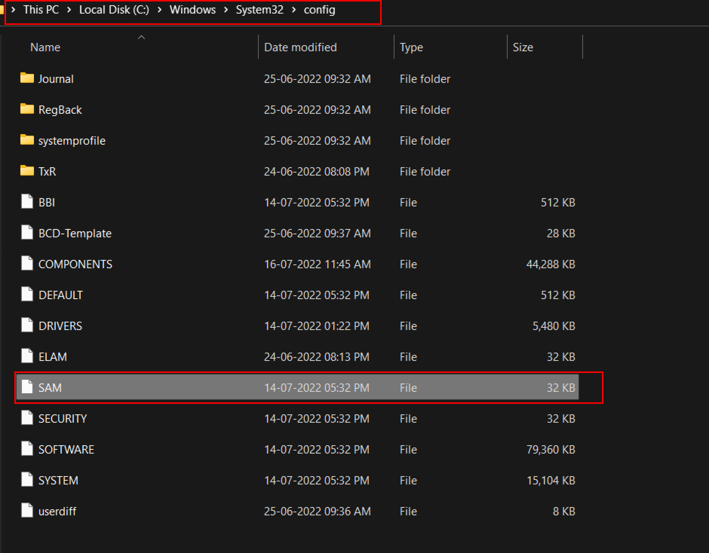

:orphan:
(password-grabbing-dump-and-crack-sam-hashes)=
# Password Grabbing Dump and Crack SAM Hashes
 
Security accounts manager `(SAM)`, `NTLM` Authentication, and `Kerberos` authentication are the three technologies (protocols) offered by Microsoft that the Windows OS and domain use to authenticate its users. Windows manages user accounts and passwords in hashed (in `LM hash and NTLM hash`) format using the Security Accounts Manager (SAM) database or the Active Directory database which is a one-way hash.  To prevent attacks, the system stores the passwords in a hashed format rather than plaintext. The system implements the SAM database as a registry file, and the Windows kernel obtains and keeps an exclusive filesystem lock on the SAM file. This file contains a filesystem lock, which adds some protection to the password storage process. The sam file is located at `C:\windows\system32\config`  passwords that are hashed and saved in SAM can be found in the registry. 

open the Registry Editor and navigate yourself to `HKEY_LOCAL_MACHINE\SAM`to check the sam file.

A user cannot copy or transfer the SAM file while Windows is running because the system locks it with an exclusive filesystem lock. The lock does not release until the OS has shut down or the system throws a blue screen exception. However, attackers can extract the on-disk contents of the SAM file using a variety of methods in order to make the password hashes accessible for offline brute-force attacks. The password hashes are partially encrypted by the SAM file using an `SYSKEY` function (available in Windows NT 4.0 and later versions).

## Dumping SAM 

To dump the SAM file's contents, first, you need to compromise the machine and need to have administrator access. With mimikatz it is fairly easy to dump the sam file and this method is best suited for internal penetration testing.  
Mimikatz is a popular open-source post-exploitation tool made in C Language by Benjamin Delpy. Mimikatz is a great tool to extract plain text passwords, hashes, and Kerberos Tickets from Memory. It can also be used to generate Golden Tickets. Mimikatz is a collection of modules that use privilege escalation and lateral movement techniques to assist both security testers and malicious actors. 

Check out this blog to learn more about Mimikatz [Click here](mimikatz-the-post-exploitation-tool-for-offensive-security-testing)

For this method first, run the `privilege::debug` command to obtain the debug privileges on mimikatz. Then `token::elevate` command is used to elevate to the system level privileges. This command is responsible for giving mimikatz access to the SAM file so that it can dump hashes. `Lsadump::sam` command is used to dump the sam file. 

``privilege::debug``
`token::elevate`
`lsadump::sam`

From the above screenshot, mimikatz is running on debug privilege and has the NT authority privilege to run. 

`Admin → 92937945b518814341de3f726500d4ff`
`Martin → 5ebe7dfa074da8ee8aef1faa2bbde876`
These hashes can be cracked using any tools like John the ripper, medusa, hashcat, etc. After dumping all the hashes from the sam file we are using john the ripper with `rockyou.tx`t to crack the passwords by using the following commands

`john hash --format=NT -w=/usr/share/wordlists/rockyou.txt`

And from the screenshot, john the ripper reveals the password by cracking the given hash. By following similar steps user martin's hash can also be cracked.

## Conclusion

Various tools like pwdump, Metasploit-framework, hash-dump, koadic, etc can be used to dump the sam file and crack the hash. The post-exploitation process, which is typically carried out with highly privileged accounts, is covered in this article. This step is easily avoided at a lower level.

> **Looking to expand your knowledge of penetration testing? Check out our online course, [MPT - Certified Penetration Tester](https://www.mosse-institute.com/certifications/mpt-certified-penetration-tester.html)**