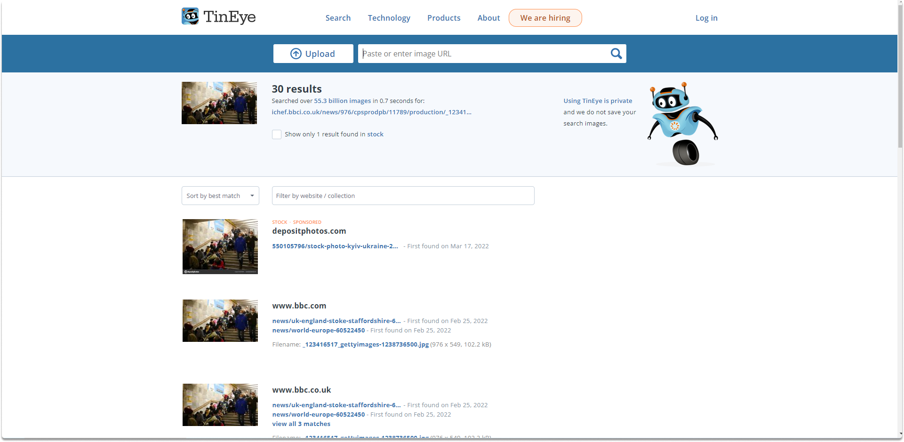

:orphan:
(performing-reverse-image-searches)=

# Performing Reverse Image Searches

In our [previous blog post](top-5-reverse-image-search-tools), we made an introduction to reverse image search. On this blog page, we will perform a reverse image search of the following image on 3 platforms which are TinEye, Yandex, and Google image search, and will take a look at the results.

## Introduction

Below is the image we are going to research.

If you want to follow along with it, you can download this image, and drag/drop it on the platforms as we did.

We uploaded the image on each of the 3 platforms as you will see in a minute in the following sections. Each of them had slightly different results. Let’s take a look at our findings.

**Yandex**

On Yandex, we can see that it gives where this image was shared before, alternative dimension options. One of the things that makes Yandex so powerful is that when you search for an image Yandex looks for also slight variations of it. You can also see the related images as well.

On Yandex, we have also another option which is `select area`.

You can select a specific area o the image and take a look at the results if you can find valuable information. You can reset it to go back to the original image.

**TinEye**

Let’s take a look at TinEye.

TinEye searched 55.3 billion images and found 30 results. The exact results are heavily from BBC sources.

You can use the filter options in TinEye to find out the oldest exact match of our search.

**Google**

Google searches for the exact matches like TinEye. On Google images, you can see the pages that Google identifies this particular image as _Ukraine people right now_ and asks if I was searching for this.

It is searching for any image that matches its size, which is 976 × 549 right now. Let’s click on all sizes to see if Google will display successful results.

As you can see Google displays the same image of different sizes successfully. Let’s go back to the search results. Narrow down the results to only `bbc.co.uk`.

You can filter down your options tailored to your research needs. In the below image you can see the first results side by side from Yandex, TinEye, and Google respectively.

## Conclusion

In this blog post, we performed a simple reverse image search utilizing Yandex, TinEye and Google image search. While performing a reverse image search, you should use multiple search engines since each may provide different results based on the algorithm they use.

> **Want to learn practical Open-Source Intelligence skills? Enrol in MCSI’s [MOIS - Certified OSINT Expert Program](https://www.mosse-institute.com/certifications/mois-certified-osint-expert.html)**
