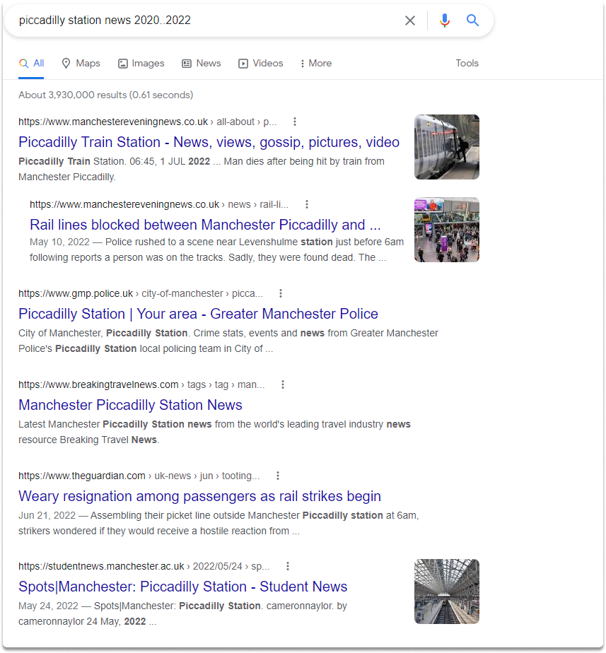
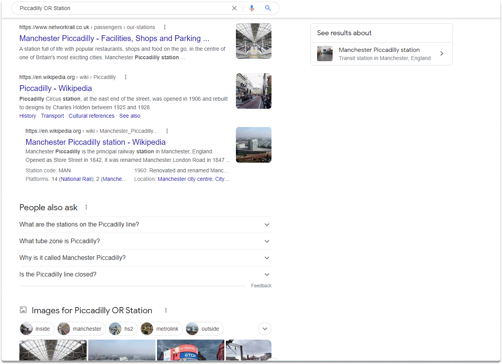
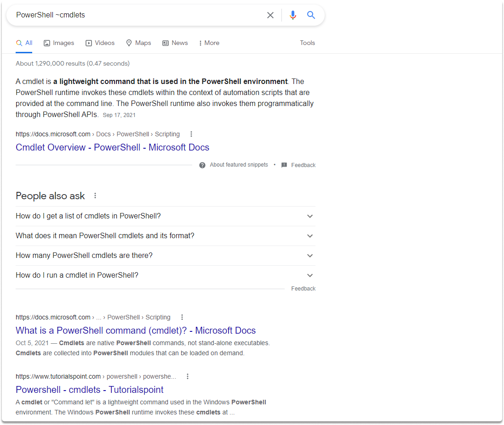
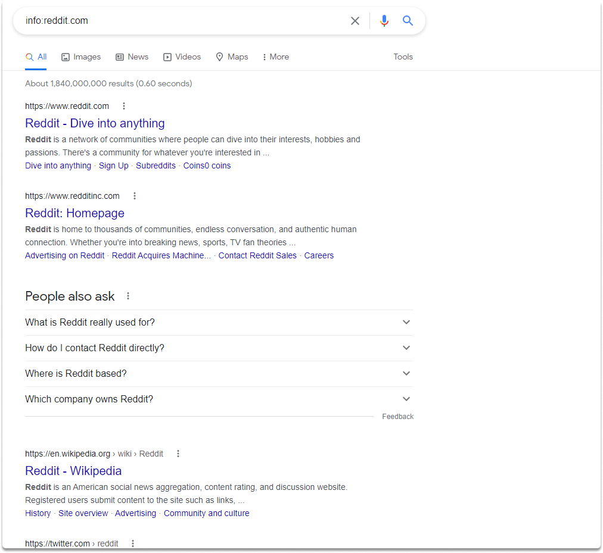
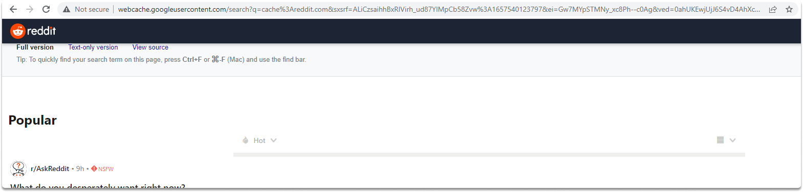

:orphan:
(practicing-google-advanced-operators-for-osint)=

# Practicing Google Advanced Operators for OSINT

For years, investigators have used the internet, search engines, and social media to gather data that may be useful. Google Dorking is a valuable tool in open-source intelligence research, especially when looking for person-of-interest research. In a [previous blog post](improving-search-results-with-google-keywords), we made introductory practices to Google advanced operators for OSINT. In this blog post, we will continue exploring Google’s advanced search techniques.

## Practicing Google Advanced Operators

**1-)** Search for Piccadilly station news from 2020 to 2022 in Google search

We can search for a range, duration, and date with the double dots operator. You can use the double dots(..) by providing a specific range as shown in the following screenshot.

`piccadilly station news 2020..2022`

The above search term result will yield Piccadilly station news from 2020 to 2022.

**2-)** How can you narrow down the search results to the pages containing either Piccadilly or Station?

We can achieve this by typing the following search term:

`Piccadilly OR Station`

If you are going to use or operator, you should use it in capital letters as shown in the example. Alternatively, you can also use a pipe symbol to search for a term that contains either of the search terms you specify.

**3-)** Optimize google search to display Powershell cmdlets and anything related to cmdlets.

We can achieve this task by utilizing tilde. The tilde operator looks for the term that follows after it as well as its equivalents. Entering PowerShell cmdlet, for example, will produce PowerShell tutorial cmdlets cheat sheets, cmdlets libraries, or anything else that is similar to the search term cmdlets.

`PowerShell ~cmdlets`

**4-)** Display websites similar to linkedin.com.

We can search and display matching online sites by utilizing `related` parameter. Type the following search term in front of the web page URL, which is linkedin.com in this case.

`related:linkedin.com`

**5-)** Which operator helps you find information Google has about reddit.com? Display the Google-cached version of reddit.com.

We can use the `info:` operator which delivers information google has on a certain domain.

`info:reddit.com`

For the second part of the question, we can utilize cache: operator.

`cache:reddit.com`

**Tasks**

- How can you narrow down the simple google search results to only map-based for Vancouver?

- Type `weather:Vancouver` in your search bar.

  What did you see?

  Can you display how is the weather like in Toronto with the same operator?

> **Want to learn practical Open-Source Intelligence skills? Enrol in MCSI’s [MOIS - Certified OSINT Expert Program](https://www.mosse-institute.com/certifications/mois-certified-osint-expert.html)**
