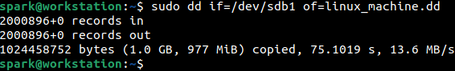
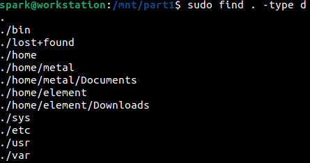
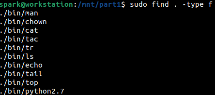
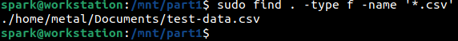
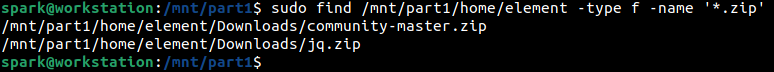
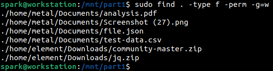
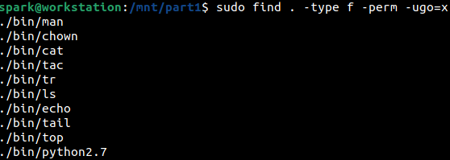
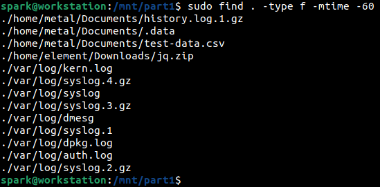
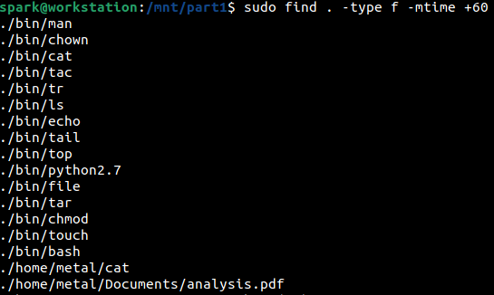
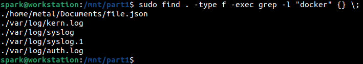

:orphan:
(processing-the-contents-of-a-forensic-image-on-linux)=
# Processing the Contents of a Forensic Image on Linux
 
In the *[previous](mounting-forensic-images-on-linux)* blog post we saw how a forensic image can be mounted on Linux. Typically, forensic investigations are time bound and forensic images carry a lot of data. We can use powerful Linux commands to quickly gather information about the files/directories on a forensic image. In this blog post, we will see how `find` command can be used to process the contents of a forensic image.

## Using `find` command for Digital Forensics

A forensic image of a target computer’s hard disk is acquired with the intention of gathering information about recently modified files/directories, confirm the existence of suspicious files or malicious scripts or to look for deleted data. 

Every file on a Linux computer has metadata like:
- a designated *[type](file-types-in-linux)*
- extension
- *[permissions](file-permissions-in-linux)*
- size
- *[timestamps](understanding-linux-timestamps-for-dfir)*

We will utilize the `find` command to extract files/directories on the forensic image according to the specified metadata.

The forensic image *linux_machine.dd* was acquired from a Linux computer,

 And mounted on user *spark’s* computer at */mnt/part1*.

For the remainder of this blog post, user *spark* is within the */mnt/part1* directory. All the commands have been issued with root user permissions to ensure access to all the contents of the forensic image. 

## Finding files/directories based on Type

In this section, we will see how `find` command can be used to identify files based on their type, using the following syntax:

`find [directory-to-search-within] -type [type]`

Here, we will specify *[directory-to-search-within]* as */mnt/part1*. Since user *spark* is currently within this directory, it is represented with a dot. The *[type]* parameter contains a single letter indicating which file type to look for within the specified directory.

- *d*: finds all directories
- *f*: finds all files
- *l*: finds all symbolic links
- *b*: finds all block device files
- *c*: finds all character device files
- *p*: finds all pipe files

From the following screenshot, we can see how `find` has been used to print all the directories on the forensic image. 

We can see that within */home* there are two sub-directories, one for user *metal* and another for user *element*. This indicates that there are two users on the computer from which this forensic image was taken from.

In the following screenshot, we can see how `find` command has been used to identify all the regular files within the forensic image. The output shown below has been truncated – it will be a very long listing. It would be a good idea to save this output within a file.

## Finding files/directories based on Extension

The following screenshot shows how `find` is used to find all the *csv* files within the mounted forensic image. The *-name* option and its argument **.csv* indicates to search across all the file names in the forensic image and only return results whose file names end with *csv* extension.

Next, we can see how a search for all *zip* files is performed within user *element’s* */home* directory. There are two zip files.

## Finding files/directories based on Permissions

From the following screenshot, we can see how `find` has been used to print all files, for which all members of a group can write to. *-perm* option and its argument is used to specify the specify the permissions to look for.

The numerical representation of the permission string can also be passed to *-perm*. This is a great technique to identify scripts on the forensic image. You can look for files with executable permissions set on them. The following screenshot shows how `find` has been used to identify all the files with executable permissions *x* set on them - the permission must be set for the user *u*, group that has access to the binary *g* and others *o*.

## Finding files/directories based on Timestamps

`find` command can be used to identify files/directories that were modified within the last *n* number of days using the syntax:

`find [directory-to-search] -type [type] -mtime -n`

The following screenshot shows the list of files modified within the last 60 days, that are present in the forensic image.

To find files/directories that were modified any time before the last *n* days, the following syntax can be used:

`find [directory-to-search] -type [type] -mtime +n`

The following screenshot shows the list of files modified sometime before the last 60 days, that are present in the forensic image.

Likewise, it is possible to also identify files that were accessed (using `find` option *-atime*) or had their metadata modified (using `find` option *-ctime*) within the last *n* days or anytime before the last *n* days.

It is also possible to find files/directories that were modified or accessed or had their metadata updated anytime over the past few minutes, using *-mmin*, *-amin* and *-cmin* respectively.

## Searching for a specific string

Assume you want to *[search](linux-command-line-101-viewing-file-contents)* for the existence of a specific string across all the files in the forensic image. It is possible with `find` and `grep`. 

The following screenshot shows how `find` and `grep` have been used to find all files containing the word *docker* in the forensic image.

It looks like the string has been found in one file belonging to user *metal* and across some log files. This could indicate the possibility of user *metal* using docker on the machine. 

Now let’s break down this complex command:

`find . -type f -exec grep -l “docker” {} \;`

- This search is performed within the current directory */mnt/part1*
- `type f` indicates that the search must be performed across all files in the forensic image
- `-exec {} \;` indicates that the command specified after the *exec* option must be executed, which is `grep` in this case. The string {} is replaced with the name of every file identified by `find`.

- `grep -l “docker”` indicates to search for the keyword *docker* and print the names of the files in which this keyword is found

## What next?

In this blog post, we saw how the `find` command can be used to quickly process the files in a forensic image. Even images taken from a Windows or Mac computer can be processed this way in Linux. 

## Project Idea 

Here is a project idea for you:

- Use a Linux computer or set up a Linux virtual machine
- Copy some files and folders to a USB drive
- Take a forensic image of the USB drive
- Mount the forensic image in Linux
- Identify all the hidden files and directories, in the forensic image
- Identify all the empty files and directories, in the forensic image
- Identify all files of size greater than 10 MB, in the forensic image
- Identify all files that have been modified within the last week, in the forensic image
- Identify all files that have been modified within the last hour, in the forensic image

Congratulations! Now you know how to use a Linux computer to acquire a forensic image, mount it and process its contents.
