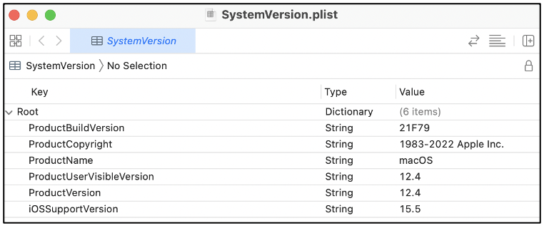
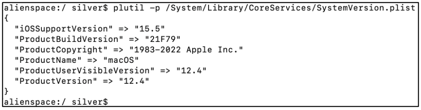

:orphan:
(properly-list-files-on-macos)=
# Properly List Files on macOS
 
On a computer running macOS, you will quite often encounter files with the extension *.plist*. In this blog post we will explore what those files are, what their purpose is and why cybersecurity professionals must know about them.

## Introducing .plist files

Let us start with something familiar. On Windows computers, the registry holds configuration information for applications that are installed on the computer and user-specific preferences. The *.plist* files on macOS have provide similar functionality.

## Use of Property List (.plist) files

Property List files with *.plist* extension hold configuration information for installed applications, have user-specific application preferences and may even hold arguments required for an application to launch. On macOS, these *.plist* files are scattered throughout the file system, depending on where they may be used.

*.plist* files exist in XML format or binary format. The various properties are stored as key-value pairs. Let us take a look at one such file *SystemVersion.plist*, present in */System/Library/CoreServices* on a Mac computer. Take a look at this *[post](directory-structure-on-macos)* for a quick introduction to the directory structure seen on devices running macOS.

## Viewing the contents of .plist files

On a Mac computer, the contents of a *.plist* file can be viewed using *XCode*, which is Apple’s Development IDE (not installed by default) or using `plutil` command-line tool, which is installed by default on Mac computers.

The following screenshot shows the contents of *SystemVersion.plist* viewed using XCode. You can see that the base tag is called ‘Root’, following which you can find various key-value pairs holding operating system information. This computer is currently running macOS 12.4.

`file` command can be used in the terminal to identify if the *.plist* file is present in XML or binary form. The syntax for use is:

`file [.plist file name]`

In the following screenshot, the complete path to *SystemVersion.plist* has been provided to `file`. It can be seen that this file is present in XML format.

`plutil`, also referred to as *Property List Utility* is a command-line tool present on Mac computers to view the contents of a *.plist* file, and also convert it between XML and binary formats. When `plutil` is used without any switches, as shown in the following screenshot, it is simply used to check if the syntax of the file’s contents is correct. If it is, then an ‘OK’ is returned.

To view the contents of a *.plist* file, regardless of the format it is in, then *-p* switch can be used with `plutil` as shown below. The contents of the file will be printed in human-readable form in the terminal.

To view the contents of a *.plist* file on Windows, a utility called *Reaper* can be downloaded and used. There are various Windows-based tools available for this purpose. 

On Linux, the contents of a *.plist* file can be viewed using a text editor or by using `cat` command in the terminal.

Usually, it is not recommended for a user to make any modification to the *.plist* files as it could result in syntax errors or even cause abnormal application behaviour.

## Why should cybersecurity professionals know about .plist files?

- Penetration testers and red teamers typically target the various *.plist* files present, to hack their way into a system. Modifying the properties specified in this file, could cause an application to exhibit unintended behaviour.
- Consequently, when abnormal behaviour is suspected on a Mac computer, then digital forensic analysts attempt to gather the relevant *.plist* files and examine their contents. It would be helpful for an investigator to be aware of the location of critical *.plist* files, to be able to access them without much delay.
