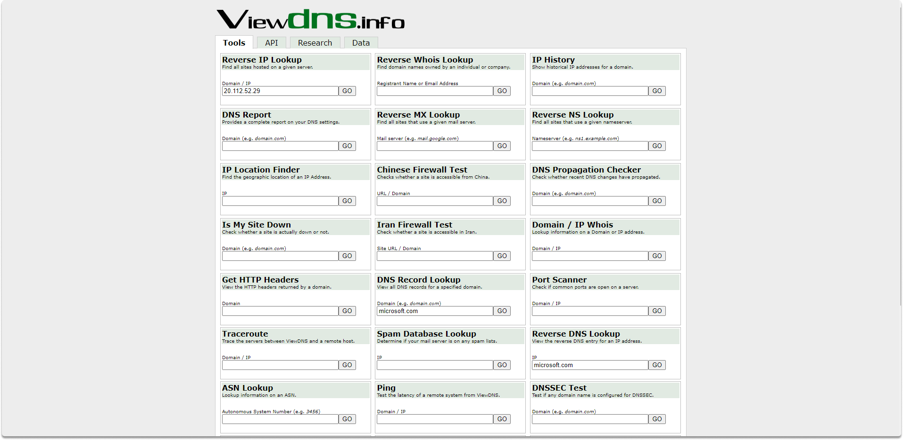
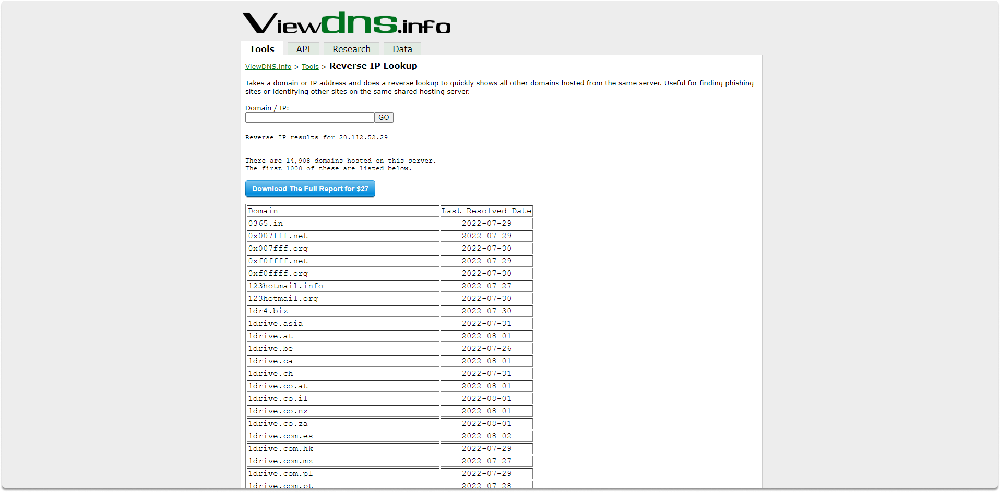
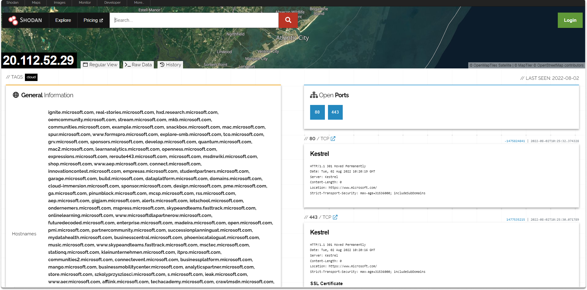
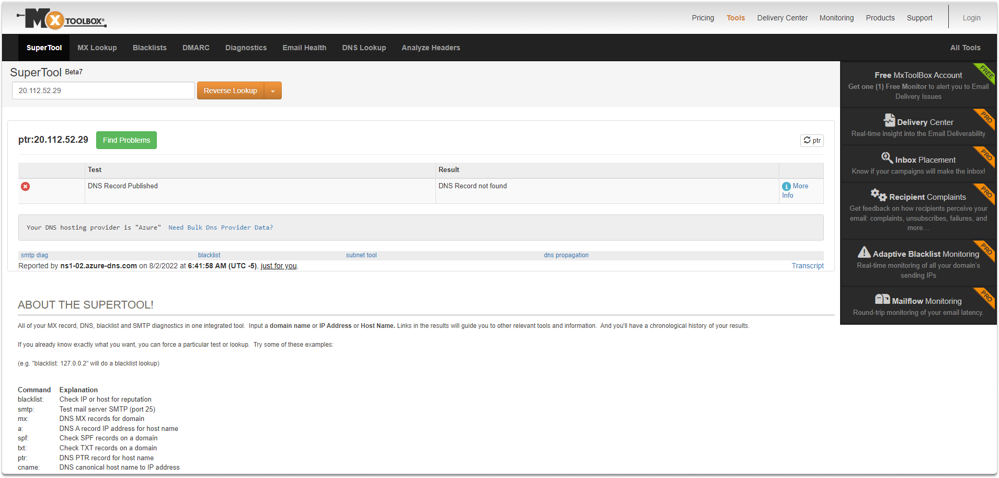
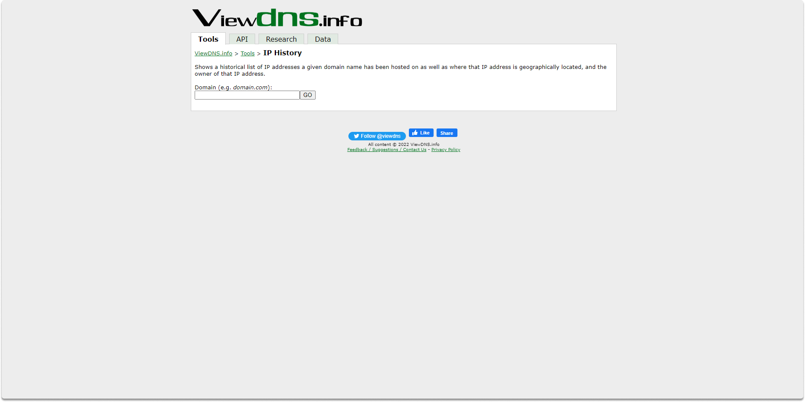
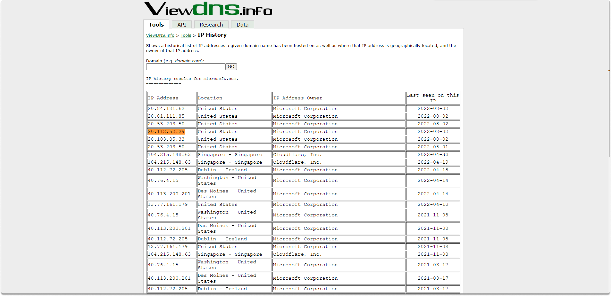

:orphan:
(reverse-ip-and-domain-lookup)=

# Reverse IP and Domain Lookup

You can use IP addresses to track people across several websites online. You may have IP addresses gathered via online research, email message, or internet connection. Using OSINT, we will explore various methods for obtaining a target's IP address. We have already covered how to do a simple whois query in a [previous blog article](https://blog.mosse-institute.com/2022/08/01/domain-name-lookup.html). This domain name lookup will provide IP addresses linked with the websites you're investigating.

A website's content is hosted at an address which is also called an IP address. You can find an IP address while researching a domain by performing some simple tasks that we will cover in a minute. Keep in mind that the IP address at hand may be hosting many websites at the same time. Although there are many tools publicly available for domain and IP lookup, we will display only a small portion of the utilities. You can explore them yourself at the following address: https://osintframework.com/

## IP and Domain name research tools

Let's take a look at some of the most popular and free tools for learning more about an IP address or domain name.

**ViewDNS Reverse IP lookup**

ViewDNS (https://viewdns.info/) is a complete tool that provides you with a vast amount of details regarding an IP address or a given website. You can also display additional domains hosted on an individual IP address with this site. Let’s take a look at the reverse IP lookup tool to see what we can find.

As you can see in the above image, ViewDNS identified 14,908 domains hosted on 20.112.52.29 and listed the first 1000 of these.

**Shodan**

Shodan is yet another useful tool that you can use for a variety of reasons, one of which is reverse IP lookup. You can search for an IP address or range, to find out details about the host, services, service banners, and so on.

**Reverse IP lookup/ Mxtoolbox**

This is another reverse IP look-up service provided by Mxtoolbox. It simply performs a reverse IP look-up on an address you provide.

**ViewDNS IP History**

This program converts a domain name to an IP address and lists previous IP addresses that the domain has used. A search on microsoft.com yields the following output as shown in the image below.

The first column contains the IP address that was previously connected with the domain, the second column has the current user and company linked with that IP address, and the last column contains the date ViewDNS acquired these attributes.

## Conclusion

By the completion of this blog post, we have learned how to perform a domain name and IP look-up with publicly available tools. You may use reverse IP lookup to find out if a domain name is registered or not, as well as the registrant and contact details for a domain name or IP address if that specific address is linked to other domains, and so on.

**_Task_**

Use the ViewDNS IP History tool we covered above to find out if the following domain was used another server before: `azure.com`

> **Want to learn practical Open-Source Intelligence skills? Enrol in MCSI’s [MOIS - Certified OSINT Expert Program](https://www.mosse-institute.com/certifications/mois-certified-osint-expert.html)**
