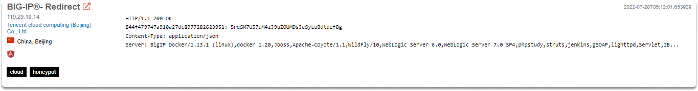
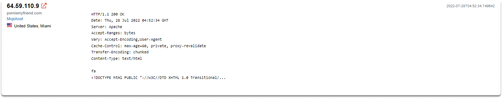
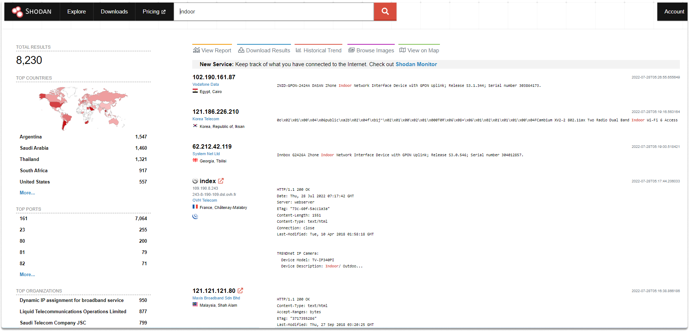
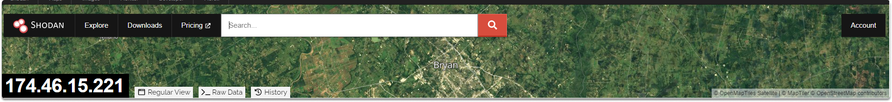
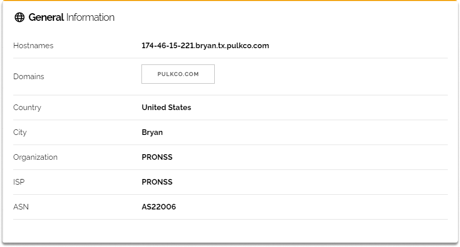
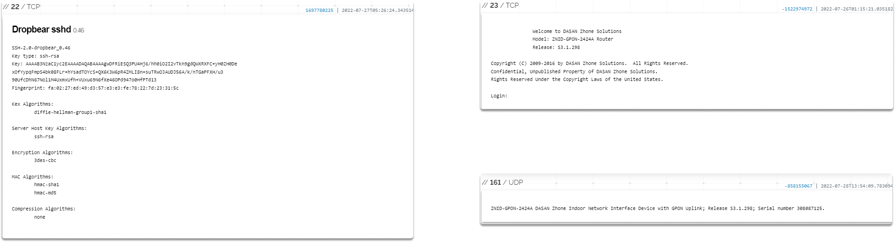

:orphan:
(shodan-basic-searches-find-devices-and-vulnerabilities)=

# Shodan Basic Searches Find Devices and Vulnerabilities

Shodan, as we discovered in the introduction to the shodan blog page, operates servers across the world that scan Internet-connected devices and collect the banner to determine what systems are operating on the server. These Internet-connected devices will generate various banners based on the services they are running. Shodan servers produce a random IP address to crawl, as well as a random port to verify and validate the random IP and port. The banner information, IP, and port data are all indexed and accessible which makes it a useful tool for an OSINT investigator. Upon finishing the blog post you will be ready to use Shodan in your research. Let’s start learning!

## Shodan: Performing a basic search

When you make a search on Shodan’s search bar, your query only looks at the main banner text and does not scan the meta-data by default. Let’s say that you want to search the term "nginx," the results will only contain results that include the phrase "nginx" in their banner.

As we have already discussed in the banner grabbing section, you will see the information gathered by the Shodan crawlers in the banner and it is linked to the IP and port of the specific device. The banner is simply written information that describes a service. In the following images, you will see banner information of specific devices.

On the main page, there are several filter choices on the left, and the search results with information on each device are on the right. Let’s make search for “indoor” and take a look at the results.

Shodan doesn't only index banner information but also device metadata such as the following:

- geographic location,
- operating system,
- hostname and much more.
  After choosing a device from the search engine results, you will be redirected to a website that has more extensive information on the device or service. This information might contain things like location, organization, ports, services, and so on. Let’s turn back on our results and take a look at a random device to see what we can find out.

Shodan gives us a map and populates where the specific device with 174.46.15.221 is located based on the geolocation metadata it collects.

We learn the hostname, domains, country, city, organization, ISP, and ASN.

Additionally, we identify that ports TCP 22, 23, and UDP 161 are open.

On the right column under open ports, we can also learn more about these services as shown in the following images.

## Final Words

As OSINT researchers, Shodan is a powerful tool that you may want to add to your toolkit. By the completion of this blog page, you should be able to identify banners, meta-data, services, and vulnerabilities on a specific device on Shodan.

:::{seealso}
Want to learn practical Open-Source Intelligence skills? Enrol in MCSI’s [MOIS - Certified OSINT Expert Program](https://www.mosse-institute.com/certifications/mois-certified-osint-expert.html)
:::
