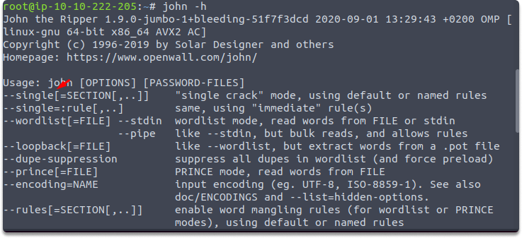
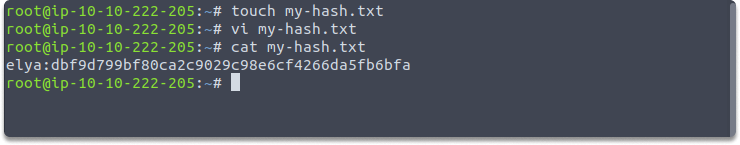
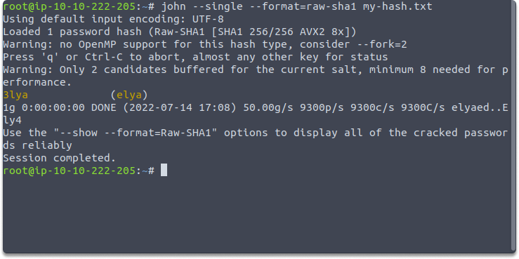

:orphan:
(single-mode-password-cracking-with-john-the-ripper)=

# Single Mode Password Cracking with John the Ripper

In a [previous blog post](hands-on-with-john-the-ripper-performing-a-basic-dictionary-attack), we performed a basic password cracking with John using wordlists. In this blog post, we are going to explore John’s single crack mode.

## Introduction

John The Ripper (which can be also abbreviated as JTR or simply John) is an open-source application that recovers passwords from their hashes. John's primary goal is to detect weak passwords on Unix computers. You can use John also to check NTLM hashes, Kerberos, and other protocols. JTR is well-known for its support for a wide range of hash types(including DES and crypt encryption algorithms).

Now that we have refreshed the basic information about John, let’s have a look at Single-mode password cracking mode.

### Deeper look at single password cracking mode

John has four password-cracking modes, which are as follows:

- Wordlist mode,
- Single-crack mode,
- External mode,
- and Incremental mode.

Let's start with the John tool to figure out what the single crack mode is.

In Single-crack mode, John will generate passwords from the login names, `Full Name` field, and user's home directory. These possible password choices are then used to crack the password of the user account from which they were obtained or to crack the password hash using the same salt. As a result, it is significantly quicker than wordlist mode. Although the single mode is really quick, you can utilize it if you have usernames.

**What is the default cracking mode?**

If you do not specify the cracking mode as an input to John in the command line, the default order will be used. It will first employ the single-crack mode, then the wordlist mode, and finally the incremental mode.

**Mangling Rules**

Assume you have the username Elya. In single mode, John creates its own dictionary depending on the information you supplied and employs a series of rules known as "mangling rules." These guidelines state how it can alter the word it began with in order to build a wordlist depending on relevant variables for the subject you're attempting to crack. Some possible passwords would be as follows:

- ElyaS,
- Elya2,
- @Elya,
- ElyaA, and so forth.

**Specifying File-type**

If you're cracking hashes in single crack mode, you'll need to adjust the file type you're giving John in order for it to know what data to generate a wordlist from. You achieve this by prepending the hash with the username to which the hash belongs, so in the example below, we would update the file `my-hash.txt`.

`elya:dbf9d799bf80ca2c9029c98e6cf4266da5fb6bfa`

`john --single --format=raw-sha1 my-hash.txt`

**Challenge**

- Can you identify the following hash and crack it with John?

  `513b2da4a8917d19c8c23e5a6ba7d921`

  The user name is: laika

> **Looking to expand your knowledge of penetration testing? Check out our online course, [MPT - Certified Penetration Tester](https://www.mosse-institute.com/certifications/mpt-certified-penetration-tester.html)**
