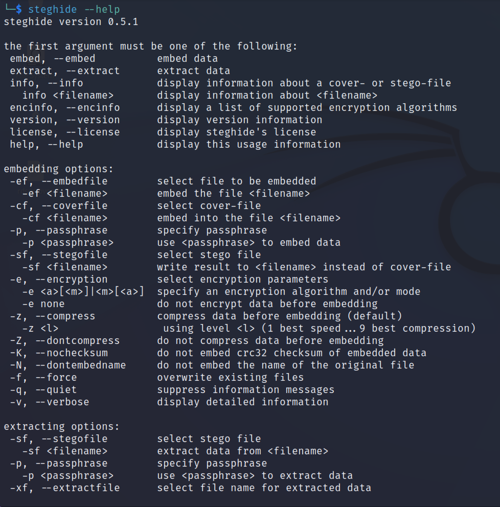
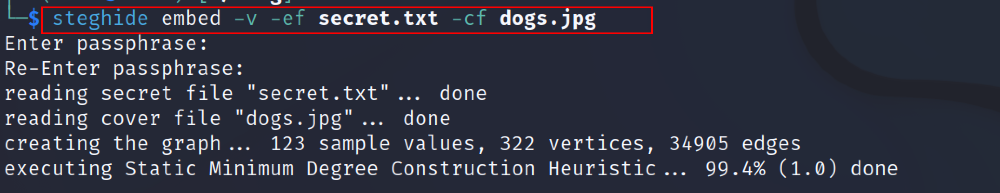
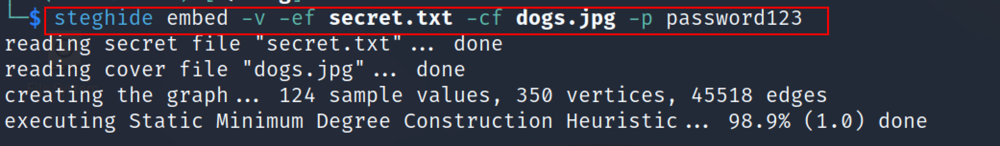
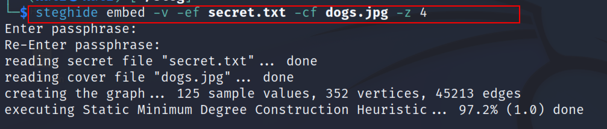
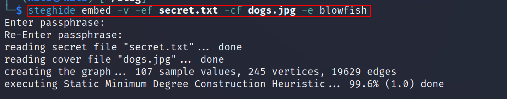
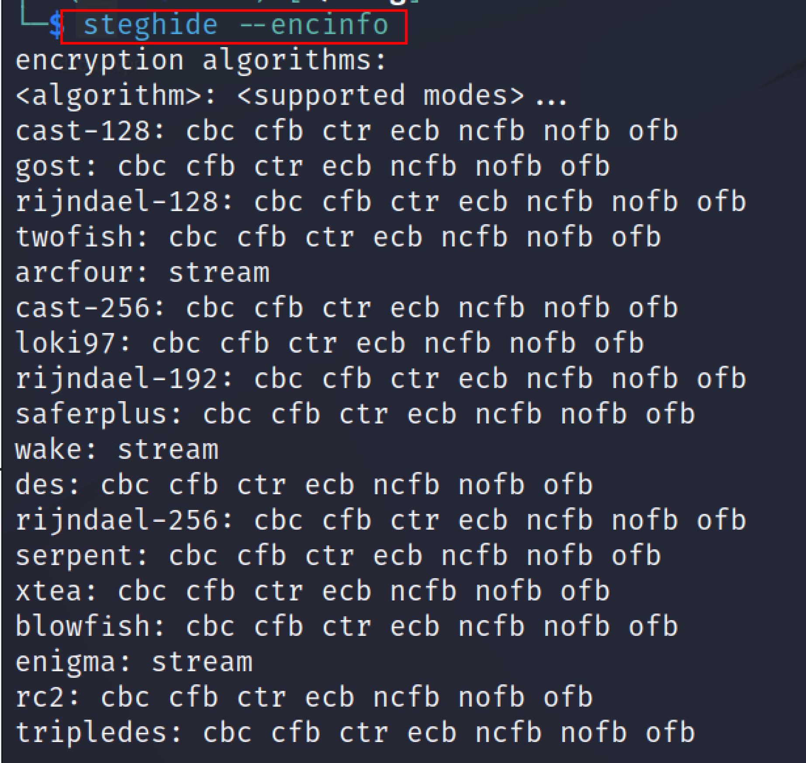
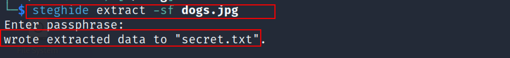
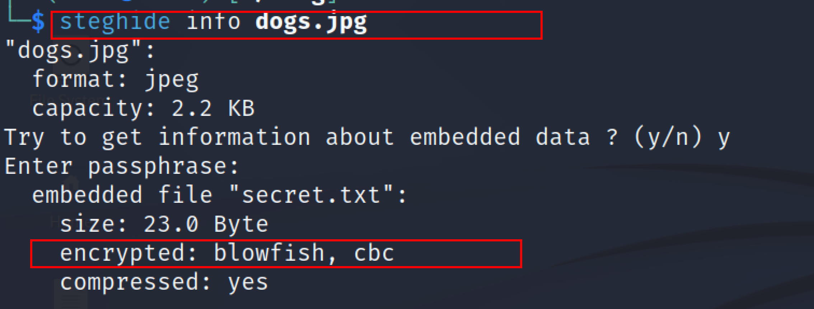

:orphan:
(steghide-hiding-data-in-plain-sight)=
# Steghide: Hiding Data in Plain Sight
 
Steganography is the art of hiding data "behind" other data without the victim's knowledge. It secretly inserts bits of unused data into ordinary files such as graphics, sound, text, audio, and video. The hidden data can take the shape of plaintext, ciphertext, or even an image. The most common approach to hiding data in files is to use a graphic image as a cover. Unlike encryption, detecting steganography can be difficult. Steganography is used by attackers to conceal information when encryption is not possible.   Attackers can include information such as hacking tool source code, a list of compromised servers, plans for future attacks, communication and coordination channels, and so on. Linux users can choose from a variety of open-source programs such as Steghide, Exif, Stegosuite, Steg, Outguess, and many more. In this article, we will focus on how to use hide data behind any image using the steghide tool. 

## Steghide 

Steghide is a steganography program that is able to hide data in various kinds of image and audio files. The color respectively sample-frequencies are not changed thus making the embedding resistant against first-order statistical tests. Steghide is a steganography tool that allows you to conceal secret information within an image or sound recording using a password.
Steghide uses a graph-theoretic approach to steganography. The default encryption algorithm is Rijndael with a key size of 128 bits (which is AES - the advanced encryption standard) in the cipher block chaining mode. 

### Installation

To install steghide on Linux, apt package manager can be used. The following command can be used to install steghide on Linux 
`apt-get install steghide `
In windows, download the steghide from `http://steghide.sourceforge.net/download.php`. Once downloaded simply unzip the files and use it through cmd. 

### Working with steghide 

To get started using Steghide, we use the help command. Use the steghide `— help` flag to view all of the options that steghide supports.

`steghide -- help`



### Embedding Data in the image 

This command will the data in the image using Steghide so that only the person who recognizes it can read that. 
```
steghide embed -v -ef <txt filename> -cf <media filename>
embed : this option is used to embed data
-ef : this flag is used to select the file to be embedded
-cf: this flag is used to select the cover file 
-v: display detailed information 
```
For example, we made a text file named secret.txt in which confidential data is present and dogs.jpg is an image in which secret.txt will be embedded.  



### Embedding files with password protection 

The following command can be used to embed file using a passphrase. 
```
steghide embed -ef <txt filename> -cf <media filename> -p  <password>
-p: this flag is used to specify the passphrase 
```
For example, embedding a secret.txt file into dogs.jpg using a passphrase. 



*Note: Remember the passphrase you used because to decode the secret.txt  it will be required again.*

### Compression Mode

If we wish to compress a text file before hiding it, the following command can be used. The compression level ranges between 1 and 9. The first level offers you compression speed, while the 9th level gives you the best compression techniques.

`steghide embed  -ef <txt filename> -cf <media filename> -z 4 `




### Encryption Mode 

The data can be encrypted that we are hiding by using encryption techniques. This can be achieved by using the following command. 

`steghide embed -ef <txt filename> -cf <media filename> -e <algorithm name>`



The `--encinfo` option can be used to check information about all possible algorithms and modes used by steghide. 



### Extracting data using steghide 

To extract the hidden data use the following command. 
````
steghide extract -sf <filename>
-sf: this flag is used to select the stego file.  
````


### Retrieve Embedded File Information

To retrieve information on data hidden and which algorithm is used to encrypt the data in the file. Then the following command can be used. 
`steghide info < filename>`



## Conclusion 

Steganography is a technique that conceals one message within another. It is mostly used by attackers to conceal information once they have hacked the system. This article demonstrated how to use the steghide tool to conceal data. Steghide is one of the finest steganography tools, which has various applications, such as file encryption, compression, and many more.

> **Do you want to get practical skills to work in cybersecurity or advance your career? Enrol in [MCSI Bootcamps](https://www.mosse-institute.com/bootcamps.html)!**