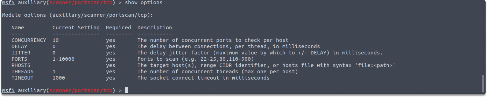
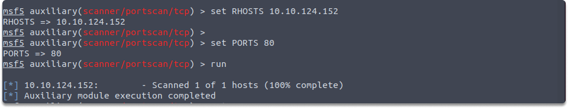
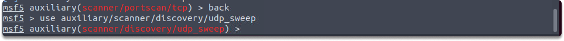
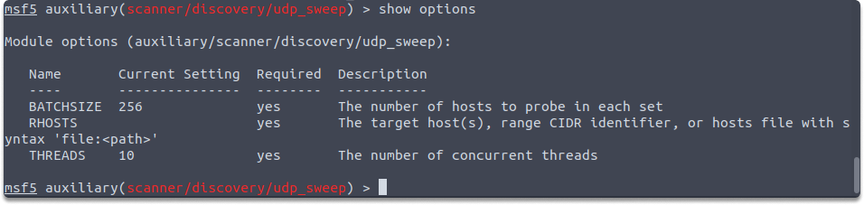
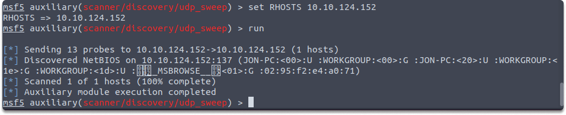
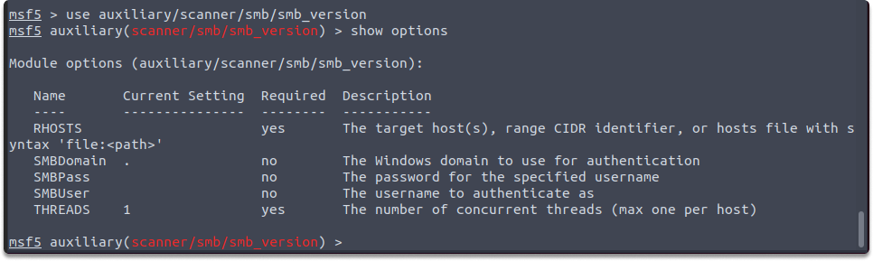
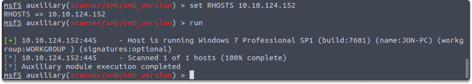
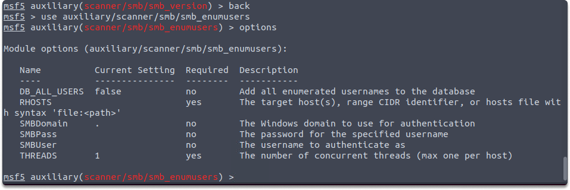
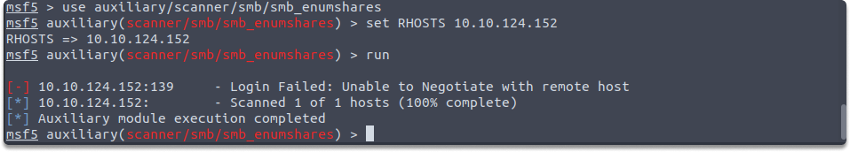

:orphan:
(tcp-udp-and-smb-auxiliary-modules-in-metasploit)=

# TCP, UDP, and SMB Auxiliary Modules in Metasploit

In this blog post, we'll explore TCP, UDP, and SMB protocols auxiliary modules within the Metasploit Framework that you can utilize for information gathering and enumeration. Let's start with TCP auxiliary modules and required variable settings...

**TCP: auxiliary/scanner/portscan/tcp**

TCP is a connection-oriented protocol that assures the reliable transfer of packets. TCP is used by many services, including Telnet, SSH, FTP, and SMTP. This module runs a simple port scan on the target machine to determine whether TCP ports are open. Its auxiliary module name is auxiliary/scanner/portscan/tcp, and you must configure the variables as in the screenshots:

`use auxiliary/scanner/portscan/tcp`
`show options`

RHOSTS: As we have already learned in previous blogs, RHOSTS is a variable that holds the IP address/range of the target system you want to scan. As you can see from the output of the `show results`, the target IP address is a required parameter.

PORTS: Ports variable holds the port/port range you want to scan. It is also required for `auxiliary/scanner/portscan/tcp`. So let’s set both of them.

`set RHOSTS 10.10.124.152`

Run the following command to find out the port 80’s status on 10.10.124.152.

Let’s give a port range now such as 1-1000:

`set PORTS 1-1000`

`run`

As you can see in the screenshot, Metasploit ran the auxiliary/scanner/portscan/tcp module on the target address and found the above ports open.

**UDP:auxiliary/scanner/discovery/udp_sweep**

In comparison to TCP, UDP is a lightweight protocol. It is, however, not as dependable as TCP. Services such as SNMP and DNS make use of UDP. This module runs a basic port scan on the target machine to determine whether UDP ports are open.

UDP auxiliary module name is auxiliary/scanner/discovery/udp_sweep. You must configure the following variables:

`use auxiliary/scanner/discovery/udp_sweep`

`show options`

`set RHOSTS 10.10.124.152`

`run`

Lastly, let’s take a look at SMB auxiliaries and required variables.

**SMB: /smb_version and /smb_enumusers**

SMB (Server Message Block) is an application layer protocol that is largely used for sharing files, printers, and other resources. SMB communicates over TCP port 445. Let's have a look at some of the SMB auxiliaries:

- Smb_version: Smb_version module probes the target to determine which SMB version is installed. Its auxiliary module name is auxiliary/scanner/smb/smb_version, and the following parameters must be configured such as the following:

  `use auxiliary/scanner/smb/smb_version`

  

  `set RHOSTS 10.10.124.152`

  `run`

  

- smb_enumusers: This auxiliary module communicates with the target system using the SMB RPC service and identifies the system's users. Its auxiliary module name is auxiliary/scanner/smb/smb_enumusers, and the following parameters must be configured such as the following:

  `use auxiliary/scanner/smb/smb_enumusers`

  `show options`

  

  `set RHOSTS 10.10.124.152`
  `run`

  

## Final Words

Upon completion of this page, now you can perform a TCP, UDP, and SMB scan on a target address using Metasploit's related auxiliary modules.

:::{seealso}
Looking to expand your knowledge of penetration testing? Check out our online course, [MPT - Certified Penetration Tester](https://www.mosse-institute.com/certifications/mpt-certified-penetration-tester.html)
:::
