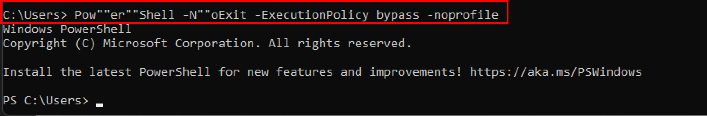

:orphan:
(techniques-used-for-malware-obfuscation)=
# Techniques Used for Malware Obfuscation
 
Malware obfuscation is a technique for making textual and binary data harder to decipher. Because they disclose patterns of malware behavior, it aids adversaries in hiding crucial strings in software. The strings would be like opening a PowerShell or cmd, infected URLs. Moreover, attackers use numerous obfuscation techniques to hide and stay undetected for as long as possible.

*The following are the various obfuscation techniques used by malware to avoid detection by antivirus solutions:*


## Inserting Special Characters 

To make well-known commands more difficult to detect, attackers insert special characters such as commas `(,)` and semicolons `(;)` between malicious commands and strings. Because these special characters are treated as whitespace characters in command-line parameters, they are easily processed.
Attackers use this technique to break malicious strings in order to avoid signature-based solutions from interpreting malicious commands.

following example shows, obfucation of opening of PowerShell with execution policy bypass string which is generally used in malwares. 


`,;cmd.exe,/c,;,echo;powershell.exe -NoExit -exec bypass`

`-Exec Bypass`: to bypass/ignore the execution policy like Restricted which restricts the PowerShell scripts from running 


## Inserting Parentheses 

In most cases, parentheses are used to improve code readability. When a parenthesis is used, variables in a code block are treated and evaluated in the same way that a single-line command is. This feature is used by attackers to split and obfuscate malicious commands.
```
cmd.exe /c ((echo command1) &&(
echo command2))
```

following screenshot shows, obfucation of opening of PowerShell with execution policy bypass string which is generally used in malwares. 


## Inserting Caret Symbol

The caret symbol `(^)` is a reserved character that is commonly used in shell commands to escape. Attackers take advantage of this functionality to evade malicious orders during execution.  they inject single or double caret symbols inside a malicious command.

`C:\WINDOWS\system32\cmd.exe /c p^^o^^w^^e^^r^^s^^h^^e^^l^^l^^.^^e^^x^^e -No^^Exit -exec bypass `

When the above command is executed, the first caret symbol is escaped:
`C:\WINDOWS\system32\cmd.exe /c p^o^w^e^r^s^h^e^l^l^.^e^x^e - No^Exit -exec bypass `

After the second caret symbol is also escaped, powershell.exe is executed with a command-line argument: 
`C:\WINDOWS\system32\cmd.exe /c powershell.exe -NoExit -exec bypass `


## Inserting Double Quotes

The inclusion of double quotes within a command has no effect on its regular execution. A double quote symbol is also used as an argument delimiter by the command-line parser. Attackers concatenate malicious commands in arguments using double quote symbols. 
For example, to open up a PowerShell environment with the execution policy bypassed, the following command can be used.

`Pow””er””Shell -N””oExit -ExecutionPolicy bypass -noprofile `



## Using Pre-assigned Environment Variables 

Another technique exploited by attackers is retrieving specific characters from pre-assigned environment variables such as `“%CommonProgramFiles%.”` The characters in such variables are referred to through the index and exploited by attackers to execute malicious commands. 
`“%CommonProgramFiles%”` contains a default value `“C:\Program Files\Common Files.”` Specific characters from this value can be accessed through indexing and used to execute malicious commands as follows:

`cmd.exe /c “%CommonProgramFiles:~3,1%owerShell.exe”`

The above command retrieves a single character ‘P’ at index 3, which is concatenated with “owerShell.exe”, and opens up the powershell.


## Conclusion

Powershell is a popular attack vector that is pre-installed on windows based systems and is often used by attackers while scirpting malware. This article demonstrates some of the malware obfuscation techniques used by the attacker to open the PowerShell and bypass the executing policy without getting noticed by antivirus based on the signatures. 

> **Looking to expand your knowledge of penetration testing? Check out our online course, [MPT - Certified Penetration Tester](https://www.mosse-institute.com/certifications/mpt-certified-penetration-tester.html)**