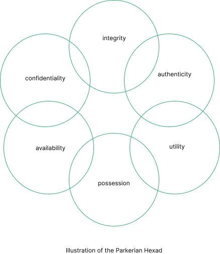

:orphan:
(the-parkerian-hexad-a-more-complete-set-of-information-security-elements)=

# The Parkerian Hexad A More Complete Set of Information Security Elements

The Parkerian hexad is a set of information security elements that are comprised of confidentiality, integrity, availability, possession/control, authenticity, and utility. As you might already guess there are three additional attributes that are proposed by Donn B. Parker. We can say that the Parkerian hexad is a more complicated variant of the traditional CIA triad. In this blog post, you will be provided with the parkerian hexad and its components.

## Elements of the Parkerian hexad

The Parkerian hexad incorporates the confidentiality and availability elements of the CIA triad principles, with the same meanings as before. However, integrity is defined slightly differently.

**Definition of Integrity in the Parkerian Hexad**

In Parkerian Hexad, the data must be entire and unaltered from its former condition. Integrity implies that the information is whole, sound, and undamaged. It signifies that the information is comprehensive and it is in the desired excellent order. Now that we have clarified how the integrity element differs from CIA triads, let’s take a look at other components of the Parkerian Hexad.

**Possession or Control**

The actual distribution of the device on which the information is stored is referred to as possession or control. Possession allows you to analyze a potential data loss in its storage device without incorporating additional issues like availability.

**Authenticity**

The concept of authenticity allows you to specify whether you have correctly assigned a specific data to its legitimate owner or author. For example, let’s assume that you send an email message that has been edited to appear to have originated from a different email address than the one from which you actually sent. In this case, you compromise the email's validity. To address this issue you can utilize digital signatures to guarantee authenticity.

**Utility**

The utility component depends on the data and its presentation. You can have varying degrees of utility and it relates to the data's usefulness to you. Consider transferring files and directories to another virtual machine present in a shared data center in the cloud. Assume that you encrypted some of the files. The encrypted files would be useless to an attacker or other unauthorized person since the data would be unreadable. However, unencrypted files would be far more useful since the attacker or unauthorized person would be able to access the data.

## Conclusion

The principles covered in the Parkerian hexad give a solid foundation for discussing all of the possible outcomes in the domain of information security. By the end of this page, you should be able to explain the components of the parkerian hexad and how.

:::{seealso}
Do you want to get practical skills to work in cybersecurity or advance your career? Enrol in [MCSI Bootcamps](https://www.mosse-institute.com/bootcamps.html)
:::
