:orphan:
(top-5-osint-tools-to-fact-check-social-media-content)=

# Top 5 OSINT Tools to Fact-check Social Media Content

In this day and age, it's important to be able to fact-check social media content. With the spread of fake news, it's more important than ever to be able to verify the accuracy of what you're seeing online. That's where OSINT comes in. OSINT, or open-source intelligence, is the practice of using publically available information to verify facts. There are a number of different OSINT tools available, and in this blog post, we'll be taking a look at the top five tools to fact check social media content.

## Introduction

One major problem of open-source media platforms is that they are frequently used to propagate disinformation, which may severe economic, social, and political effects. While there is so much misinformation on social media, it has become necessary to check accurate information. This is when open source fact-checking tools come in handy. Before we go into tool examples, let's define what is fact-checking.

### What is fact-checking?

Fact-checking, according to Wikipedia, is a practice that aims to evaluate factual data to promote its validity and accuracy of it.

**What is fact-checking?**

Fact-checking software is useful for examining news, and media and detecting and validating fraudulent images, contents, and statements.

**What are the verification components in the first draft?**

When viewing internet media, it is useful to be aware of certain fundamental fact-checking concepts to look for.

- Originality: Is the first draft an original narrative, article, or piece of content?

- Source: Who created the first draft, or who captured the initial piece of content?

- Time: When was it made?

- Where: Where was the draft created or captured?

- Motivation: Why was the draft built or captured?

## Social media fact-checking and verification tools

Let’s have a look at the social media fact-checking and verification tools:

There are various sites that may help you in determining to answer the initial questions. The following are the most significant:

## 1- InVID

InVID is a plugin to debunk fake news and verify videos and images. While you perform an OSINT fact-checking analysis as a first step, download the extension on your firefox or chrome web browser. Go to the video source and copy the link to the video you want to debunk. Open InVID as shown in the screenshot. Click on tools, and video analysis, and copy and paste the source of the video.

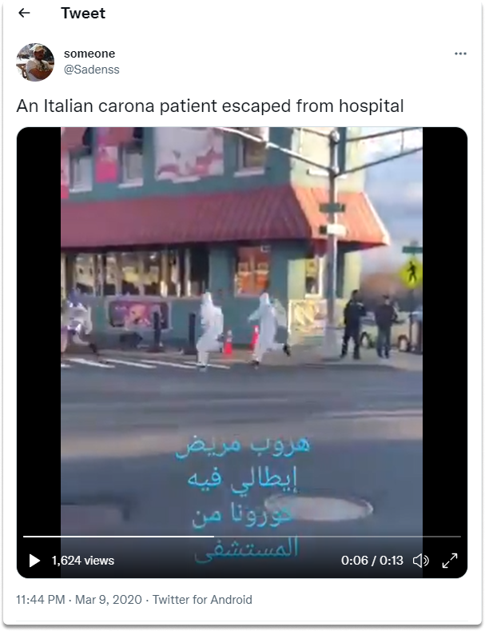

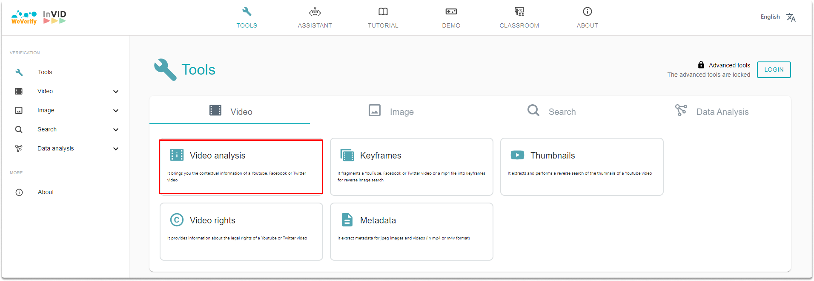

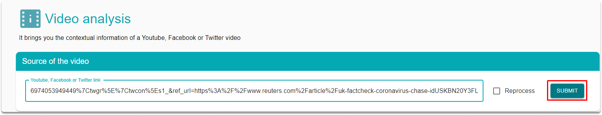

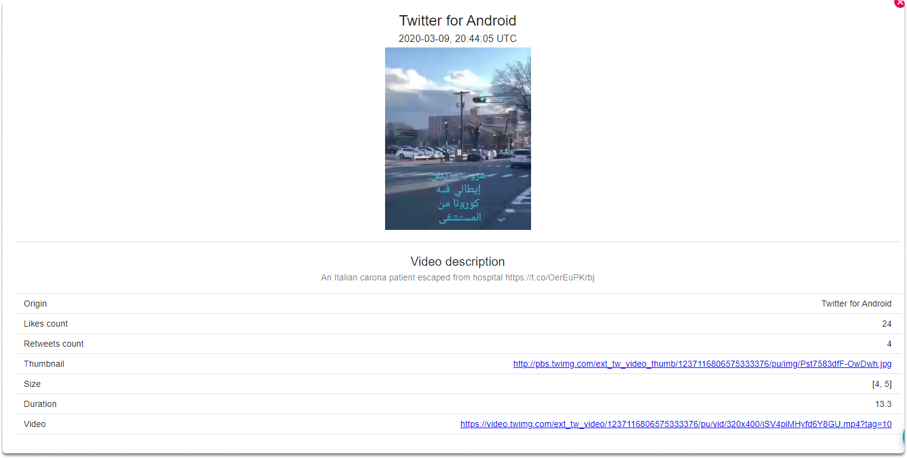

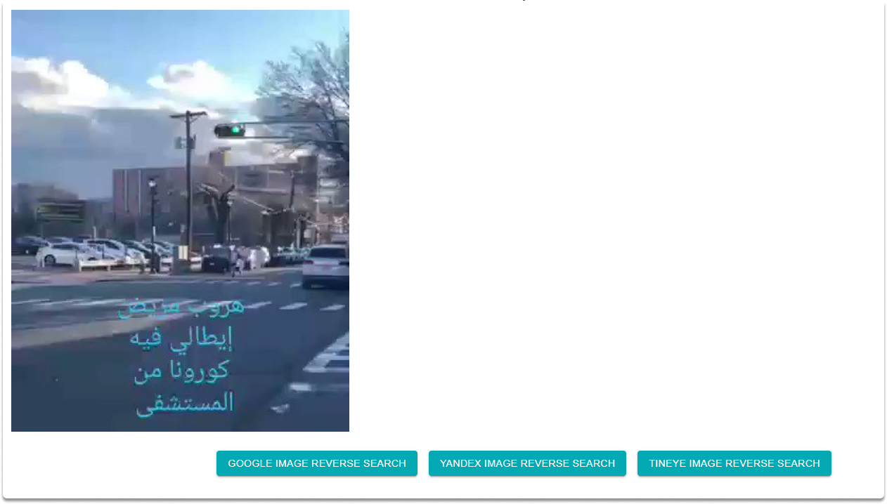

## 2- Google image search

Google image search (or alternative search engines such as Yandex)allows you to reverse an image on the web. Since we have a thumbnail of the video we want to fact-check we can make a reverse image analysis to find out if the same thumbnail has been uploaded before. In this case, we will upload the thumbnail. As an alternative, you can click on the reverse image search buttons suited to your needs in InVID itself. As you can clearly see in the outputs both ways lead us to the same result page on which you can find out details such as whether the video was uploaded before, when, on which platforms, and are there any versions of it. With reverse image search, you can find various versions where you may have a better resolution or clues that might be useful in the next step.

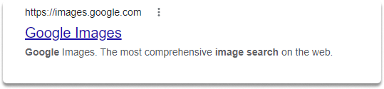

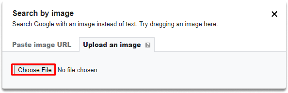

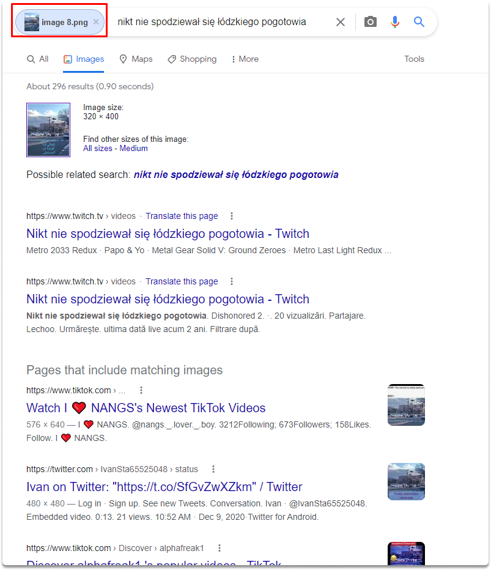

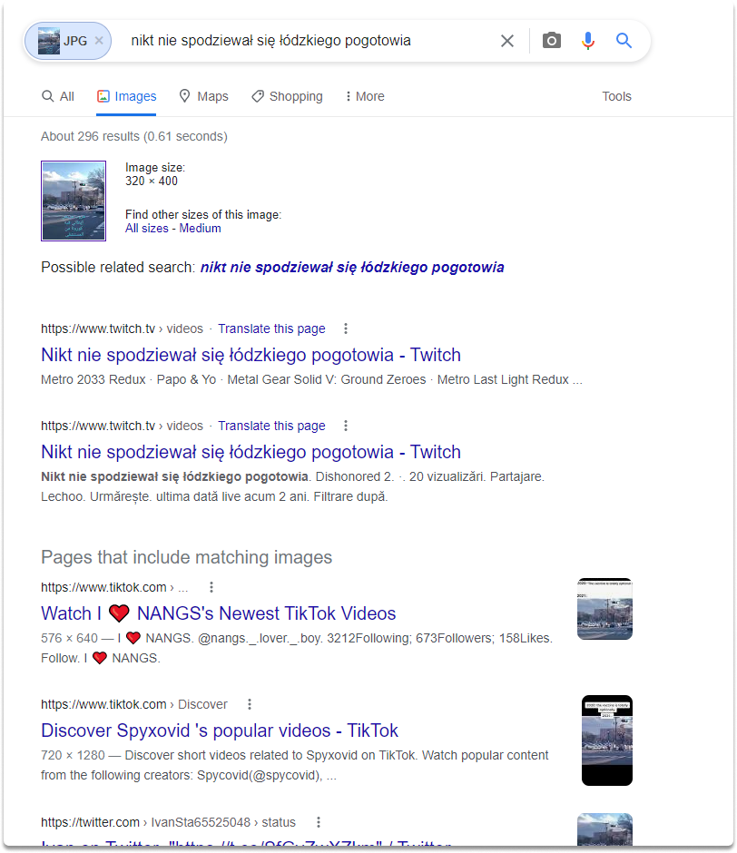

## 3- Google search

You can type the details you found in the video on a google search bar. As you can see in the results, we have found a location clue.

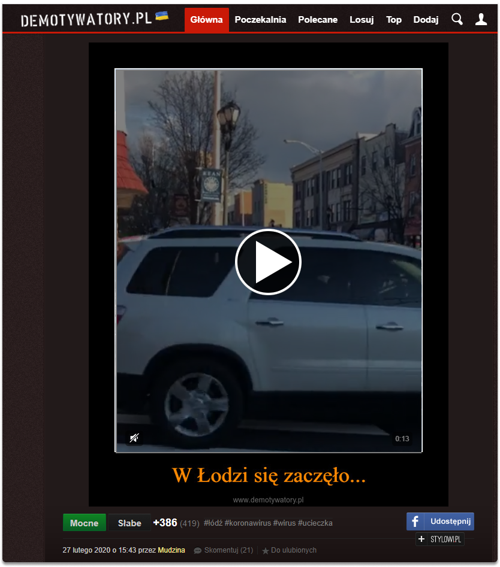

## 4- Google maps

As we have discussed in another blog post, Google maps can give you very detailed information about a location in the world. You can find where the video is from or what is the original source by taking a look at the details of an image or video. You can search the details you found on google maps to locate the source of the video and deepen your research ftom there.

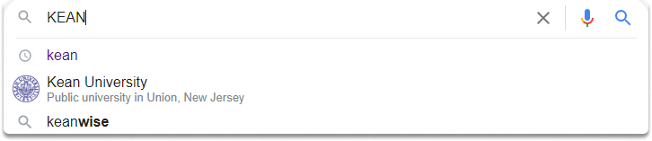

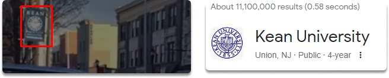

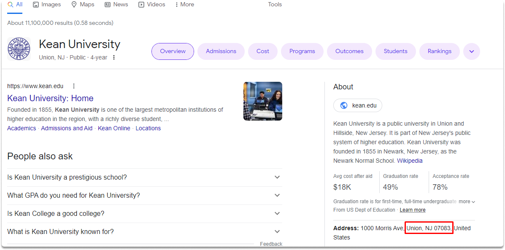

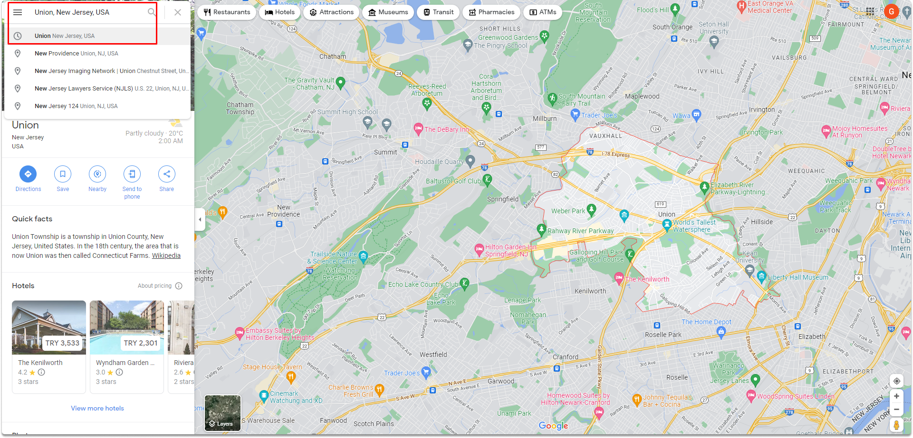

## 5- Snopes

Snopes uncovers fake news, tales, and urban legends and investigates/validates rumors to determine their veracity. It is now the oldest and largest online fact-checking site, generally considered a useful research tool by reporters, ethnologists, and users.

:::{seealso}
Want to learn practical Open-Source Intelligence skills? Enrol in MCSI’s [MOIS - Certified OSINT Expert Program](https://www.mosse-institute.com/certifications/mois-certified-osint-expert.html)
:::
