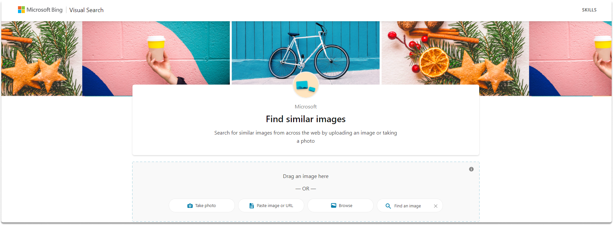

:orphan:
(top-5-reverse-image-search-tools)=

# Top 5 Reverse Image Search Tools

A reverse image search feeds a picture to a search engine for analysis, whereas a conventional internet search includes typing words into a search engine for relevant results. It operates by uploading a picture or entering its URL into a reverse image search engine, which will check its database for additional areas where such an image exists online and show all of them. Thus, you can determine the source of images. The findings may differ based on the website you chose. In this blog post, we will take a look at the top 5 tools that you can use for reverse image search.

Let’s start by explaining what is a reverse image search.

## Reverse image search engine tools

Here are various reverse image search engine websites you can utilize:

**Yandex**

Yandex is a Russian-based search engine. Yandex offers an image search feature that may be used to perform a reverse image search. Simply input the complete URL of the digital image of interest and search for similar photos on other websites. You may search for images by dragging them and selecting the file as shown in the image.

**Bing**

Bing is another web search engine that you can use for reverse image searches. By clicking the camera symbol to the right of the search area, you may also access Bing Images. Although you will obtain fewer results than Google Image Search, you will be able to match more photos. There are several ways to search for reverse images, including copying the image or URL, snapping a snapshot, and dragging an image.

**TinEye**

TinEye is another website that offers reverse picture analysis. These findings tend to concentrate on precisely identical photos. Over 54.9 billion photographs have been indexed so far (source: https://tineye.com/faq). You may reverse search an image by uploading, pasting, or typing the URL.

You may either copy and paste or input the image's URL. You may also drag & drop or pick the image, as seen in the screenshot.

**Google**

Google reverse search provides an image reverse engine in which you can query images. You can either insert a URL into the search field. Alternatively, you can also upload any image you want. You may search for any image by either copying the URL or uploading an image as you can see in the examples.

Lastly, let's take a look at Baidu.

**Baidu Images**

Baidu is a Chinese search engine. Baidu, like other search engines, provides a reverse image search. Baidu presently does not have an English version of its site and solely displays Chinese content. For better demonstrative purposes, we used Google Translate in the screenshots below. When you go to Baidu, you'll see a search box with a little camera symbol to the right.

## Conclusion

In this blog post, we explored various reverse image tools that you can use in your reverse image search studies. Now you know what is a reverse image search and which open-source tools you can use.

> **Want to learn practical Open-Source Intelligence skills? Enrol in MCSI’s [MOIS - Certified OSINT Expert Program](https://www.mosse-institute.com/certifications/mois-certified-osint-expert.html)**
