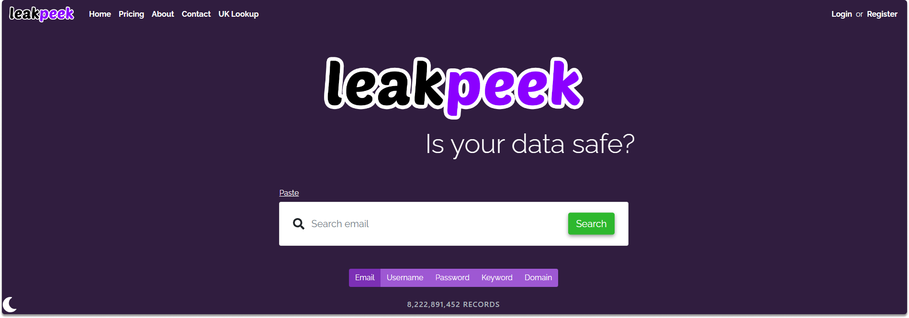
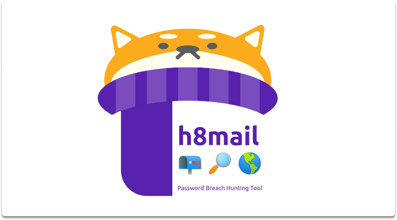
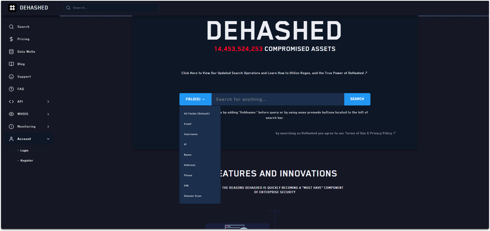
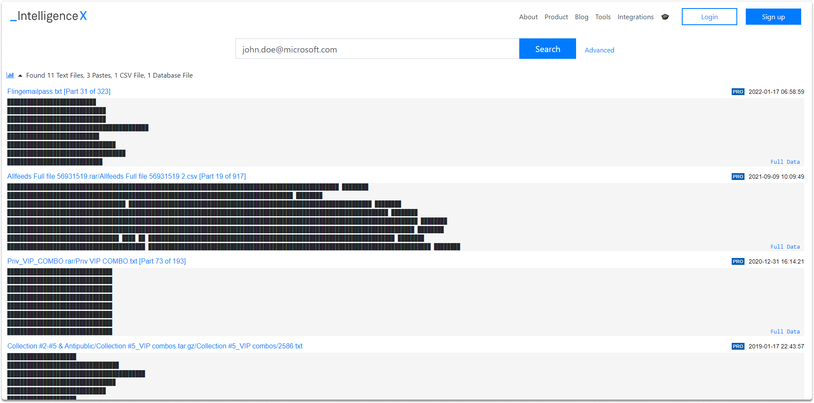
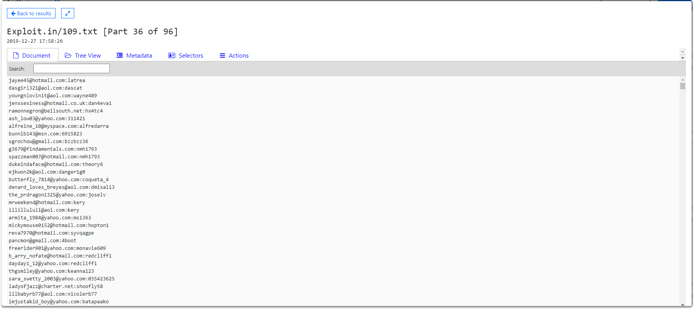
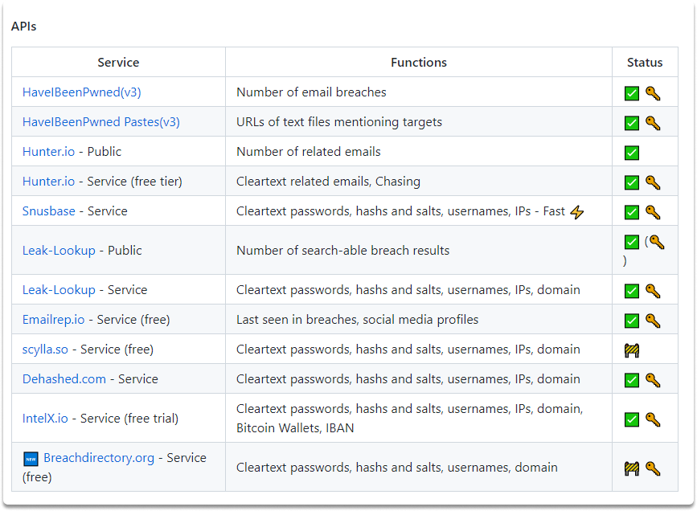

:orphan:
(top-5-tools-for-hunting-breached-passwords)=

# Top 5 Tools for Hunting Breached Passwords

In the past few years, there have been many high-profile data breaches. As a result, it's now more important than ever to make sure your passwords are strong and unique. However, if you've ever been caught up in a data breach or doing an OSINT research, you may be wondering how to find out if an email address was compromised. In this blog post, we'll introduce you to some of the best tools for hunting down breached passwords.

**Leakpeek**

Leakpeek lets you check for an email or username in any breached databases (in 8,000,000,000 records by 2022 July), to see publicly leaked passwords. You can open a browser and type *https://leakpeek.com/*.

On the main page, you can copy and paste the email address as shown in the following image. As you can see in the below image, there are four entries found on various websites such as in _Fling.com_, _MySpace.com_, and _MyHeritage.com_. You can also see that passwords are partially hidden in the free plan.

**DeHashed**

DeHashed is a powerful compromised data search engine designed to provide insight into database breaches and account leakage. DeHashed harvests emails and account credentials from breached data leaks and delivers all the credentials for a certain email address.

You may search by email, username, IP address, phone number, domain name, and other keywords.

You can find valuable information such as password hashes that you may relate to other accounts of the subject you are researching.

When you get a hash, there are likely to be multiple breached password hashes for the email address you are researching. If there is a pattern or if you recycle your passwords, it will be easily identifiable.

**LeakCheck**

Another breached password hunting tool is LeakCheck.

After you register at LeakCheck, you can display a portion of the password of the dumped email address. From there on, you may want to use a dictionary to brute force or guess the password. You can find the website at the following link: https://leakcheck.net/

**Intelligence X**

Intelligence X is another breached database search engine. If you will use a free version, you will see that the information is redacted.

However, when you scroll down through the database you will see other publicly available passwords and accounts as shown in the following image.

**H8mail**

h8mail is another powerfull email OSINT and breach hunting tool.

What makes you h8mail is so effective is that you can combine it with other osint tools such as theHarvester. You can feed a single or a collection of email addresses to h8mail to find out plaintext passwords. You can use h8mail locally by downloading the whole database or connecting h8mail to an API. You can learn more about this effective tool at the following address: https://github.com/khast3x/h8mail

## Conclusion

By the completion of this blog post, you have gained an insight into various OSINT breached password tools. Keep in mind that websites come and go. Any tool discussed above may be down at the time of your reading. However, there will be always new tools that you’ll be aware of with quick research.

:::{seealso}
Want to learn practical Open-Source Intelligence skills? Enrol in MCSI’s [MOIS - Certified OSINT Expert Program](https://www.mosse-institute.com/certifications/mois-certified-osint-expert.html)
:::
