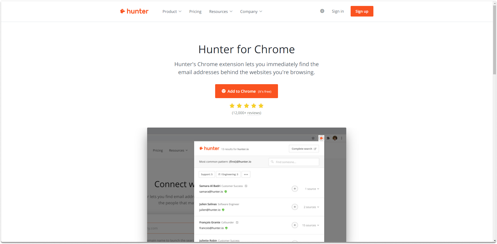
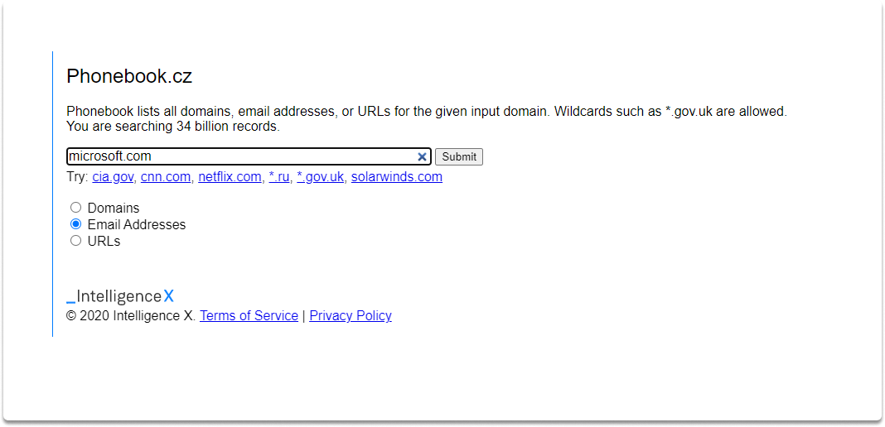
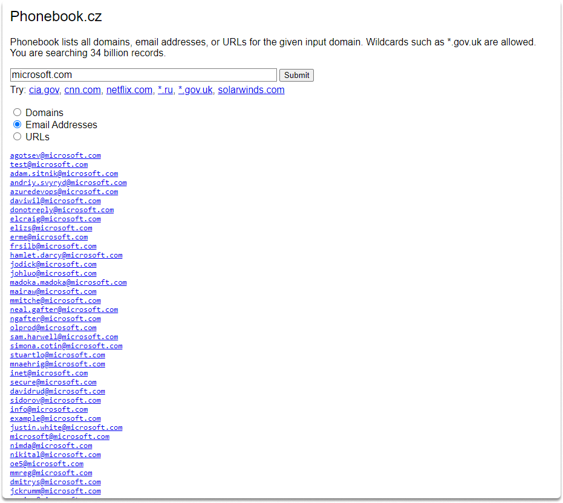
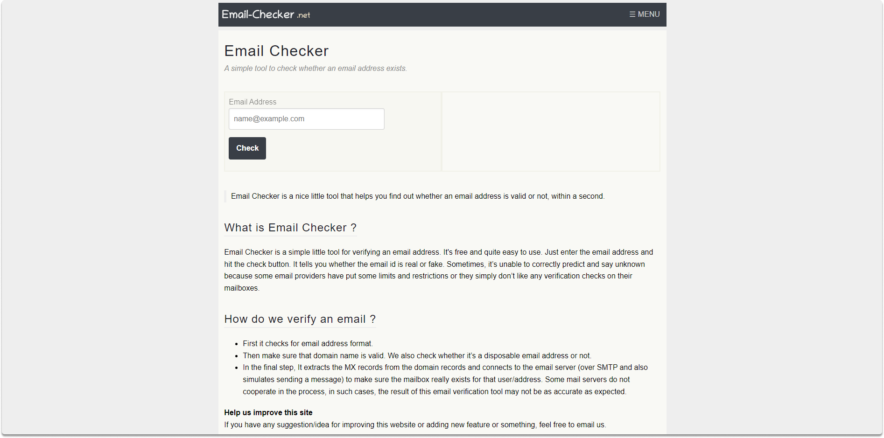
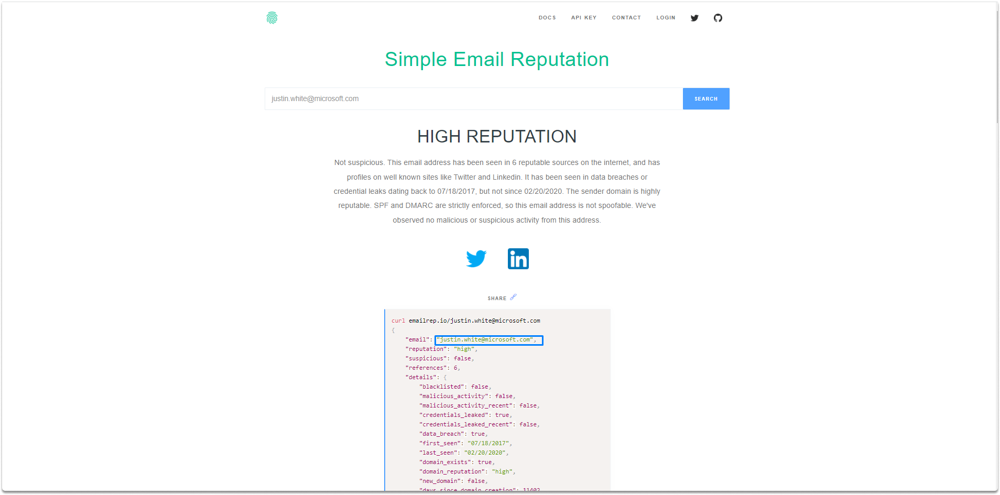

:orphan:
(top-5-tools-to-use-for-email-osint)=

# Top 5 Tools to Use for Email OSINT

There are several methods for locating someone's email address on the web such as looking at their about page, going through their social media accounts, and so on. However, these manual approaches may be unreliable too time-consuming. That’s why you may need some tools to address this problem. This blog will describe what email OSINT is and what tools and methods are available to gather the email addresses of your target business or individual.

## What is an email OSINT?

Email OSINT is a way of gathering emails from target organizations or people that are accessible online. We may use free services to find persons based on their related e-mail addresses. These email validation services verify the existence of an e-mail address and provide additional comprehensive technical details that might be valuable for our study. Let's have a look at some tools that might help us with this.

**Hunter**

The first tool we are going to mention is Hunter.io. Hunter is an email discovery and validator program that allows you to locate contact details for any website. Hunter has also a chrome extension that gives 25 free searches a month.

You can export the results into a `csv` file. You can find the extension link here: https://hunter.io/chrome

Now let’s take a look at another tool which is` phonebook.cz`

**Phonebook**

`Phonebook.cz` can assist you in locating email addresses for a specific firm. It will show a list of corporate email addresses, and you can also search for domains and URLs.

As you can see there are a bunch of results that are potential email addresses for microsoft.com.

**Norbert**

Norbert is another email finder tool that you can find at the following link: https://www.voilanorbert.com/. They put the email address through an email vetting process to confirm its correctness, assigning a `certainty score` to each email.

Now let’s have a look at another email verification tool

**Email Checker**

Email Checker is another tool for validating email addresses. In some cases, you may have various email addresses and need to check if they are valid. Sometimes, email providers, may put limits or restrict any verification checks. Apart from this and false negatives, the email checker is a fast tool that you may want to utilize in manual or automated research.

**Simple Email Reputation**

This web-based tool checks the reputation of an email address. If the result has no reputation it simply means that the email has not been viewed anyplace reliable on the internet. In the following image we checked an email we found in earlier phases.

You can learn more if you’re interested in how the API works at the following link: https://github.com/sublime-security/emailrep.io

## Summary

On this blog page, we have discovered what is email OSINT and what are tools to utilize for this purpose.

:::{seealso}
Want to learn practical Open-Source Intelligence skills? Enrol in MCSI’s [MOIS - Certified OSINT Expert Program](https://www.mosse-institute.com/certifications/mois-certified-osint-expert.html)
:::
