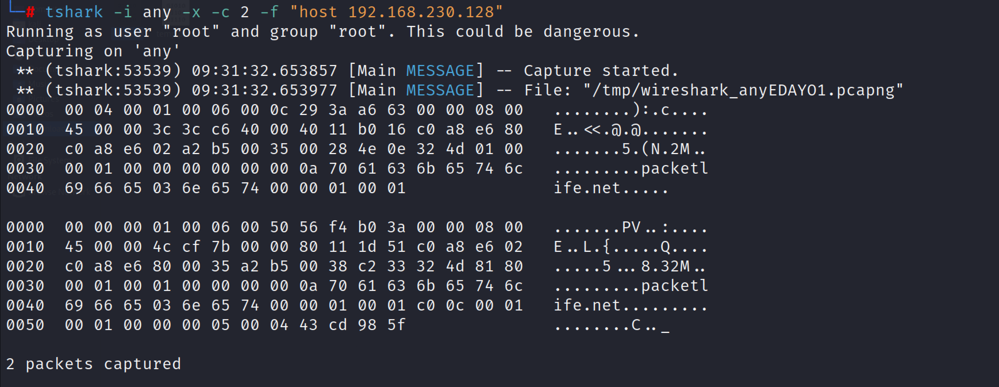

:orphan:
(tshark-wiresharks-command-line-interface-alternative)=
# Tshark Wiresharks Command Line Interface Alternative
 
Wireshark is a packet analyzer and sniffer. It captures network traffic on the local network and stores it for further analysis. This tool is mostly used by system administrators and IT professionals to troubleshoot network errors in real-time. However, Wireshark also provides a powerful command-line tool called Tshark for people who enjoy working on the command line interface. Tshark also lets you capture packet data from a live network, and read packets from a previously captured file. The native capture file format of TShark is libpcap, which is also used by tcpdump and other utilities.

## Tshark Installation 

Use the following command to install tshark on Linux operating system:
`sudo apt-get install tshark` 
If the Wireshark package is installed, then by default tshark utility will also be installed, to check the version tshark tool:
`tshark -v `


*note: if logged in as a regular user, then you would need sudo rights to use the tshark utility.*

A network interface card (NIC) or a WiFi card is used by servers, workstations, and desktop computers to process network traffic. Run the following command to see what network devices are accessible to TShark.

`tshark -D `


## Packet capturing 

After the interface is known for capturing packets, we can start capturing some packets. The `-i` option should be used to mention the interface to capture on. The following command can be used to start capturing on the `eth0` interface. 
`tshark -i eth0 `


*Note: from the above command the captured network packets are stored in the /tmp directory.* 

The `-w` options can be used to capture network packets and copy them into the designated file of format pcap. 

`Tshark -i <interface> -w <file_name>.pcap`


*Note: Initially you would need to create a file called temp.pcap otherwise the tshark will give an error and will stop the capture.* 

### Capture packets only from a specific source or destination IP

Network engineers and security researchers use this command the most often. Use the `-f` option to filter traffic based on a certain IP. 
`tshark -i <interface> -f “host <IP>”`


You can even dump the packet’s hexadecimal format by adding an `-x `to the tshark command, and the tshark utility gives the user the option to display a particular number of captured packets with help of `-c` option.



### Capture only specific protocol network packets

The command can be used to only capture packets from specified protocols while displaying the results of the tshark tool. 

`Tshark -i <interface> -f “<protocol”>`


*Tcp,udp,dns,icmp,arp,etc.. Can be protocols to capture.*

### To view an entire packet 

To view an entire packet in the tshark tool the `-V `flag can be used. The output is broken into several portions, beginning with Frames and progressing to Ethernet, Internet Protocol, and so on.

`tshark -i eth0 -c 1 -V -f "icmp" ` 


### To read captured packets with tshark 

The user can simply read saved pcap files by using the tshark option `-r`. 
`tshark -r <file-name>.pcap `


Tshark will display the capture file's packets on standard output. This may appear difficult, but  Tshark's command line output is similar to the Wireshark interface.
```
Packet number, Time, Source, Destination, Protocol, Length, Info
4   0.911310 145.254.160.237 → 65.208.228.223 HTTP 533 GET /download.html HTTP/1.1 
```
- The time column indicates the time the packet was captured. 
- Source and Destination entries display the packet's source and destination IP addresses.
- The protocol used is displayed in the Protocol field. 
- Length shows the length of the packet
- Info shows the additional info about the packet. 

By passing the tshark output into grep, these packet summaries can be filtered. 


## Conclusion: 

The article covers the fundamentals of packet capture and analysis with the tshark tool. You can use multiple options inside the same command to narrow down the results to your unique interests. More information about the filters can be found on the tshark tool's manual page.

:::{seealso}
Do you want to get practical skills to work in cybersecurity or advance your career? Enrol in [MCSI Bootcamps](https://www.mosse-institute.com/bootcamps.html)
:::