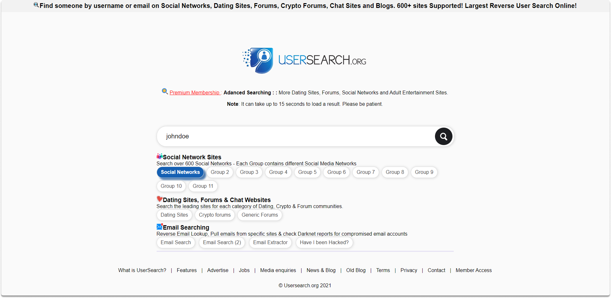

:orphan:
(username-search-tools-making-online-research-easier)=

# Username Search Tools Making Online Research Easier

Once you find an email address, you may now have the target's username. Username details might connect to a lot more information during OSINT research since a particular username may be used as a login credential on other platforms. You can perform a manual search initially. However, it is hard to keep up with a ton of websites. At this point, you may need some tools to facilitate your research. In this blog post, we will take a look at five username search tools you can benefit from in OSINT operations.

Let's take a look at some of the tools you may use to do OSINT username searches.

**Namechk**

Namechk is an open-source web-based username and domain name lookup tool. As demonstrated in the images below, you may verify whether a specific username is used for significant domain names and social networking sites. You can findNamechk here

You can see all available domains and usernames in the above image.

**WhatsMyName**

WhatsMyName allows you to search for usernames on several websites. Simply enter your POI into the search field and narrow the results using the site and category criteria.

**User Search**

User search looks for the specified username on major sites and produces a list of detected accounts that match the target. You can use this website in conjunction with other username search tools in your toolbox to verify your account.

**Knowem**

KnowEm searches the most prominent social networking sites for the existence of the username you specified. A search for the username "johndoe" returns information on its availability on the top 25 networks.

You can review the search of the top social Networks in the below image:

You can also categorize the searches by blogging, bookmarking, business, community, design, entertainment, health, information, and so on. You can find the site here.

**Namevine**

Namevine is a tool that searches for registered accounts on the top 10 social networks. You might want to utilize this tool if you don't know the whole user name of the individual you're looking into.

Twitter, Facebook, Pinterest, YouTube, Instagram, Tumblr, WordPress, Blogger, and Github are all searched by Namevine. You may also perform a domain name search.

## Conclusion

Using the above services, you may search usernames across many websites, and in particle ones, you may receive links to profiles that you are researching. Because users may use duplicate usernames for the same rationale they recycle their passwords, you may discover websites or services linked to the username you discovered during an OSINT study.

:::{seealso}
Want to learn practical Open-Source Intelligence skills? Enrol in MCSI’s [MOIS - Certified OSINT Expert Program](https://www.mosse-institute.com/certifications/mois-certified-osint-expert.html)
:::
