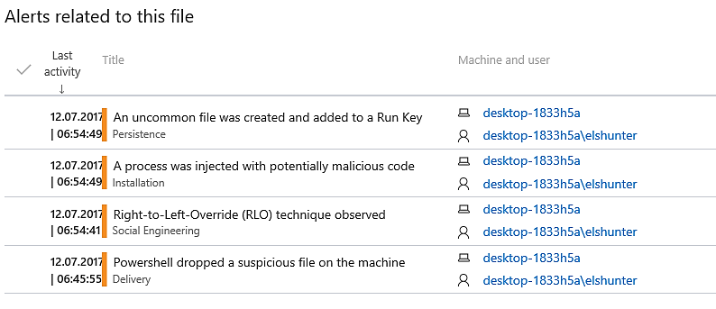

:orphan:
(windows-advanced-threat-protection)=
# Windows Advanced Threat Protection
 
Windows Defender Advanced Threat Defense (ATP) offers proactive protection, detects threats and zero-day exploits, and provides centralized management for the whole security lifecycle.   

You may view additional details about the product on its [official website](https://www.microsoft.com/en-us/windowsforbusiness/windows-atp).    

Windows Defender ATP requires no agent and is integrated into the operating system.    

ATP is capable of adapting to evolving threats, deploying new defenses, and coordinating cleanup.    

ATP employs the following to defend against sophisticated threats:     

- Windows Defender System Guard    
- Windows Defender Application Guard     
- Windows Defender Exploit Guard   
- Windows Defender Antivirus    
- Windows Defender Application Control     

Microsoft also promotes it as a threat hunting tool: "Instantly search and explore six months of historical endpoint data."

To access a trial version of Windows Defender ATP, you must register and accept the Trial Online Service Terms. If authorized, you will be offered a 90-day trial period to evaluate ATP.

     

The previous screenshot demonstrates that ATP was able to correctly detect Mimikatz merely being put onto the machine rather than being executed.    

When we click on the warning, a new window pops up with further information that we can look at.    

    

The previous screenshot shows us that it provides us with a severity level; in this case, we can see that it is low. It explains the category of malware that this would be classified as, which is "credential stealing" in this particular instance.     

In addition, the impacted computer as well as the date and time stamps are displayed below.    

Additionally, the warning provides us with a concise explanation of the virus, as well as suggested responses, a process tree for alerts, and an event graph.      

We are able to determine what was dropped onto the machine by looking at the event graph.    
In this instance, a zipped file that contains Mimikatz as well as a Mimikatz script written in PowerShell.     

    

     

Now, let's take a look at one of the high alarms that is displayed on the dashboard. This one also appears to be connected to Mimikatz.    

    

    

This is a warning that the file `Invoke-Mimikatz.ps1` was either generated in notepad or copied and pasted into it from somewhere else.     

    

The original name of the PS1 file that is stored on the image is `Invoke-Mimikatz.ps1`, but it has since been renamed to `Invoke-MMK.ps1`.      

     

The hash of the file, as well as its location on the disk, is sent to us by ATP.     

     

Microsoft will present you with a harmless Microsoft Word document as part of the demonstration. This document will cause your test machine to behave as though it were under assault.     

We will gain an understanding of what the effects of this simulated attack will be, as well as how ATP identified the so-called attack.    

The graphic on the bottom provides an illustration of many threats being identified at the same time.    

Take note that there is also a risk rating provided.    

   

Let's look into one of the warnings a little bit further.      

Again, we have the ability to investigate further particulars by widening the suspicious activity that was reported:     

   

The given description includes information about the parent process as well as the potentially suspicious execution event: 

    

On the image at the bottom, we can see the complete process tree that resulted in this action being marked as suspicious. This can be seen because it was displayed there.      

       

Finally, we are also provided with the hashes of the files.

    

In essence, Microsoft Word initiated the execution of PowerShell, and PowerShell produced a file that has the appearance of a JPG file.     

In order to determine what ATP found concerning this JPG file, let's take a look at a few more alerts.     

A portion of the PowerShell command that was run from within the Word document is displayed in the Description section of this page.     

   

After this, we are able to observe `RuntimeBroker.exe`, which was launched by the "JPG" file, establishing an outbound connection on port `80`.    

    

Persistence was discovered by abusing a Registry Run key.   

   

    

A tree-like visual diagram is also displayed, showing how the registry key was added after it was created.    

    

Another alert associated with the file is the detection of process injection:    

   

    

The action is depicted once more in the following graphical format:   

    

When we click on the JPG file, another window pops up displaying a variety of information that is unique to the analysis of the file.     

We can see that ATP has provided us with the file's hashes. Additionally, it sends the file to VirusTotal so that it can be analyzed there. ATP informs us of the total number of other endpoints around the world that have reported being infected with this file.    

    

In this section, we take a look at the malicious activities that were carried out by the file while it was on the machine.      

The fact that this file communicated outbound to an external IP address, which we had previously seen in another alert, is something that immediately jumps out at you.     

    

In this section, we are able to see an overview of the detected alerts:    

    

The following is a view of the statistics that tells us the file was only discovered on one of the host machines:     

    

## Microsoft Advanced Threat Analytics

**Microsoft Advanced Threat Analytics** is yet another helpful tool made available by Microsoft (ATA).

According to what is stated on the website, Advanced Threat Analytics can help you lower the risk of suffering expensive damage and provide you with all the information you require in the form of a clear, real-time view of the attack timeline.     

Embedded with all of the intelligence necessary to learn, analyze, and identify normal and suspicious user or device behavior, the system can also learn from previous interactions.   

ATA brags that there is no need to create rules, fine-tune, or monitor a flood of security reports. This is something that they say is a significant advantage.        

It is highly developed, capable of learning on its own, and is always ready to analyze events and threat intelligence.     

## Conclusion

The Windows Advanced Threat Protection tool is undeniably helpful, and it is not overly complicated to use its features once you get the hang of the interface.  

The information is straightforward and applicable.    

## References

[Windows ATP](https://www.microsoft.com/en-us/windowsforbusiness/windows-atp)   

> **Want to learn practical Secure Software Development skills? Enrol in MCSI’s [MASE - Certified Application Security Engineer](https://www.mosse-institute.com/certifications/mase-certified-application-security-engineer.html).**