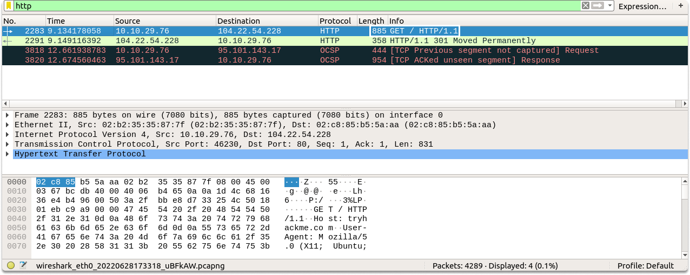
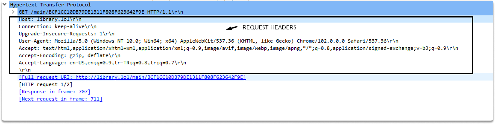

:orphan:
(wireshark-http-request-analysis)=

# Wireshark HTTP Request Analysis

Understanding how to assess HTTP may help with numerous security activities, such as detecting attack vectors, recognizing malicious HTTP requests, and detecting user-agent abnormalities. In this blog post, we are going to learn HTTP requests by capturing packets in Wireshark. Let’s start with a quick refresher on the most important characteristics of HTTP.

## What is HTTP?

The Hypertext Transfer Protocol (HTTP) specifies how your web browser uses Internet Protocol to connect with a remote computer. Both the client and the server must agree to use the same requirements in order to interpret the messages sent and received by each. HTTP is a **stateless** protocol that allows information to be sent between a client and server in **clear text** (rather than binary format). It works on the OSI model's seventh layer (application).

In typical functioning, HTTP uses TCP ports 80 or 8000. It may, however, be adjusted in extreme cases to utilize different port numbers.

Let's look at an HTTP protocol in action now.

## A peek at HTTP requests with Wireshark

HTTP requests enable a client machine to give data about itself to a server and additional data about a request and control over how it is carried out.

The client starts an HTTP session by connecting to the HTTP server with whom it wants to interact. It then transmits the request packet to the server and specifies the action to perform.

`<METHOD> <request-uri> <HTTP-VERSION>`



As you already know, HTTP is a straightforward protocol which means that we don’t look for any handshake before communication. Let’s look at a request line:

**Request line**: A request line specifies an action, a resource on which to perform the action, and gives information about the HTTP version it uses.


**Method**: The method is just the action that the client wishes the server to do. It is always written in capital letters. As you can see in the screenshot our method is GET in this particular packet.

**Request URI**:

In an HTTP/1.1 request block, you specify the address and file name.
Assume the user types in something like this:

`http://library.lol/main/BCF1CC10DB79DE1311F808F623642F9E`

The client then specifies the URI as the following:

`GET /main/BCF1CC10DB79DE1311F808F623642F9E”`

As you can see in the image, the host line contain “library.lol\r\n”. As a result, the request would begin as follows:

```
GET /main/BCF1CC10DB79DE1311F808F623642F9E HTTP/1.1
Host: library.lol\r\n
```



**HTTP Version**: The HTTP-VERSION element informs the server of the client's version so that the server understands how to read the request and what to provide or not in response. As you can see in our screenshot the HTTP version is HTTP/1.1.

And then headers follow if there is any additional data client wants to add.

## Conclusion

Upon completion of this blog page, now you have learned what a standard HTTP request traffic looks like and how to dissect an HTTP request during traffic analysis via Wireshark.

> **Do you want to get practical skills to work in cybersecurity or advance your career? Enrol in [MCSI Bootcamps](https://www.mosse-institute.com/bootcamps.html)!**
