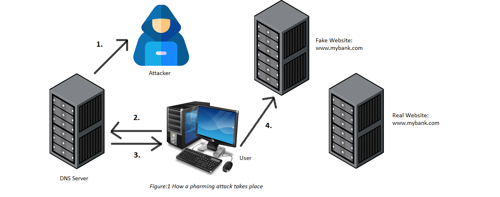

:orphan:
(pharming)=

# Pharming

By now, you are likely familiar with phishing attacks, which involve hackers sending out fraudulent emails, instant messages, or creating deceptive websites designed to mimic legitimate sources. A similar type of social engineering attack is pharming, where the attacker has motives similar to a phishing attack. In this article, we will delve into the fundamentals of a pharming attack, its workings, and measures individuals or organizations can take to avoid falling victim to this type of attack.

## What is Pharming?

A pharming attack is a technique in which an attacker redirects a victim to a seemingly legitimate, yet fake, website. The purpose of a pharming attack is to deceive users and steal their sensitive information, such as login credentials, financial details, or personal data.

## How does a Pharming Attack take place?
A pharming attack can take place in two different ways:

### DNS Poisoning:

In this type of attack, the malicious actor employs a technique known as DNS poisoning, where they manipulate a DNS(Domain Name System) server to provide an incorrect IP address when resolving a hostname. To better grasp this method, let's examine the following scenario:

Suppose when you type a website address like www.example.com in your web browser, your computer doesn't know the exact location of that website on the internet. It then sends a request to a DNS server, which acts like a phonebook for the internet. It knows the IP addresses (unique numbers) associated with different website addresses.

The DNS server receives your request and checks if it has the IP address for www.example.com in its records. If it has the information, it sends the corresponding IP address back to your computer. Subsequently, your web browser connects to that IP address and retrieves the webpage, which is then displayed on your screen.

Now, let's suppose the attacker has tampered with or poisoned this DNS server so that it has an incorrect IP address for the website you requested. As a result, when you input www.example.com and send a request to this DNS server, it furnishes your system with the incorrect IP address. Consequently, instead of accessing www.example.com, you are redirected to the attacker's website, www.evil-site.com.

### Malware-Based Pharming:

Malware-based pharming involves infecting a victim's computer with malicious software (malware). This malware manipulates the DNS settings or modifies the hosts file on the compromised system. As a result, the system's user requests are redirected to fraudulent or malicious websites.

## Pharming Attack Demonstration:

Let us take a look at the pharming attack demonstration, as shown in Figure 1.

1. The attacker conducts some form of DNS attack that results in a corrupted DNS resolution.

2. The victim user types in a web address of his online banking website, www.mybank.com. His system sends a request to the DNS server.

3. In response, the DNS server responds with an incorrect IP address and points him to a different website.

4. The target user visits this website that looks and feels just like the requested website. Now if the user enters his username and password for this website, these credentials are easily stolen by the hacker.

## Ways to Prevent a Pharming Att

This section presents some of the measures that you can take to avoid becoming a victim of a pharming attack.

* Do not click on any links or open/download attachments from unsolicited emails or suspicious sources. 
* Employ a robust antimalware and antivirus solution. Make sure that it is updated to the latest version.
* Choose a reputable DNS service provider that has effective security measures in place to prevent these attacks.
* Whenever you access sensitive websites, ensure that you are using a secure and encrypted connection. Look for the "https" prefix in the website URL, which indicates a secure connection. Avoid transmitting sensitive information over unsecured Wi-Fi networks or unknown public networks.
* Utilize strong authentication methods, such as two-factor authentication (2FA) or multi-factor authentication (MFA), for accessing sensitive online accounts. This adds an extra layer of security and makes it more difficult for attackers to gain unauthorized access.
* Always review the address bar in your browser to see if the domain name of the requested website is correct.
* Conduct training and awareness programs to educate employees about the risks of pharming attacks, phishing emails, and other social engineering techniques. Encourage them to report any suspicious activities or potential security breaches to the appropriate IT personnel.

## Conclusion:

By staying vigilant and implementing preventive measures, you can minimize the risk of falling victim to these deceptive and malicious attacks, preserving the security of your online activities and sensitive information.