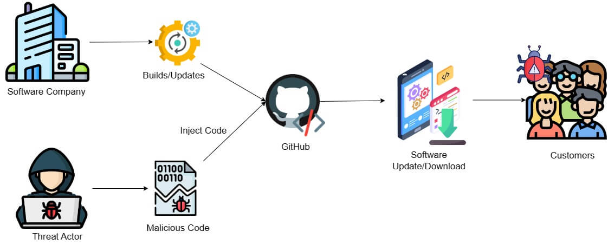

:orphan:
(supply-chain-attacks)=

# Supply Chain Attacks

A supply chain refers to the interconnected network of organizations, individuals, activities, information, and resources involved in the production, distribution, and consumption of goods or services. Vendors are the suppliers or sellers of products or services within this supply chain. In the realm of information technology, supply chains, and vendors are instrumental in sourcing hardware, software, networking equipment, and other technological components. They enable IT companies to acquire essential resources, meet customer demands, drive innovation, and ensure the smooth functioning of the digital ecosystem. As organizations grow more reliant on supply chains, their vulnerability to attacks expands, demanding the implementation of robust security measures and increased vigilance to safeguard critical systems and data. This article delves into supply chain attacks, notable examples, and protective measures that organizations can employ to defend against such threats.

## What is a Supply Chain Attack?

A supply chain attack refers to a malicious act where an attacker targets a company's supply chain or third-party vendors to compromise the security of the final target. Instead of directly attacking the target organization, the attacker seeks vulnerabilities or weak points in the supply chain to gain unauthorized access, introduce malicious components, or manipulate processes, with the ultimate goal of infiltrating the target's systems or data. This type of attack exploits the trust placed in the interconnected network of suppliers, distributors, and vendors, taking advantage of the dependencies and potential vulnerabilities within the supply chain to carry out the attack.

## How do Supply Chain Attacks Work?

In the past, these attacks focused on exploiting weaker partners within the supply chain to target their more prominent trading counterparts often by introducing compromised components. However, supply chain attacks have evolved over time to include a range of techniques and vectors. One of the most prevalent methods involves targeting the software supply chain.

In this type of attack, perpetrators conduct reconnaissance to identify the target organization's supply chain dependencies and potential vulnerabilities, such as insecure network protocols, unprotected server infrastructures, or unsafe coding practices.

Armed with this information, attackers zero in on the software build process. They inject malware into legitimate software packages or updates, which are then unknowingly installed by end-users, leaving their systems compromised.

Additionally, attackers may create malicious software libraries designed to imitate legitimate ones. If software developers unwittingly rely on these libraries when building their applications or software, it provides an avenue for unauthorized access to systems where the compromised software is deployed.

## Examples of Notable Supply Chain Attacks

### SolarWinds Supply Chain Attack

SolarWinds is a leading IT management software provider for organizations across the globe. In December 2020, this organization became a target of a devastating supply chain attack. Attackers gained unauthorized access to the SolarWinds network and injected a malicious backdoor into the legitimate updates of its SolarWinds Orion Platform. 

SolarWinds unknowingly distributed these compromised updates to thousands of its customers, including numerous government agencies, major corporations, and critical infrastructure entities worldwide. This gave the attackers a foothold within the networks of these organizations.

### Target Supply Chain Attack

The Target supply chain attack was a significant cyberattack that affected the retail giant Target Corporation during the holiday season of 2013. Attackers gained access to Target's network by carrying out a phishing attack against Target's HVAC (heating, ventilation, and air conditioning) vendor company. The attackers used stolen vendor credentials to access Target's customer database and stole sensitive data including full names, phone numbers, email addresses, payment card numbers, and credit card verification codes. This attack resulted in major financial and reputational losses for the company.

## How to Protect Your Organization against Supply Chain Attacks?

Protecting against supply chain attacks requires a defense-in-depth approach consisting of multiple layers of security controls. Some of the protective measures include the following:

* Implement a rigorous vetting process for suppliers, vendors, and partners. Evaluate their security practices, protocols, and track records. Ensure they adhere to recognized security standards and have robust cybersecurity measures in place.

* Include strict security requirements in your contracts with suppliers. Clearly define security obligations regarding secure software development, incident response procedures, and the responsibility for security monitoring and reporting.

* Establish mechanisms for code and component verification, such as using trusted code repositories, implementing code signing, and validating the integrity of software updates. Regularly scan for malicious code or vulnerabilities in the software supply chain.

* Implement device and user validation mechanisms that verify the integrity of devices and authenticate users. This ensures that only trusted devices and authorized users can access critical systems, mitigating the risk of compromised devices or unauthorized access within the supply chain.

* Deploy advanced endpoint detection and response solutions capable of detecting and mitigating suspicious activities.

* Stay current with security updates and patches for software and hardware components used within the supply chain. Promptly apply patches and updates to mitigate known vulnerabilities.

## Conclusion

Supply chain attacks pose a significant threat to businesses, highlighting the importance of preventing such incidents. These attacks can have far-reaching consequences, ranging from financial losses and reputational damage to compromised customer data and disrupted operations. By implementing strong security measures, organizations can fortify their supply chains, mitigate vulnerabilities, and preserve the trust of their customers and stakeholders.