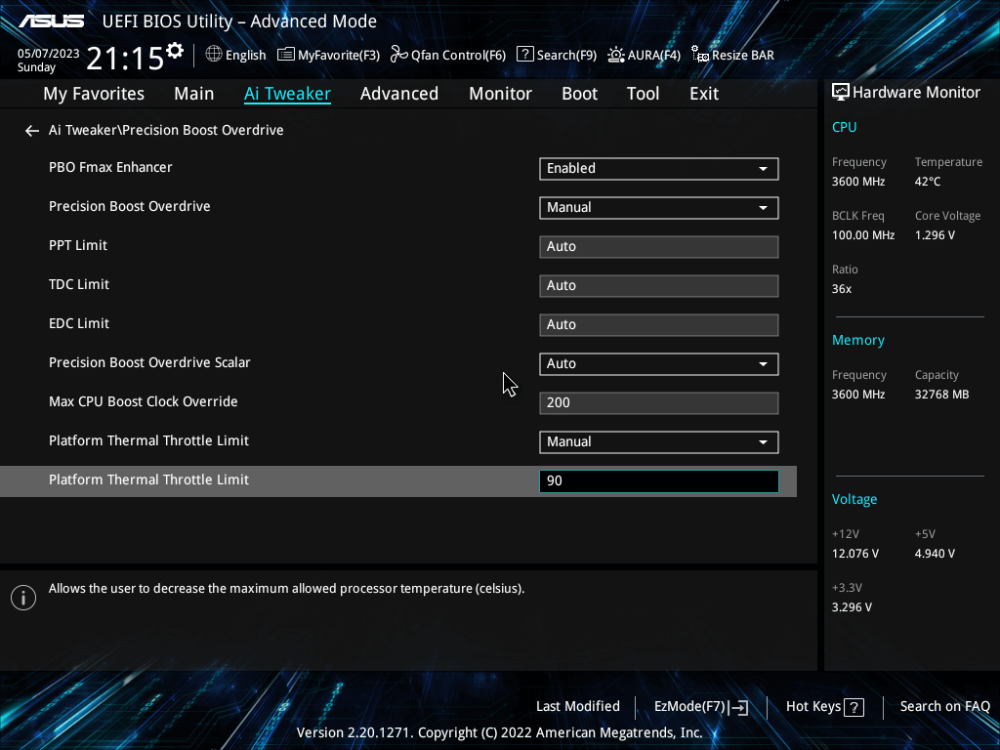

:orphan:
(bios-uefi)=

# BIOS/UEFI

In the realm of computer systems, the BIOS (Basic Input/Output System) and UEFI (Unified Extensible Firmware Interface) play pivotal roles in initializing and managing hardware components during the boot-up process. These firmware interfaces act as a bridge between the hardware and the operating system, enabling communication and configuration between the two. In this article, we will delve into the concepts of BIOS and UEFI, exploring their settings and features that contribute to the efficient functioning of modern computer systems.

 

## Understanding BIOS and UEFI

### BIOS (Basic Input/Output System)

The BIOS, a fundamental part of older computer systems, is a firmware interface that provides essential functionalities during the boot-up process. It resides on a chip on the computer's motherboard. The BIOS primarily performs tasks like initializing hardware components such as the CPU, RAM, storage devices, and input/output devices. It also locates and loads the operating system into the computer's memory.

The BIOS interface is text-based and can be accessed during system boot by pressing a designated key (often Del, F2, or F10) before the operating system starts. In the BIOS interface, users can configure hardware settings and manage certain security features like passwords and boot order.

**Example**: In the BIOS settings, a user can select the order in which the computer attempts to boot from different devices. For instance, a user can prioritize booting from a USB drive over the internal hard drive.

### UEFI (Unified Extensible Firmware Interface)

UEFI, a more modern replacement for BIOS, offers a more advanced and feature-rich firmware interface. It is stored in a specific partition on the computer's storage device, typically in a FAT32 file system. UEFI is designed to provide better support for larger storage capacities, faster boot times, and more security features.

Unlike BIOS, UEFI has a graphical user interface (GUI) that makes it more user-friendly and easier to navigate. UEFI firmware also supports the use of mouse and touchscreen input, enhancing user interaction. It supports a wider range of storage devices and offers features like Secure Boot, which helps protect the system against malicious software.

**Example**: UEFI's Secure Boot ensures that only trusted operating systems and drivers are loaded during the boot process, preventing the execution of unauthorized code.

## Key Settings and Features of BIOS and UEFI

### BIOS Settings and Features

1. **Boot Order**: This setting determines the sequence in which the computer attempts to boot from various devices such as the hard drive, optical drive, USB drive, or network. It allows users to prioritize booting from a specific device.

2. **Date and Time Settings**: Users can set the system's date and time in the BIOS interface. This information is crucial for various operations, including file timestamping and system scheduling.

3. **Password Protection**: BIOS allows users to set passwords to prevent unauthorized access to the system's settings. It can include passwords for accessing the BIOS interface itself and for booting the system.

4. **Hardware Configuration**: BIOS provides options to configure hardware components such as the CPU, RAM, and hard drives. Users can adjust parameters like clock speeds, voltage, and memory timings.

### UEFI Settings and Features

1. **UEFI Boot Manager**: UEFI allows users to manage boot options through a graphical interface. This includes selecting the boot device and setting the boot order.

2. **Secure Boot**: UEFI's Secure Boot feature ensures that only digitally signed and trusted operating systems and bootloaders are allowed to run during the boot process. This prevents malware and unauthorized code from executing.

3. **UEFI Drivers**: Unlike BIOS, UEFI supports modular drivers that can be loaded during the boot process. This simplifies hardware initialization and allows for easier updates.

4. **Graphical User Interface**: UEFI's GUI provides an intuitive interface for users to interact with firmware settings. It supports mouse and touch input, making navigation more user-friendly.

5. **Storage Support**: UEFI supports a wider range of storage devices, including larger hard drives and modern SSDs. It also supports GUID Partition Table (GPT), which allows for more efficient disk utilization and enables booting from drives larger than 2.2TB.

## Importance of BIOS and UEFI in Modern Computing

The BIOS and UEFI are vital components that enable computers to start up and function properly. While the traditional BIOS served its purpose for many years, the transition to UEFI brought numerous benefits to modern computing:

1. **Faster Boot Times**: UEFI's optimized initialization process and support for modern hardware technologies lead to significantly faster boot times compared to the older BIOS.

2. **Enhanced Security**: UEFI's Secure Boot feature helps prevent unauthorized software from running during the boot process, bolstering system security and reducing the risk of malware infections.

3. **Compatibility with Modern Hardware**: UEFI's support for larger storage devices and advanced hardware components ensures compatibility with the latest technology advancements.

4. **User-Friendly Interface**: UEFI's graphical user interface simplifies firmware configuration, making it more accessible to a broader range of users.

5. **Efficient Disk Management**: GPT support in UEFI enables efficient disk utilization, making it possible to create larger partitions and utilize high-capacity storage devices effectively.

## Final Words

BIOS and UEFI are firmware interfaces that play crucial roles in the boot-up process of computers. While the traditional BIOS has been succeeded by the more advanced UEFI, both serve the essential function of initializing hardware and facilitating communication between the operating system and hardware components. The transition to UEFI has brought about faster boot times, enhanced security features, and improved compatibility with modern hardware. As computing continues to evolve, BIOS and UEFI remain integral to the functionality and performance of computer systems.