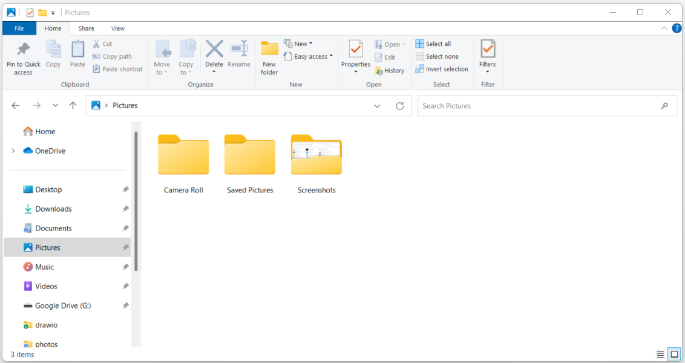
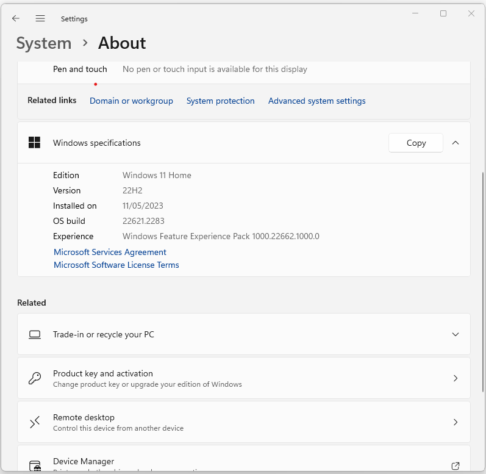
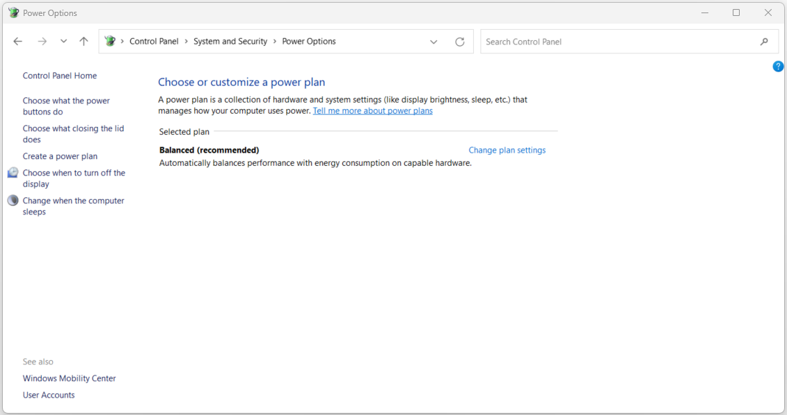

:orphan:
(control-panel-file-explorer-system-power-options)=

# Control Panel: File Explorer Options, System, and Power Options

The Control Panel in the Windows operating system serves as a hub for configuring and customizing various system settings and features. In this article, we will explore three significant sections of the Control Panel: **File Explorer Options**, **System**, and **Power Options**. Each of these sections plays a pivotal role in enhancing user efficiency, managing system resources, and controlling power consumption on a Windows computer.

## File Explorer Options

**File Explorer Options** is a key component of the Control Panel that allows users to personalize the way they interact with files and folders on their computer. By accessing this section, users can configure various settings related to navigation, view, and behavior within the Windows File Explorer.

 

### General Settings

In the **General** tab of File Explorer Options, users can set preferences for file management behaviors. For instance, users can choose whether File Explorer opens to Quick Access or This PC, determine whether to show recently used files and frequently used folders, and enable or disable the "Open each folder in its own window" feature.

**Sample Use Case: Setting Default Folder View**

Steps to Configure:
1. Open the Control Panel.
2. Click on "File Explorer Options."
3. In the "General" tab, under the "Open File Explorer to" section, choose between Quick Access and This PC.
4. Customize other options such as showing recently used files and frequently used folders.
5. Click "Apply" and then "OK" to save the changes.

### View Settings

The **View** tab within File Explorer Options enables users to customize how files and folders are displayed. Users can choose to show hidden files, specify whether file extensions are displayed, and adjust the view layout, such as icons, tiles, or details.

**Sample Use Case: Displaying File Extensions**

Steps to Configure:
1. Access the Control Panel.
2. Navigate to "File Explorer Options."
3. Go to the "View" tab.
4. Locate and uncheck the "Hide extensions for known file types" option.
5. Click "Apply" and then "OK" to confirm the change.

### Search Settings

The **Search** tab allows users to configure settings related to searching for files and folders. Users can specify whether to search within file contents, include system directories in searches, and configure search indexing options.

**Sample Use Case: Indexing Specific Locations**

Steps to Configure:
1. Open the Control Panel.
2. Click on "File Explorer Options."
3. Navigate to the "Search" tab.
4. Under "How to search," choose "Always search file names and contents."
5. To manage indexing locations, click on "Modify" and select the desired folders to include or exclude from indexing.
6. Click "OK" to confirm the changes.

## System

The **System** section in the Control Panel is instrumental in managing essential system-related settings, including device management, hardware profiles, and remote assistance.

 

### Device Manager

Device Manager is a crucial utility within the **System** section that enables users to manage and troubleshoot hardware devices connected to their computer. It provides a detailed view of hardware components, drivers, and their status.

**Sample Use Case: Updating Device Drivers**

Steps to Configure:
1. Open the Control Panel.
2. Click on "System" to access system-related settings.
3. In the "System" window, select "Device Manager" from the left-hand menu.
4. Locate the hardware category (e.g., Display adapters, Sound, video and game controllers) you want to update.
5. Right-click on the specific device and select "Update driver."
6. Choose whether to search automatically for updated driver software or browse your computer for driver software.
7. Follow the prompts to complete the driver update.

### Hardware Profiles

The **Hardware Profiles** option within the **System** section allows users to create and manage different hardware profiles for their computer. Each profile can have unique settings tailored for different usage scenarios.

**Sample Use Case: Creating Hardware Profiles**

Steps to Configure:
1. Access the Control Panel.
2. Go to the "System" section.
3. Click on "Hardware Profiles."
4. Select an existing profile or create a new one.
5. Configure hardware settings such as devices, drivers, and network connections specific to the profile.
6. Save the profile and switch between different profiles as needed.

### Remote Assistance

The **Remote Assistance** feature lets users request help from friends or IT professionals to troubleshoot and resolve computer issues remotely. This can be particularly useful for users who need assistance but are unable to physically access their computer.

**Sample Use Case: Requesting Remote Assistance**

Steps to Configure:
1. Open the Control Panel.
2. Navigate to "System" and click on "Remote settings."
3. Under "Remote Assistance," select "Allow Remote Assistance connections to this computer."
4. Choose whether to allow invitations to be sent by using email or by saving a file.
5. Click "Advanced" to configure advanced settings such as authentication and access permissions.
6. Click "Apply" and then "OK" to save the changes.

## Power Options

**Power Options** within the Control Panel empowers users to manage and optimize their computer's power consumption. By accessing this section, users can configure power plans, adjust power settings, and choose when the computer should enter sleep or hibernate modes.

 

### Power Plans

The **Power Plans** tab offers users a way to choose between different predefined power plans that balance performance and energy efficiency. Common power plans include "Balanced," "Power Saver," and "High Performance."

**Sample Use Case: Selecting a Power Plan**

Steps to Configure:
1. Open the Control Panel.
2. Click on "Power Options."
3. In the "Select a power plan" section, choose a power plan that aligns with your usage preferences.
4. Click on "Change plan settings" to access additional settings for the selected plan.
5. Customize settings such as display brightness, sleep timers, and lid-closing behavior.
6. Click "Save changes" to apply the power plan settings.

### Advanced Power Settings

The **Advanced Power Settings** link allows users to fine-tune power settings based on their requirements. Users can configure settings such as when the display turns off, when the computer goes to sleep, and the behavior of the power button.

**Sample Use Case: Adjusting Sleep Timer**

Steps to Configure:
1. Access the Control Panel.
2. Go to "Power Options."
3. Click on "Change plan settings" next to the selected power plan.
4. Click on "Change advanced power settings."
5. Navigate to the "Sleep" category and adjust the "Sleep after" setting to specify when the computer should enter sleep mode.
6. Customize other advanced settings as needed.
7. Click "Apply" and then "OK" to save the changes.

## Final Words

File Explorer Options, System settings, and Power Options are integral components of the Windows Control Panel that collectively contribute to enhancing user productivity, optimizing system performance, and managing power consumption. By delving into these sections, users can personalize their file management experience, troubleshoot hardware devices, configure power plans that align with their preferences, and fine-tune power-related settings. These features allow users to tailor their computing environment to suit their needs, making for a more efficient and user-friendly experience with the Windows operating system.