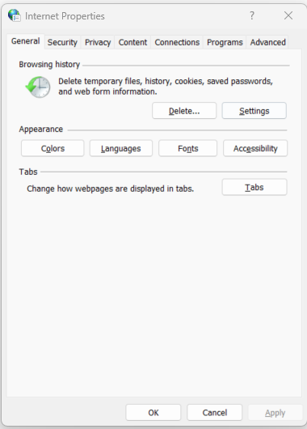
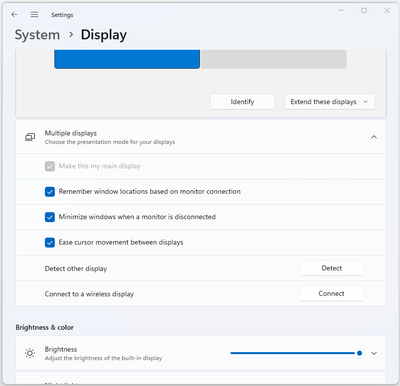
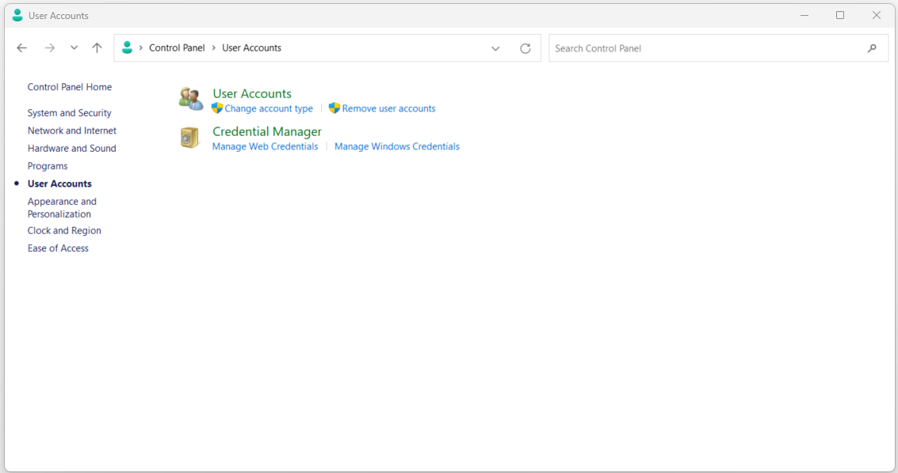

:orphan:
(control-panel-internet-options-display-user-accounts)=

# Control Panel: Internet Options, Display, and User Accounts

The Control Panel is a vital component of the Windows operating system that allows users to configure and customize various system settings and features. In this article, we will delve into three essential sections of the Control Panel: **Internet Options**, **Display**, and **User Accounts**. Each of these sections plays a crucial role in shaping the user experience and functionality of a Windows computer.

## Internet Options

**Internet Options** is a configuration panel within the Control Panel that enables users to manage and customize settings related to their internet browsing experience. These settings not only impact Internet Explorer but can also influence certain aspects of other web browsers.

 

### Security and Privacy

One of the primary tabs within Internet Options is the **Security** tab. This tab allows users to define the security level for different zones on the internet. The zones include the Internet, Local Intranet, Trusted Sites, and Restricted Sites. Each zone can have its own security settings, allowing users to set a higher level of security for untrusted websites while maintaining a lower level for trusted sites.

Additionally, the **Privacy** tab enables users to control how websites track their browsing habits using cookies. Users can adjust the level of cookie acceptance or even block them entirely.

**Sample Use Case: Enhancing Online Security**

Steps to Configure:
1. Open the Control Panel.
2. Locate and click on the "Internet Options" icon.
3. In the "Internet Properties" window, go to the "Security" tab.
4. Select a zone (e.g., Internet, Local Intranet, Trusted Sites) and adjust the security level using the slider. A higher security level restricts potentially harmful content.
5. Click on the "Custom level…" button to access more detailed security settings.
6. Review and customize individual security settings according to your preferences.
7. Click "OK" to apply the changes.

### Content and Connections

The **Content** tab provides options for content filtering, allowing users to restrict access to certain types of content based on content ratings or specific website URLs. This can be particularly useful for parents who want to create a safe browsing environment for their children.

Under the **Connections** tab, users can configure proxy settings and set up virtual private network (VPN) connections. Proxies can be used to enhance security and privacy by acting as intermediaries between the user's computer and the internet, while VPNs provide encrypted connections for improved online privacy.

**Sample Use Case: Restricting Access to Inappropriate Content**

Steps to Configure:
1. Open the Control Panel.
2. Click on "Internet Options" to open the "Internet Properties" window.
3. Navigate to the "Content" tab.
4. Under the "Content Advisor" section, click the "Enable" button.
5. Set a supervisor password. This password will be required to change content restrictions.
6. Move to the "Ratings" tab and select the content categories you want to restrict.
7. Go to the "Approved Sites" tab and add or remove specific websites to be allowed or blocked.
8. Adjust the slider to control the level of content restriction.
9. Click "OK" to save the changes and apply content restrictions.

### Advanced Settings

The **Advanced** tab houses a wide range of advanced settings that allow users to fine-tune their browsing experience. These settings include options like enabling/disabling third-party browser extensions, overriding automatic cookie handling, and managing certificates.

**Sample Use Case: Enabling/Disabling Browser Features**

Steps to Configure:
1. Access the "Internet Options" section in the Control Panel.
2. Go to the "Advanced" tab.
3. Scroll through the list of settings to find options like "Enable third-party browser extensions" or "Enable automatic image resizing."
4. Check or uncheck the boxes next to each setting based on your preferences.
5. Click "Apply" and then "OK" to save the changes.

## Display

The **Display** section in the Control Panel focuses on customizing the visual aspects of the Windows operating system, including the desktop, screen resolution, and appearance settings.

 

### Personalization

Within the Display section, the **Personalization** option provides users with a way to change the overall look and feel of their desktop. Users can customize the desktop background, window colors, and sounds. This allows for a more personalized computing experience that suits individual preferences.

**Sample Use Case: Customizing Desktop Appearance**

Steps to Configure:
1. Open the Control Panel.
2. Click on "Display" to access the display settings.
3. In the "Display" window, select the "Personalization" option from the left menu.
4. Choose a desktop background by clicking on "Desktop background" and selecting an image from the available options or browsing for your own.
5. Adjust window colors, sounds, and screensaver settings as desired.
6. Click "Save changes" to apply the personalized settings.

### Screen Resolution

Screen resolution is a critical aspect of display settings as it determines the clarity and sharpness of on-screen content. In the **Screen Resolution** settings, users can adjust the resolution to match the specifications of their monitor or display device. Higher resolutions offer more screen real estate, while lower resolutions can make items appear larger.

**Sample Use Case: Optimizing Display Clarity**

Steps to Configure:
1. Open the Control Panel.
2. Click on "Display."
3. In the "Display Settings" tab, find the "Resolution" dropdown.
4. Choose the appropriate resolution for your monitor from the list.
5. Click "Apply" to test the selected resolution. If it looks good, click "Keep changes" to apply it permanently; otherwise, revert the changes.

### Display Settings

The **Display Settings** option allows users to modify the size of text, apps, and other items on the screen. This is especially useful for users with high-resolution displays who may find default text sizes too small to read comfortably.

**Sample Use Case: Adjusting Text and App Sizes**

Steps to Configure:
1. Access the "Display" section in the Control Panel.
2. Click on "Display Settings."
3. Under the "Scale and layout" section, use the dropdown to adjust the size of text, apps, and other items.
4. Windows will recommend a default setting based on your display, but you can experiment with different options.
5. The changes will take effect immediately.

### Advanced Display Settings

For more advanced adjustments, the **Advanced Display Settings** link provides access to additional options. Users can configure the refresh rate of their display (which affects the smoothness of motion) and adjust color calibration for improved color accuracy.

**Sample Use Case: Calibrating Color and Refresh Rate**

Steps to Configure:
1. Open the Control Panel.
2. Navigate to the "Display" section.
3. Click on "Advanced display settings."
4. Under "Refresh rate," select a higher rate for smoother motion or choose the default rate recommended for your display.
5. To calibrate colors, click on "Color calibration" and follow the on-screen instructions to adjust gamma, brightness, contrast, and color balance.

## User Accounts

The **User Accounts** section is where users can manage various aspects of their user profile and account settings on a Windows computer.

 

### User Accounts Management

Under **User Accounts**, users can perform tasks like changing their account password, setting up or changing a profile picture, and managing their Microsoft account. This section also offers the ability to create and manage additional user accounts on the same computer. This is particularly useful for shared computers or for setting up separate accounts for different family members.

**Sample Use Case: Creating Additional User Accounts**

Steps to Configure:

1. Open the Control Panel.
2. Click on "User Accounts."
3. Select "Manage another account."
4. Click on "Add a new user in PC settings."
5. Follow the prompts to set up a new Microsoft account or create a local account.
6. Customize the account settings, including account type (standard or administrator).
7. Once the account is created, you can switch between accounts on the login screen.

### Credential Manager

Credential Manager is a tool within the User Accounts section that allows users to store and manage various credentials, such as usernames and passwords for websites, apps, and networks. This can simplify the login process and make it more convenient for users who access multiple services.

**Sample Use Case: Managing Saved Credentials**

Steps to Configure:
1. Access the Control Panel and open "User Accounts."
2. Click on "Credential Manager."
3. Under "Web Credentials," click "Add a Windows credential" to add credentials for websites or network resources.
4. Enter the server address, username, and password.
5. To manage existing credentials, select the credential and choose "Edit" or "Remove."

### Family Safety

The **Family Safety** feature provides options for parents to create and manage family accounts for their children. Parents can set restrictions on the websites their children can access, limit screen time, and receive activity reports to keep track of their online activities.

**Sample Use Case: Setting Up Parental Controls**

Steps to Configure:
1. Open the Control Panel.
2. Go to "User Accounts" and click on "Family Safety."
3. Select the child's account you want to manage.
4. Turn on activity reporting to receive reports on their online activities.
5. Choose web filtering settings to restrict access to specific websites.
6. Set time limits for computer usage.
7. Configure app and game restrictions based on age ratings.
8. Save the settings to apply parental controls.

## Final Words

The Internet Options, Display, and User Accounts sections of the Control Panel play pivotal roles in shaping the user experience and functionality of Windows computers. Internet Options empowers users to configure security and privacy settings for their web browsing activities, control content access, and fine-tune advanced browsing options. Display settings offer the ability to personalize the visual appearance of the operating system, adjust screen resolution for optimal clarity, and modify the size of on-screen elements. User Accounts provide users with tools to manage their profiles, change passwords, store credentials securely, and create separate accounts for different users, including parental controls for family safety.

By familiarizing yourself with these sections of the Control Panel, you can optimize your Windows computing experience to suit your preferences and requirements.