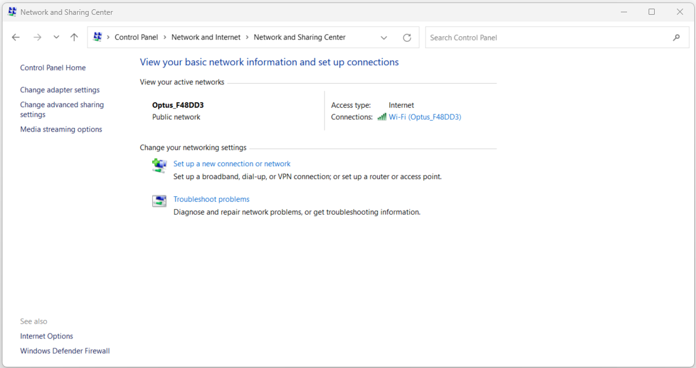
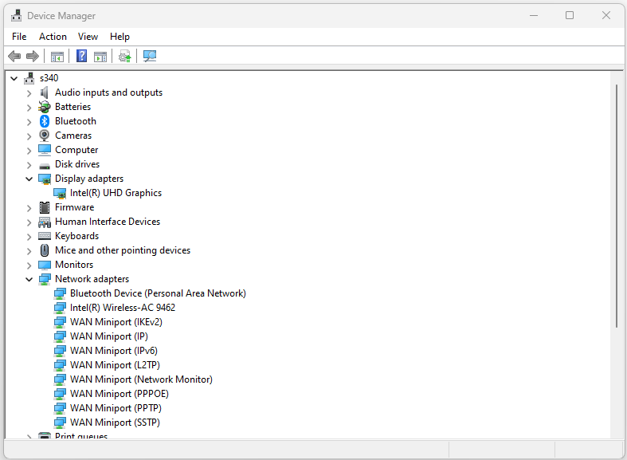
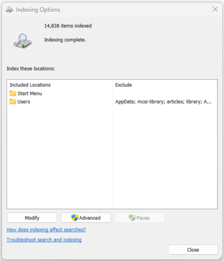

:orphan:
(control-panel-network-center-device-manager-indexing)=

# Control Panel: Network and Sharing Center, Device Manager, and Indexing

Within the Windows operating system, the Control Panel stands as a pivotal tool for configuring and customizing an array of system settings and features. In this article, we will explore three critical sections of the Control Panel: **Network and Sharing Center**, **Device Manager**, and **Indexing Options**. These sections play integral roles in managing network connections, hardware devices, and file indexing for enhanced system functionality.

## Network and Sharing Center

The **Network and Sharing Center** serves as a central hub for users to manage network connections, sharing settings, and troubleshoot network-related issues. It provides a comprehensive view of network status and facilitates actions to establish connections and manage network profiles.

### Network Connections

Within the **Network and Sharing Center**, users can access the **Network Connections** section to view and manage their network adapters and connections. From here, users can establish new connections, modify existing connections, or troubleshoot network issues.

 

**Sample Use Case: Connecting to a Wireless Network**

Steps to Configure:
1. Open the Control Panel.
2. Navigate to "Network and Sharing Center."
3. Click on "Change adapter settings" from the left-hand menu.
4. Right-click on the wireless network adapter and select "Connect/Disconnect."
5. Choose the desired wireless network from the list.
6. Enter the network password (if applicable) and click "Connect."

### Sharing Settings

The **Network and Sharing Center** also allows users to configure **Sharing Settings**, enabling the sharing of resources such as files, folders, printers, and media devices across a network. Users can adjust sharing permissions and enable password-protected sharing.

**Sample Use Case: Enabling Printer Sharing**

Steps to Configure:
1. Access the Control Panel.
2. Click on "Network and Sharing Center."
3. Select "Change advanced sharing settings" from the left menu.
4. Under "File and printer sharing," choose "Turn on file and printer sharing."
5. Optionally, enable "Turn on password protected sharing" for added security.
6. Click "Save changes" to apply the sharing settings.

### Troubleshoot Problems

The **Network and Sharing Center** also offers a **Troubleshoot problems** option, which provides automated solutions for common network-related issues. Users can run diagnostic tests to identify and resolve connectivity problems.

**Sample Use Case: Running Network Troubleshooter**

Steps to Configure:
1. Open the Control Panel.
2. Navigate to "Network and Sharing Center."
3. Click on "Troubleshoot problems."
4. Choose the network issue you are facing (e.g., "Internet Connections" or "Network Adapter").
5. Follow the prompts to diagnose and potentially fix the issue.

## Device Manager

The **Device Manager** section in the Control Panel empowers users to manage hardware devices connected to their computer. It provides a comprehensive view of hardware components, their drivers, and enables users to troubleshoot device-related problems.

 

### Device Views

Within the **Device Manager**, users can explore different views to categorize and manage hardware devices. These views include **Device by Type**, **Device by Connection**, and **Resources by Type**.

**Sample Use Case: Viewing Devices by Type**

Steps to Configure:
1. Access the Control Panel.
2. Navigate to "Device Manager."
3. Expand the "View" menu and select "Devices by type."
4. Explore the categorized list of hardware devices.

### Driver Management

The **Device Manager** also allows users to update, uninstall, and roll back device drivers. It's a crucial tool for keeping hardware components functioning optimally.

**Sample Use Case: Updating Graphics Driver**

Steps to Configure:
1. Open the Control Panel.
2. Click on "Device Manager."
3. Expand the "Display adapters" category.
4. Right-click on the graphics adapter and select "Update driver."
5. Choose to search automatically for updated driver software.
6. Follow the prompts to install the latest driver.

## Indexing Options

The **Indexing Options** section of the Control Panel enables users to manage the indexing of files and contents on their computer. This indexing enhances search performance by quickly retrieving search results from indexed locations.

 

### Modify Indexed Locations

Within **Indexing Options**, users can specify which locations on their computer should be indexed for faster search results. They can add or remove folders from the indexing process.

**Sample Use Case: Adding a Folder to Index**

Steps to Configure:
1. Access the Control Panel.
2. Click on "Indexing Options."
3. Click "Modify" to access indexed locations.
4. Check the boxes next to the folders you want to include in the index.
5. Click "OK" to confirm the changes.

### Advanced Indexing Options

The **Advanced** button in **Indexing Options** provides additional settings for fine-tuning the indexing process. Users can configure file types to be indexed, index encryption attributes, and rebuild the index if necessary.

**Sample Use Case: Rebuilding the Index**

Steps to Configure:
1. Open the Control Panel.
2. Navigate to "Indexing Options."
3. Click "Advanced."
4. Under the "Troubleshooting" section, click "Rebuild."
5. Confirm the action and allow the index to be rebuilt.

## Final Words

The Network and Sharing Center, Device Manager, and Indexing Options sections of the Control Panel are pivotal tools for managing network connections, hardware devices, and search functionality. These sections empower users to troubleshoot network issues, manage hardware drivers, and optimize the indexing of files for efficient searches. By mastering these sections, users can ensure a smooth network experience, maintain hardware functionality, and quickly access files and contents on their Windows computer.