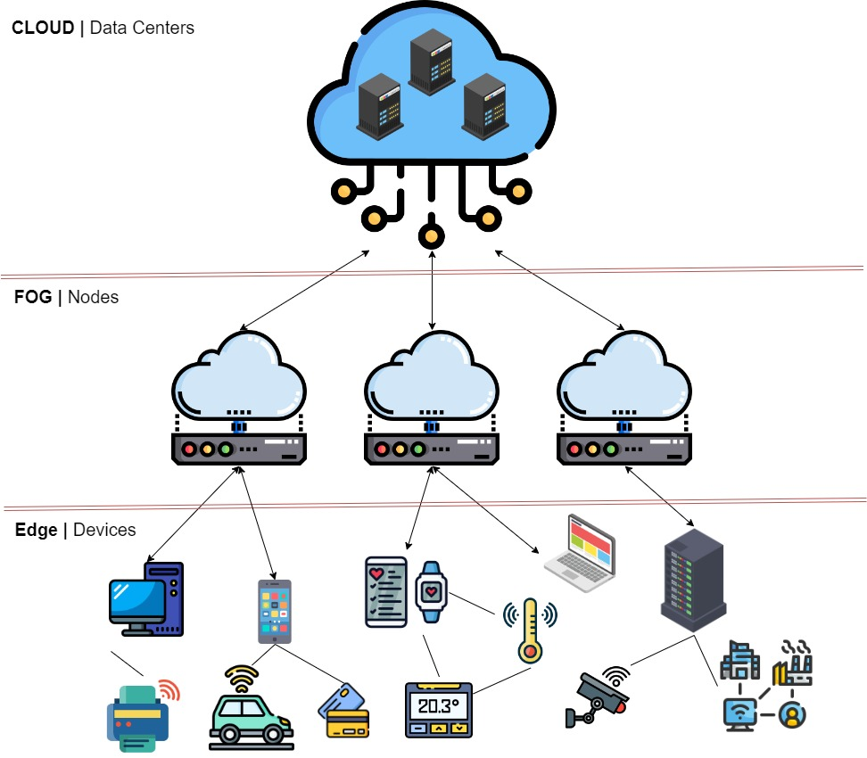

:orphan:
(edge-computing)=

# Edge Computing

Edge computing refers to computing performed at the edge of a network, as opposed to the core (usually in the data centre). Edge computing has been driven in large part by network vendors who, thanks to advances in compute power, now have processing power spare on the network (often on network devices which were historically quite tight on resources) which can be made available for tasks which support business goals. Edge computing is different from, but similar to fog computing.

## What is Edge Computing?

Edge computing, in a nutshell, is a computing paradigm that emphasizes data processing at or near the data source, often on devices located at the "edge" of the network. Unlike traditional cloud computing, which centralizes data processing in remote data centers, edge computing aims to bring computation and analytics closer to where data is generated, minimizing latency and enabling real-time decision-making. This might be, for example, on a switch or router.

## Problems Solved by Edge Computing

Edge computing takes advantage of the increase in processing power which has occurred in many classes of device over recent years to addresses the challenges associated with latency-sensitive applications and the vast amount of data generated by IoT devices. As IoT devices continue to proliferate, transmitting all data to centralized cloud servers for processing becomes inefficient and impractical. Edge computing allows data to be processed locally, reducing delays and enabling faster response times for applications that require immediate insights. 

 

## Advantages of Edge Computing

The major benefits of edge computing include:

- **Low Latency -** Edge computing drastically reduces latency by processing data locally, ensuring real-time responsiveness for applications like industrial automation and remote control.

- **Bandwidth Efficiency -** By processing data locally, edge computing minimizes the need to transmit large volumes of data over the network, optimizing bandwidth usage.

- **Real-Time Analytics -** Edge computing enables real-time data analysis at the source, facilitating quick decision-making without waiting for data to travel to a distant cloud server.

- **Privacy Enhancement -** Sensitive data can be processed and stored locally, enhancing privacy and reducing the risk of data exposure during transmission.

- **Offline Operation -** Edge devices can continue processing data and running applications even when connectivity to the cloud is lost, ensuring uninterrupted operations 

- **Return on Investment -** Utilising essential devices, such as routers or switches to perform useful business functions with their spare processing power helps a business to obtain a good return on investment for these devices more quickly. 

  

## Disadvantages of Edge Computing

While edge computing can be very useful it does have some downsides, some important ones to note are:

- **Limited Processing Power -** Edge devices typically have less computing power than cloud servers, potentially limiting the complexity of tasks they can handle. The amount of processing power available could also be constrained by how much “primary” load is placed on a device operating in a multifunction role, such as a switch.
- **Scalability Challenges -** Managing a large number of distributed edge devices can be challenging, particularly when it comes to ensuring consistent management and updates.
- **Security Implications -** Edge devices might lack robust security measures, making them potential entry points for cyberattacks if not properly secured.

*Tip: When developing security checklists and protocols it’s critical to consider what services are running on a device, regardless of the “type” of device it is. Do not assume, for example, that the only ports open on a switch will be networking related – a modern switch may be hosting a docker container with a web app!* 

 

## Security Concerns with Edge Computing

Of course, it’s also important to be aware of some of the security issues commonly associated with edge computing, such as:

- **Device Vulnerabilities -** Edge devices might have vulnerabilities that attackers could exploit to gain access to the local network or manipulate data.
- **Hosted Application or Workload Vulnerabilities:** If a system is, for example, hosting a docker container that container must also be considered as a possible point of attack and could also introduce it’s own vulnerabilities. Any software running on an edge node must also be properly maintained, patched and updated.
- **Data Exposure -** Storing and processing data on distributed edge devices increases the risk of data exposure or unauthorized access if not adequately protected.

- **Data Integrity -** Ensuring the integrity of data processed across various edge devices becomes crucial to prevent tampering and unauthorized modifications.

- **Remote Management -** Managing security patches, updates, and security configurations across numerous edge devices can be challenging and necessitates robust remote management solutions.

 

## Example Application of Edge Computing - Smart City Traffic Management

Imagine a bustling smart city where traffic management is a critical challenge - Edge computing can have a significant role to play here. With numerous sensors, cameras, and IoT devices installed across the city's intersections and roadways, a massive amount of data is continuously generated. This data includes real-time traffic flow, pedestrian movement, and vehicle patterns.

By leveraging edge computing, this smart city can process and analyse the data locally at each intersection or traffic light, rather than sending all the data to a remote cloud server. The edge devices can swiftly assess the traffic situation, identify congestion points, and make immediate decisions to optimize traffic flow. For instance, a traffic light equipped with edge computing capabilities can prioritize green signals for lanes with heavier traffic, reducing congestion and minimizing wait times for drivers.

By applying edge computing to traffic management, the smart city benefits from low-latency decision-making, ensuring real-time responses to changing traffic conditions. This not only enhances the efficiency of the city's transportation system but also reduces the risk of accidents and improves overall safety. Additionally, the localized processing minimizes the need for excessive data transmission, saving on bandwidth and ensuring that critical decisions are made even in cases of temporary connectivity loss, which otherwise could be a hazard to life. 

# Final Words

Edge computing reduces the need for large amounts of data transmission by prioritizing local data processing and analysis to enhance real-time decision-making. This approach offers benefits such as reduced latency, bandwidth optimization, and enhanced privacy (if properly implemented), but can also also raise some considerations related to security, device management, and scalability. 

 
