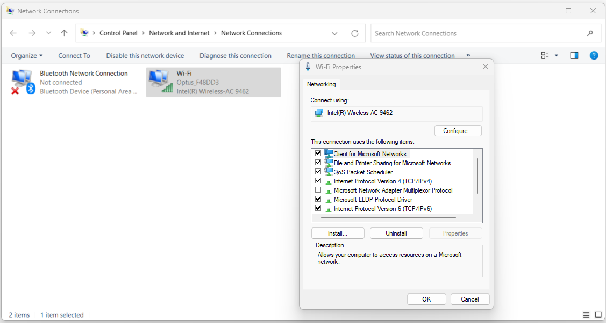

:orphan:
(establish-network-connection)=

# Establishing Network Connections in Windows

Network connections play a vital role in today's interconnected world, enabling devices to communicate, share resources, and access the internet. Windows, as one of the most widely used operating systems, offers various methods to establish network connections, each catering to different needs and scenarios. In this article, we will explore the fundamental concepts of establishing network connections in Windows, the types of connections available, and step-by-step guidance on how to create them.

 

## Understanding Network Connections

A network connection is the bridge that enables data exchange between devices. It allows computers, smartphones, and other devices to communicate, share files, access the internet, and more. Network connections can be broadly categorized into two types: wired and wireless.

## Wired Network Connections

### Ethernet Connection

An Ethernet connection, often referred to as a wired connection, uses Ethernet cables to establish a physical link between devices. This type of connection is known for its stability and consistent data transfer speeds. It is commonly used in office setups and for devices that require high bandwidth, such as gaming consoles and desktop computers.

To establish an Ethernet connection in Windows, follow these steps:

1. **Hardware Setup**: Connect one end of an Ethernet cable to your computer's Ethernet port and the other end to a network router, switch, or modem.

2. **Network Settings**:
   - **Windows 10/11**: Right-click the Start button, select "Settings," then go to "Network & Internet."
   - **Windows 7**: Click the Start button, open the Control Panel, and navigate to "Network and Sharing Center."

3. **Ethernet Settings**: In the Network & Internet settings, select "Ethernet" from the left-hand menu. Click on "Change adapter options" to open the Network Connections window.

1. **Enable Ethernet Connection**: Right-click on the Ethernet connection icon and select "Enable" if it's disabled.

2. **Connect to the Network**: After enabling the connection, right-click on it again and choose "Connect."

Your Windows device should now be connected to the network via Ethernet.

## Wireless Network Connections

### Wi-Fi Connection

Wi-Fi connections offer the convenience of mobility, allowing devices to connect to networks without the need for physical cables. This makes Wi-Fi an ideal choice for laptops, smartphones, and tablets. To establish a Wi-Fi connection in Windows:

1. **Network Settings**:
   - **Windows 10/11**: Click on the network icon in the system tray (lower-right corner) and select "Network & Internet settings."
   - **Windows 7**: Click the network icon in the system tray, then select "Open Network and Sharing Center."

2. **Wi-Fi Settings**: In the Network & Internet settings (or Network and Sharing Center for Windows 7), select "Wi-Fi" from the left-hand menu.
   
3. **Available Networks**: A list of available Wi-Fi networks will appear. Click on the network you want to connect to.

4. **Connect**: Click the "Connect" button. If the network is secured, you'll need to enter the Wi-Fi password.

5. **Automatic Connection (Optional)**: To enable automatic connection to this network in the future, check the box that says "Connect automatically."

Once connected, your Windows device will remember the network and connect to it whenever it's within range.

## Virtual Private Network (VPN) Connections

A VPN connection adds an extra layer of security and privacy to your network activities. It allows you to create a secure connection to another network over the internet. VPNs are commonly used by remote workers, travelers, and individuals who want to access region-restricted content. Windows provides built-in support for VPN connections:

1. **Network Settings**: Follow the steps to open the Network & Internet settings as described earlier.

1. **VPN Settings**: In the Network & Internet settings, select "VPN" from the left-hand menu.

2. **Add a VPN Connection**: Click on "Add a VPN connection." Provide the necessary information, including the VPN provider's name, server name or address, VPN type (such as PPTP, L2TP, etc.), and login credentials.
3. **Save the Configuration**: After entering the details, click on "Save."

4. **Connect to the VPN**: Click on the newly created VPN connection and select "Connect."

Windows will establish a secure connection to the VPN server, ensuring that your online activities are encrypted and private.

## Remote Desktop Connections

Remote Desktop allows you to access another computer remotely, as if you were sitting in front of it. This is useful for troubleshooting, accessing files on another device, or working on a remote computer. To establish a Remote Desktop connection in Windows:

1. **Enabling Remote Desktop**: Right-click on the Start button and select "System. "In the System settings, click on "Remote Desktop" on the left-hand side. Enable "Remote Desktop" by toggling the switch.
   
2. **Remote Desktop Settings**: You can further configure Remote Desktop settings by clicking on "Advanced settings."

3. **Connecting to a Remote Computer**: On the computer you want to connect from, open the Start menu and search for "Remote Desktop Connection." Enter the IP address or hostname of the remote computer and click "Connect."

4. **Enter Credentials**: You'll be prompted to enter the username and password of the remote computer. Click "OK" to establish the connection.

You will now have access to the remote computer's desktop on your local machine.

## Creating Network Connections

Windows allows you to manage and modify existing network connections, as well as create new ones.

### Adding a New Network Connection

1. **Open Network Connections**: Open the Network & Internet settings (or Network and Sharing Center for Windows 7). Select the type of connection you want to add (Ethernet, Wi-Fi, VPN, etc.).

2. **Add a Connection**: Look for an option like "Add a new connection" or "Set up a new network." Follow the prompts to provide the necessary details for the connection.

3. **Completing the Setup**: Depending on the type of connection, you might need to provide network details, security settings, and login credentials.

4. **Connect**: Once the setup is complete, you can now connect to the newly added network using the steps mentioned earlier for the specific connection type.

### Modifying Existing Connections

1. **Open Network Connections**: Access the Network & Internet settings (or Network and Sharing Center for Windows 7).

2. **Change Adapter Settings**: Look for an option that says "Change adapter settings."

3. **Modify Connection Properties**: Right-click on the connection you want to modify (Ethernet, Wi-Fi, VPN, etc.) and select "Properties."

4. **Edit Settings**: In the properties window, you can change settings such as IP configuration, security settings, and protocols.

5. **Save Changes**: After making the necessary changes, click "OK" to save the updated settings.

## Final Words

Establishing network connections in Windows is essential for communication, resource sharing, and accessing the internet. Whether it's through wired Ethernet connections for stability, wireless Wi-Fi connections for mobility, VPNs for added security, or Remote Desktop for remote access, Windows provides a range of options to suit various needs.

By understanding and utilizing these connection methods, users can stay connected, productive, and secure in their digital endeavors. As technology continues to evolve, the ability to establish reliable and efficient network connections remains a cornerstone of modern computing.