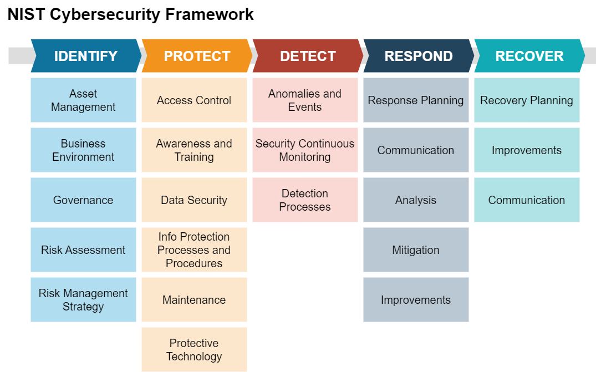

:orphan:
(key-security-frameworks)=

# Key Security Frameworks in Cybersecurity

Security frameworks play a pivotal role in the realm of cybersecurity by providing structured guidelines and best practices for designing, implementing, and managing robust security measures. These frameworks serve as essential tools for organizations to assess and improve their security posture while addressing evolving cyber threats. In this article, we will delve into some of the key security frameworks in cybersecurity, outlining their fundamental principles and significance.

## Introduction to Security Frameworks

Security frameworks are structured methodologies designed to assist organizations in establishing a comprehensive approach to cybersecurity. They offer a systematic way to identify, assess, and mitigate security risks while ensuring compliance with regulatory requirements. These frameworks provide a common language and set of practices that enable effective communication among various stakeholders, including security professionals, executives, and auditors.

Security frameworks typically consist of guidelines, best practices, and controls that cover a wide range of cybersecurity domains, such as risk management, access control, incident response, and more. By adopting these frameworks, organizations can streamline their security efforts, allocate resources efficiently, and ultimately enhance their overall security posture.

## NIST Cybersecurity Framework

The **National Institute of Standards and Technology (NIST) Cybersecurity Framework** is a widely recognized and widely adopted framework that offers guidance for organizations to manage and reduce cybersecurity risks. It was developed in response to Executive Order 13636, which aimed to improve the cybersecurity of critical infrastructure in the United States. The framework provides a holistic approach to cybersecurity, emphasizing risk management and continuous improvement.

The NIST Cybersecurity Framework consists of five core functions:

1. **Identify**: This function involves understanding and managing cybersecurity risks by identifying assets, systems, data, and potential vulnerabilities. It forms the foundation for effective risk management.

2. **Protect**: The protect function focuses on implementing safeguards to ensure the security and resilience of critical assets. This includes access controls, data encryption, and security awareness training for employees.

3. **Detect**: Detecting cybersecurity events is crucial for swift response. This function involves monitoring systems and networks to identify and promptly respond to security incidents.

4. **Respond**: In the event of a cybersecurity incident, organizations need to have a well-defined response plan. The respond function outlines strategies to contain, mitigate, and recover from security breaches.

5. **Recover**: After an incident, the recover function guides the restoration of normal operations and services. It includes assessing the impact of the incident and improving response procedures.

**Example:** A financial institution implementing the NIST Cybersecurity Framework begins by identifying critical assets such as customer data, financial systems, and communication networks. They then establish access controls, encryption mechanisms, and intrusion detection systems (IDS) to protect these assets. If a cyber attack occurs, the institution follows its predefined incident response plan to contain the breach, recover affected systems, and implement improvements based on lessons learned.

## ISO 27001

**ISO/IEC 27001**, part of the ISO/IEC 27000 family of standards, is an internationally recognized framework that provides guidelines for establishing, implementing, operating, monitoring, reviewing, maintaining, and improving an organization's information security management system (ISMS). The framework is designed to ensure the confidentiality, integrity, and availability of information assets.

ISO 27001 follows a risk-based approach to information security and consists of several key components:

1. **Scope Definition**: Organizations define the scope of their ISMS, identifying the boundaries and assets that the framework will cover.

2. **Risk Assessment**: A thorough risk assessment is conducted to identify and assess potential security risks to information assets.

3. **Risk Treatment**: Based on the assessment, organizations implement appropriate controls and measures to mitigate identified risks.

4. **ISMS Implementation**: Organizations establish policies, procedures, and processes to manage information security in line with the identified risks and controls.

5. **Monitoring and Review**: Regular monitoring, measurement, analysis, and evaluation of the ISMS's performance are conducted to ensure its effectiveness.

6. **Continuous Improvement**: Organizations continually improve their ISMS by addressing identified non-conformities, adapting to changes, and learning from security incidents.

**Example:** A healthcare organization adopting ISO 27001 starts by defining the scope of its ISMS, including patient records, medical devices, and administrative systems. They conduct a comprehensive risk assessment, identifying risks such as unauthorized access to patient data. To address this, the organization implements access controls, encryption, and regular security audits. The ISMS is continually reviewed and improved based on audit results and changing security landscapes.

## CIS Critical Security Controls

The **CIS (Center for Internet Security) Critical Security Controls**, formerly known as the SANS Top 20, is a set of cybersecurity best practices and guidelines that help organizations prioritize and implement effective security measures. These controls are designed to mitigate the most common and impactful cyber threats.

The CIS Critical Security Controls are organized into three implementation groups, each containing specific controls:

- **Basic CIS Controls**: These controls focus on foundational security measures, including inventory and control of hardware and software assets, continuous vulnerability management, and secure configurations for hardware and software.

- **Foundational CIS Controls**: This group expands upon the basic controls by emphasizing areas such as email and web browser protections, malware defenses, and controlled access based on the principle of least privilege.

- **Organizational CIS Controls**: These controls address more advanced security practices, including continuous monitoring, data recovery capabilities, and security awareness training for employees.

**Example:** An e-commerce company implements the CIS Critical Security Controls by first establishing an inventory of all devices and software in its network (Basic Control 1). It regularly scans for vulnerabilities and patches systems promptly (Basic Control 2). The company then configures its servers and workstations according to security best practices (Basic Control 3). To prevent phishing attacks, it deploys email filters and educates employees about email security (Foundational Control 5). Finally, the company conducts regular security assessments and ensures employees are trained to recognize and respond to security threats (Organizational Control 18).

## COBIT

**COBIT (Control Objectives for Information and Related Technologies)** is a comprehensive framework developed by the Information Systems Audit and Control Association (ISACA) to help organizations effectively govern and manage their information and technology resources. COBIT provides a framework for aligning IT goals with business objectives, ensuring the effective and efficient use of technology while maintaining appropriate levels of control and risk management.

COBIT encompasses five key principles:

1. **Meeting Stakeholder Needs**: Organizations must identify and prioritize the needs of stakeholders, ensuring that IT resources and processes align with business goals.

2. **Covering the Enterprise End-to-End**: COBIT provides a holistic view of all IT-related processes within an organization, promoting comprehensive governance.

3. **Applying a Single, Integrated Framework**: The framework integrates various IT standards and practices, streamlining governance efforts and minimizing complexity.

4. **Enabling a Holistic Approach**: COBIT encourages a unified approach to IT governance, breaking down silos and promoting collaboration among different departments.

5. **Separating Governance from Management**: The framework distinguishes between the strategic governance of IT and the operational management of IT resources.

**Example:** A large multinational corporation adopts COBIT to improve its IT governance. It starts by identifying key stakeholders, including executives, IT teams, and regulatory bodies. The organization then maps its IT processes, from technology deployment to risk management, ensuring that each process contributes to overall business objectives. COBIT's separation of governance and management helps the organization delegate responsibilities appropriately, with executives overseeing strategic IT decisions and IT teams handling day-to-day operations.

## SSAE SOC 2

The **SSAE (Statement on Standards for Attestation Engagements) SOC 2** framework is specifically designed to address the security, availability, processing integrity, confidentiality, and privacy of customer data stored in the cloud or at third-party service providers. It is an auditing standard created by the American Institute of Certified Public Accountants (AICPA) to assess the controls that service organizations implement to protect client data and ensure the security of their systems.

The SOC 2 framework consists of the following five trust service criteria:

1. **Security**: This criterion evaluates the organization's ability to protect its systems, networks, and data from unauthorized access, unauthorized disclosure, and other security breaches.

2. **Availability**: Availability assesses the organization's ability to ensure that its systems and services are operational and available for use as agreed upon with clients.

3. **Processing Integrity**: This criterion focuses on verifying that the organization's systems process data accurately, completely, and in a timely manner.

4. **Confidentiality**: Confidentiality measures the organization's ability to protect sensitive data and information from being disclosed to unauthorized individuals.

5. **Privacy**: The privacy criterion assesses the organization's practices for collecting, using, retaining, and disclosing personal information in compliance with its privacy policies and applicable regulations.

**Example:** A Software as a Service (SaaS) company seeking to demonstrate its commitment to data security and privacy adopts the SOC 2 framework. The company undergoes an audit that examines its security practices, such as access controls, encryption, and intrusion detection systems (Security criterion). It also demonstrates that its services have a high level of uptime and are available to customers as expected (Availability criterion). The company ensures that data entered by customers into its platform is accurately processed and maintained (Processing Integrity criterion). It implements measures to protect customer data from unauthorized access or disclosure (Confidentiality criterion) and ensures that it collects, uses, and handles customer data in accordance with privacy regulations (Privacy criterion).

## ISO 31000

The **ISO 31000** framework is a globally recognized standard for risk management. While not exclusively a cybersecurity framework, ISO 31000 provides a structured and comprehensive approach to identifying, assessing, and managing risks across various domains, including cybersecurity. This framework is highly relevant to organizations seeking to proactively address cyber threats in a broader risk management context.

Key principles of the ISO 31000 framework include:

1. **Integration into Organizational Processes**: ISO 31000 encourages organizations to integrate risk management into their overall processes and decision-making.

2. **Structured and Comprehensive Approach**: The framework provides a structured process for risk identification, assessment, treatment, and monitoring, ensuring risks are managed effectively.

3. **Customization to Context**: Organizations are urged to tailor risk management practices to their specific context, considering factors such as industry, regulatory environment, and risk appetite.

4. **Inclusive and Transparent Process**: ISO 31000 emphasizes involving stakeholders and promoting transparency throughout the risk management process.

5. **Continual Improvement**: Organizations are encouraged to continually assess and adapt their risk management practices to align with changing circumstances.

**Example:** A manufacturing company using ISO 31000 begins by identifying potential cybersecurity risks related to its industrial control systems and sensitive customer data. It assesses the likelihood and potential impact of each risk and determines suitable risk treatment strategies, such as implementing firewalls, intrusion detection systems, and regular security assessments. The company continually monitors and reviews its risk management approach, adjusting its strategies as new cyber threats emerge or business processes change.

## Cloud Controls Matrix (CCM)

The **Cloud Controls Matrix (CCM)** is a cybersecurity framework developed by the Cloud Security Alliance (CSA) to assist organizations in assessing the security posture of cloud service providers. The CCM provides a set of controls that organizations can use to evaluate the security capabilities of different cloud services, ensuring that their data remains protected in cloud environments.

The CCM framework encompasses 16 domains of control, each containing multiple control objectives:

1. **Application and Interface Security**: Ensuring the security of applications and interfaces used to interact with cloud services.
2. **Audit Assurance and Compliance**: Evaluating the cloud provider's audit processes and compliance with relevant standards.
3. **Business Continuity Management and Operational Resilience**: Assessing the provider's ability to maintain services during disruptions.
4. **Change Control and Configuration Management**: Verifying the management of changes to cloud services.
5. **Data Security and Information Lifecycle Management**: Ensuring the security and proper management of data throughout its lifecycle.
6. **Encryption and Key Management**: Evaluating the encryption mechanisms and key management practices used by the provider.
7. **Governance, Risk, and Compliance**: Assessing the provider's governance, risk management, and compliance practices.
8. **Human Resources Security**: Evaluating the provider's practices for managing personnel and access to sensitive data.
9. **Identity and Access Management**: Verifying the control of access to cloud resources and data.
10. **Infrastructure and Virtualization Security**: Ensuring the security of underlying infrastructure and virtualization technologies.
11. **Interoperability and Portability**: Assessing the ease of moving data and applications between different cloud providers.
12. **Mobile Security and BYOD**: Evaluating the security of mobile devices and Bring Your Own Device (BYOD) practices.
13. **Security Incident Management, E-Discovery, and Cloud Forensics**: Assessing the provider's ability to manage security incidents and facilitate e-discovery.
14. **Supply Chain Management, Transparency, and Accountability**: Verifying the provider's practices in managing third-party relationships and transparency.
15. **Threat and Vulnerability Management**: Ensuring the provider's ability to detect and address security vulnerabilities.
16. **Physical and Environmental Security**: Evaluating the physical security measures implemented at data centers.

**Example:** An organization evaluating potential cloud service providers for its data storage needs employs the CCM framework. It examines each provider's adherence to control objectives within the "Data Security and Information Lifecycle Management" domain to ensure that data is stored securely and managed properly throughout its lifecycle. The organization also considers the provider's encryption mechanisms (within the "Encryption and Key Management" domain) to safeguard data at rest and in transit. This comprehensive assessment helps the organization make an informed decision regarding the most secure and suitable cloud service provider.

## NIST Risk Management Framework (RMF)

The **NIST Risk Management Framework (RMF)** is a structured and standardized approach for managing risks to the security and privacy of information and systems within federal government agencies and other organizations. It provides a framework for categorizing information systems, assessing and mitigating risks, and monitoring the effectiveness of security controls.

The NIST RMF consists of the following steps:

1. **Categorization:** Information systems are categorized based on factors such as the type of data they handle and their criticality to the organization.

2. **Selection:** Appropriate security controls are selected based on the system's categorization and the organization's risk management strategy.
   
3. **Implementation:** Selected security controls are implemented and integrated into the system's architecture and operations.

4. **Assessment:** The effectiveness of the implemented controls is assessed through testing and evaluation to ensure they meet security requirements.

5. **Authorization:** Senior leadership grants authorization for the system to operate based on the assessment results and risk determination.

6. **Continuous Monitoring:** Ongoing monitoring and assessment of security controls and the system's overall security posture are conducted.

**Example:** A government agency implementing the NIST RMF starts by categorizing its information systems, such as databases containing sensitive citizen data, into different risk levels. Based on these risk levels, appropriate security controls are selected, such as encryption, access controls, and intrusion detection systems. The agency implements these controls across its systems and conducts thorough assessments to ensure compliance. Once the controls are deemed effective and risks are mitigated, senior leadership grants authorization for the systems to operate. Continuous monitoring is then established to ensure the ongoing security of these systems.

## Comparison of Key Security Frameworks

| Framework                   | Focus Areas                            | Key Principles                  | Applicability                                           |
|-----------------------------|----------------------------------------|--------------------------------|---------------------------------------------------------|
| NIST Cybersecurity Framework | Holistic cybersecurity management      | Risk management, continuous improvement | Diverse industries and sectors                          |
| ISO 27001                   | Information security management system | Risk assessment, continuous improvement | Organizations of all sizes and industries               |
| CIS Critical Security Controls | Effective cybersecurity measures      | Prioritized controls           | General best practices for cybersecurity              |
| COBIT                       | IT governance and management           | Alignment with business goals   | Organizations with IT resources and processes           |
| SSAE SOC 2                  | Cloud and third-party data protection  | Security, availability, processing integrity, confidentiality, privacy | Service organizations storing customer data in the cloud |
| ISO 31000                   | Risk management across domains         | Integration, customization, transparency | Organizations of all sizes and industries               |
| Cloud Controls Matrix (CCM) | Cloud service provider assessment      | Control domains and objectives | Organizations using or considering cloud services      |
| NIST RMF                    | Risk management for federal agencies   | Categorization, assessment, continuous monitoring | Federal government agencies and other organizations   |

## Final Words

In the dynamic realm of cybersecurity, the adoption of diverse and comprehensive security frameworks stands as a cornerstone of effective defense. These frameworks, ranging from NIST Cybersecurity and ISO 27001 to CIS Critical Security Controls, COBIT, SSAE SOC 2, ISO 31000, Cloud Controls Matrix (CCM), and NIST RMF, offer systematic guidelines and best practices that empower organizations to proactively address cyber risks. These methodologies cater to specific domains, whether it's information security, cloud services evaluation, risk management, governance alignment, or federal agency requirements. By leveraging these frameworks, organizations can strategically fortify their defenses, safeguard valuable data, ensure regulatory compliance, and cultivate a culture of security awareness. This multi-dimensional approach epitomizes a proactive stance against cyber threats, reinforcing the digital landscape for a more secure and resilient future.