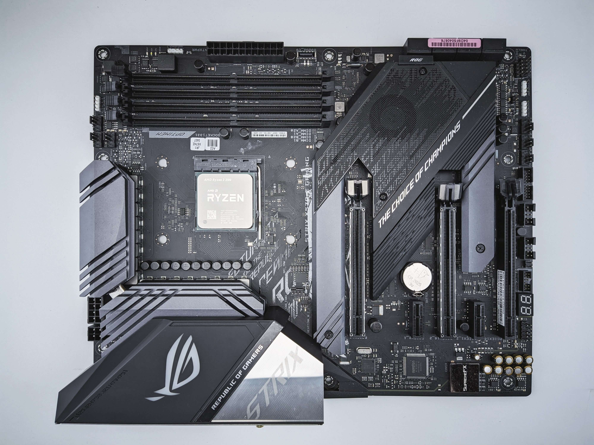

:orphan:
(motherboard)=

# Motherboards

In the realm of computer hardware, the motherboard stands as one of the most critical components, serving as the central nervous system of your device. It's a complex and essential piece that connects all the other components together, enabling them to communicate and function harmoniously. In this article, we'll delve into the various aspects of motherboards, exploring their functions, components, types, and their importance in building and operating a computer system.

## What is a Motherboard?

A motherboard, often referred to as a mainboard or system board, is the primary circuit board found in computers and other similar electronic devices. It serves as a foundation, providing physical and electrical connections that allow various components to interact and work together seamlessly. The motherboard acts as a bridge between the central processing unit (CPU), memory, storage devices, and other hardware peripherals.

 

## Functions of a Motherboard

The motherboard fulfills several crucial functions that contribute to the overall operation of a computer:

1. **Component Integration**: The motherboard integrates various essential components, such as the CPU, RAM, graphics card, storage drives, and power supply. These components are physically and electrically connected to the motherboard, allowing them to work in tandem.

2. **Communication Hub**: It facilitates communication between different hardware components. The CPU communicates with RAM, storage devices, and other peripherals through the motherboard's buses and connectors.

3. **Power Distribution**: The motherboard distributes power from the power supply unit (PSU) to the connected components. Different parts of the motherboard receive different levels of power, ensuring that each component operates correctly.

4. **Data Transfer**: The motherboard provides interfaces and connectors that allow data to be transferred between various devices. For instance, it includes SATA ports for connecting hard drives and SSDs, USB ports for connecting peripherals, and PCIe slots for graphics cards and expansion cards.

5. **BIOS/UEFI**: Basic Input/Output System (BIOS) or Unified Extensible Firmware Interface (UEFI) is stored on the motherboard's firmware. It initializes hardware components during the boot-up process and ensures the computer starts up correctly.

## Components of a Motherboard

A motherboard consists of several key components that collectively enable its functionalities. Some of the most crucial components include:

1. **CPU Socket**: The CPU socket is where the central processing unit (CPU) is installed. Different CPUs require different socket types, so it's essential to choose a motherboard that supports the specific CPU you intend to use.

2. **RAM Slots**: These slots hold the system's memory modules, known as RAM (Random Access Memory). The number of RAM slots and supported RAM types determine the maximum amount and speed of memory your system can have.

3. **Expansion Slots**: Expansion slots, usually in the form of PCIe (Peripheral Component Interconnect Express) slots, allow you to add additional components like graphics cards, sound cards, and networking cards to your system.

4. **Storage Interfaces**: Motherboards feature storage interfaces like SATA (Serial ATA) and M.2 slots that allow you to connect hard drives and solid-state drives (SSDs) for data storage.

5. **Connectors or I/O Ports**: Various connectors are present on the motherboard, including USB connectors for peripherals, audio jacks for speakers and microphones, and Ethernet ports for networking.

6. **Chipset**: The chipset manages data flow between the CPU, memory, and peripheral devices. It also provides features like USB support, overclocking capabilities, and more. 

7. **BIOS/UEFI Chip**: The BIOS or UEFI chip stores firmware that contains essential instructions for the computer to start up. It configures hardware components during the boot process.

## Types of Motherboards

Motherboards come in different sizes and configurations to accommodate various needs. The two main factors that differentiate motherboard types are their size and the type of CPU socket they support. Some common motherboard form factors include:

1. **ATX (Advanced Technology Extended)**: ATX motherboards are standard-sized and offer multiple expansion slots and connectors. They are commonly used in full-sized desktop PCs and workstations.

2. **Micro-ATX**: Micro-ATX motherboards are smaller than ATX but still offer a decent number of features and expansion slots. They are suitable for compact desktop builds.

3. **Mini-ITX**: Mini-ITX motherboards are the smallest and most compact form factor. They are often used in small form factor (SFF) and home theater PCs (HTPCs) due to their size limitations.

## Importance of Motherboards in Computer Building

The motherboard is the cornerstone of any computer system. It determines the compatibility of various components and affects the overall performance and capabilities of the system. Choosing the right motherboard is crucial for several reasons:

1. **Component Compatibility**: Different motherboards support different CPUs, RAM types, and expansion cards. Choosing a compatible motherboard ensures that your components work seamlessly together.

2. **Performance**: The quality of the motherboard can impact the system's overall performance. High-quality motherboards with efficient power delivery systems can support better CPU overclocking and overall stability.

3. **Expansion and Upgradability**: The type and number of expansion slots on a motherboard determine how much you can upgrade your system in the future. If you plan to add more RAM, storage, or additional cards, selecting a motherboard with sufficient expansion options is important.

4. **Connectivity**: Motherboards dictate the number and type of ports available on your system. This includes USB ports, audio jacks, networking ports, and display outputs. Choosing a motherboard with the right connectivity options for your needs is essential.

## Final Words

In the grand tapestry of computer hardware, the motherboard holds a pivotal role. Like the intricate web of neurons in the human brain, the motherboard connects and facilitates communication among various components, enabling them to function harmoniously. Whether you're assembling a high-performance gaming rig, a creative workstation, or a compact home theater PC, understanding the functions and importance of motherboards is essential for making informed decisions during the computer-building process. By selecting the right motherboard that suits your needs and components, you're laying the foundation for a powerful and efficient computing experience.