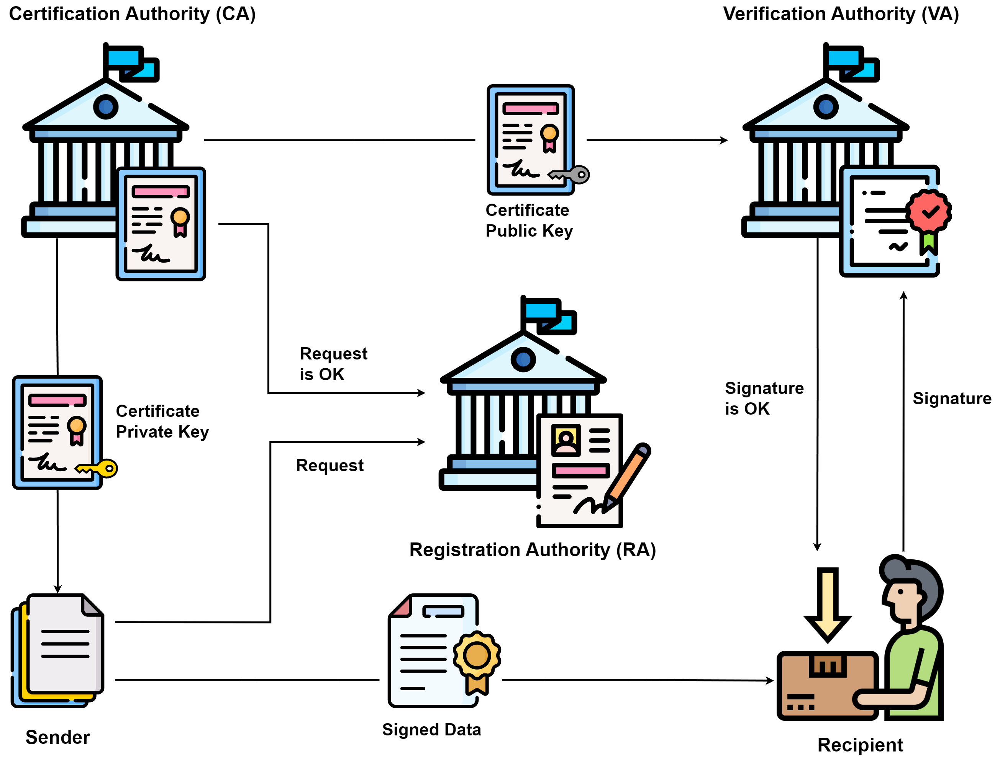

:orphan:
(public-key-infrastructure)=

# Public Key Infrastructure (PKI)

Public Key Infrastructure (PKI) serves as a foundational framework for secure digital communication and identity verification. By combining cryptographic techniques with digital certificates, PKI enables the establishment of trust and the protection of sensitive data. This comprehensive exploration delves into the technical aspects of each PKI component, offering a detailed understanding of their functions, mechanisms, and significance.

## PKI Components

### Certificate Authority (CA)

The Certificate Authority (CA) holds a central role in PKI. Operating as a trusted entity, the CA issues digital certificates that vouch for the authenticity of public keys and the identity of the certificate holder. Beyond certificate issuance, the CA undertakes vital functions to ensure the integrity of the PKI ecosystem:

- **Certificate Issuance**: When an entity (a person, a server, a device) requests a digital certificate, the CA evaluates the request and, after verifying the requester's identity, creates a certificate containing the public key. The certificate is then digitally signed using the CA's private key.
- **Certificate Revocation**: Certificates can become compromised or invalidated due to various reasons, including the loss of a private key or a change in the entity's status. To address this, the CA maintains a Certificate Revocation List (CRL) that enumerates the serial numbers of revoked certificates. This ensures that relying parties can promptly identify certificates that are no longer trustworthy.

It's important to note that there can be different types of CAs. Root CAs are the top-level authorities in a PKI hierarchy, while subordinate or intermediate CAs are entities that derive their trust from a root CA. These hierarchical relationships contribute to the robustness of the PKI structure.

### Public and Private Keys

Asymmetric cryptography, a core concept of PKI, revolves around the use of a key pair: the public key and the private key. These keys work together to provide various security services:

- **Public Key**: As the name suggests, the public key is openly distributed and can be shared without compromising security. It is used to encrypt data that only the corresponding private key can decrypt. Additionally, it's used to verify digital signatures generated by the private key.
- **Private Key**: Kept confidential, the private key is used for decrypting data that was encrypted with the corresponding public key. It also plays a crucial role in generating digital signatures, which authenticate the origin of digital content.

The synergy between these keys ensures the confidentiality, integrity, and authenticity of data transmission.

### Certificate Revocation List (CRL)

To maintain the trustworthiness of the PKI system, the Certificate Revocation List (CRL) serves as a critical component. The CRL is a regularly updated list that contains information about certificates that have been revoked before their expiration dates. Certificates can be revoked due to reasons such as a compromised private key, an entity's status change, or any other security concern.

Key attributes of the CRL include:

- Serial numbers of revoked certificates
- Date and time of revocation
- Reason for revocation

By referring to the CRL, relying parties can determine whether a particular certificate is still valid or has been compromised. In addition to CRLs, the Online Certificate Status Protocol (OCSP) offers a real-time alternative for checking the status of certificates.

### Registration Authority (RA)

The Registration Authority (RA) acts as a bridge between entities and the Certificate Authority (CA). While the CA is responsible for issuing certificates, the RA focuses on identity verification and the processing of certificate requests. The RA's role is critical in ensuring the legitimacy of certificate applicants and the accuracy of the information associated with their certificates.

The RA's functions encompass:

- **Identity Verification**: Before forwarding a certificate request to the CA, the RA verifies the identity of the requester. This can involve checking official documents or performing face-to-face identity checks.
- **Certificate Request Handling**: Once identity verification is complete, the RA facilitates the submission of the certificate request to the CA. This collaborative approach ensures that only legitimate entities receive valid certificates.

### Certificate Repository

A Certificate Repository is a centralized storage system that houses copies of digital certificates issued by CAs. It provides a mechanism for entities to access and retrieve public keys and certificates when needed. The repository streamlines the process of validating certificates and establishing secure connections.

The repository supports:

- **Certificate Retrieval**: When a user's web browser establishes a connection with a secure website (using HTTPS), it queries the repository to retrieve the website's digital certificate. This certificate is then used to verify the website's authenticity and establish a secure connection.

### End Entities

End entities are the ultimate users, devices, or servers that actively participate in the PKI ecosystem. They generate key pairs, create certificate requests, and utilize certificates for secure communication and authentication.

Key tasks of end entities include:

- **Key Pair Generation**: End entities generate their key pairs, consisting of a public key and a private key. These keys are mathematically linked, enabling secure encryption and digital signatures.
- **Certificate Requests**: After generating the key pair, end entities submit certificate requests to the Registration Authority (RA), providing necessary identity information and the public key.

## Key Pair Generation and Certificate Issuance

The process of obtaining a digital certificate involves several steps:

1. **Key Pair Generation**: The entity generates a public-private key pair using cryptographic algorithms such as RSA or ECC. This process results in two interrelated keys: a public key and a private key.

2. **Certificate Request**: The entity creates a certificate signing request (CSR), which contains its public key and identity information. The CSR is then submitted to the Registration Authority (RA).

3. **Identity Verification**: The RA verifies the entity's identity through established protocols, ensuring the authenticity of the requester. This step is crucial for maintaining the security of the PKI system.

4. **Certificate Issuance**: Once the identity is verified, the CSR is sent to the CA. The CA reviews the request, validates it, and generates a digital certificate containing the entity's public key. The certificate is then signed by the CA's private key.

5. **Certificate Distribution**: The issued certificate is made available in the Certificate Repository. This repository acts as a centralized source from which entities can retrieve certificates for validation purposes.

## Ensuring Security in PKI

Maintaining the security and integrity of PKI is of paramount importance to ensure the trustworthiness of digital communications. Various security measures are implemented:

- **Private Key Protection**: Private keys are sensitive assets that must be safeguarded. Hardware Security Modules (HSMs) provide a secure environment for generating, storing, and using private keys.

- **Certificate Revocation**: Timely revocation of compromised or invalidated certificates prevents their misuse. CRLs and OCSP services allow relying parties to check the validity status of certificates.

- **Certificate Pinning**: Certificate pinning associates a specific certificate with a particular service or domain, reducing the risk of man-in-the-middle attacks.

- **Key Rotation**: Regularly updating key pairs and certificates minimizes the potential impact of key compromise.

## Final Words

In the realm of digital security, Public Key Infrastructure (PKI) emerges as a cornerstone, underpinning secure communication, data integrity, and identity validation. The orchestration of components such as the Certificate Authority (CA), Registration Authority (RA), and the interplay of public and private keys forms an intricate web of trust. This infrastructure not only fortifies online interactions, but also extends its reach to safeguard IoT devices and align with privacy regulations. As technology advances and threats evolve, PKI remains resilient, ensuring that our digital landscape is founded on trust and secure transactions.