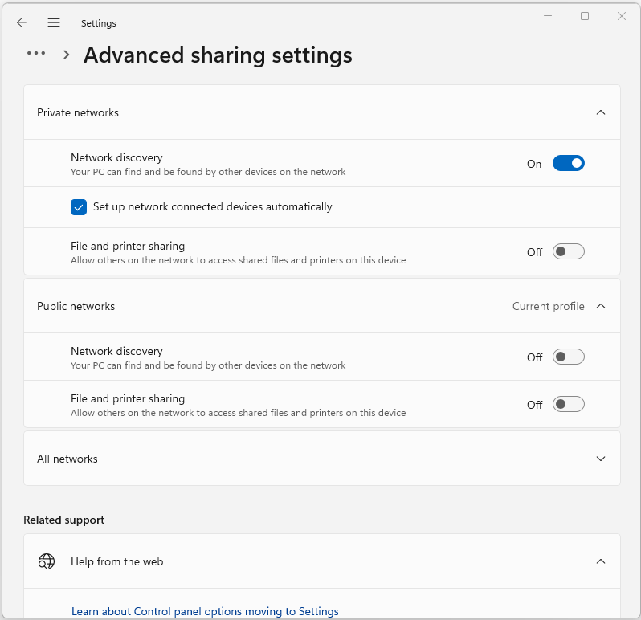

:orphan:
(public-vs-private-network)=

# Network Profiles in Windows

Network profiles play a crucial role in managing and configuring network settings on Windows operating systems. A network profile defines the level of security and sharing settings for a specific network connection, helping users to maintain a balance between convenience and security. Windows categorizes networks into three distinct profiles: Public, Private, and Domain. In this article, we will delve into the details of each network profile, exploring their characteristics, use cases, and the process of changing between them.

## Understanding Network Profiles

A network profile determines how a Windows PC interacts with other devices and systems on the same network. The choice of profile influences settings such as firewall rules, file and printer sharing, network discovery, and other security-related aspects.

 

### Public Network

The **Public network profile** is designed for networks that are considered untrusted or public spaces, such as public Wi-Fi networks in airports, coffee shops, or hotels. In this profile, Windows adopts a stringent security approach to protect your computer from potential threats that might arise in such environments.

**Characteristics:**
- **Network discovery is turned off:** Your computer won't be visible to other devices on the network, and you won't be able to see them either.
- **File and printer sharing is disabled:** Other devices can't access your shared files or printers, and you can't access theirs.
- **Firewall settings are restrictive:** Incoming connections are blocked or limited to a few essential services.

**Use Case Example:**
Imagine you're at an airport and need to quickly check your email. You connect to the airport's public Wi-Fi network. Windows recognizes it as a Public network and automatically applies the Public profile. This ensures that your device is shielded from potential unauthorized access or security breaches while you browse the web.

### Private Network

The **Private network profile** is intended for trusted networks, typically those in your home or workplace. When you connect to a network and specify that it's a private network, Windows assumes you trust the other devices on that network to some extent.

**Characteristics:**
- **Network discovery is enabled:** You can see other devices on the network, and they can see your computer.
- **File and printer sharing is permitted:** You can access shared files and printers on other devices, and they can access yours.
- **Firewall settings are more permissive:** Certain services and applications are allowed to communicate with your device.

**Use Case Example:**
Consider a scenario where you're at home and want to stream a movie from your computer to your smart TV. Both devices are connected to the same Wi-Fi network. By designating the network as Private, you enable network discovery and file sharing. This allows your smart TV to detect and play media files stored on your computer seamlessly.

### Domain Network

The **Domain network profile** is relevant for computers that are part of an Active Directory domain. This profile is typically used in professional environments where network policies are managed centrally.

**Characteristics:**
- **Network discovery and sharing settings depend on the organization's policies:** These settings are configured by network administrators, offering a balance between security and functionality as defined by the organization.
- **Firewall settings are determined by the network administrators:** They can define which services are accessible within the domain.

**Use Case Example:**
In a corporate setting, your work computer is connected to the company's network. Since the network is managed through Active Directory, the network profile is automatically set to Domain. The organization's IT team configures the network settings, ensuring that your computer can communicate with necessary resources while maintaining a secure environment.

### Comparison Table

| **Aspect**                  | **Public Profile**                   | **Private Profile**                  | **Domain Profile**                  |
|-------------------------------|---------------------------------------|---------------------------------------|--------------------------------------|
| **Network Discovery**         | Turned off                           | Enabled                               | Configured by network administrators |
| **File & Printer Sharing**    | Disabled                             | Enabled                               | Configured by network administrators |
| **Firewall Settings**         | Restrictive                          | More permissive                       | Determined by network administrators |
| **Access to Shared Resources**| No access                            | Access allowed                        | Access allowed based on policies    |
| **Use Case Example**          | Using public Wi-Fi at an airport     | Sharing files on a home network      | Enterprise network with domain control |
| **Security Focus**            | High security                        | Balance between security and convenience | Organization-specific security settings |
| **Default Profile for...**    | Unknown networks or public spaces    | Home or trusted networks              | Computers part of an Active Directory domain |

## Changing Network Profiles

Windows allows users to change the network profile associated with a network connection. However, this feature is primarily designed for users to set the appropriate profile when first connecting to a network. Once the profile is set, Windows generally maintains it unless there is a significant change in the network configuration.

Here's how you can change the network profile:

- **Using the Settings App:**
   - Open the Settings app.
   - Go to the "Network & Internet" section.
   - Click on "Wi-Fi" or "Ethernet," depending on your connection type.
   - Under "Network profile," select either "Public" or "Private," as appropriate.

- **Using the Control Panel:**
   - Open the Control Panel.
   - Navigate to "Network and Sharing Center."
   - Click on "Change advanced sharing settings" on the left panel.
   - Choose the desired network profile under "Network discovery."

## Importance of Network Profiles

Network profiles contribute significantly to maintaining a secure computing environment while ensuring that users can seamlessly access and share resources on their local networks. By categorizing networks into Public, Private, and Domain profiles, Windows provides a flexible framework that adapts to various scenarios.

- **Security:** The differentiation between Public and Private profiles helps protect your device from potential threats when connecting to untrusted networks. The Public profile restricts sharing and communication, reducing the likelihood of unauthorized access.

- **Convenience:** The Private profile facilitates seamless interaction between devices within trusted networks. It enables features like file and printer sharing, making it convenient to access resources on other devices.

- **Enterprise Management:** The Domain profile is instrumental in professional environments, allowing centralized control over network policies. Network administrators can configure settings that align with the organization's security and functionality requirements.

## Final Words

Network profiles in Windows are a fundamental aspect of managing network connections. They provide a practical way to balance security and convenience, ensuring that users can make the most of their networked devices while safeguarding their data and privacy.

Remember to always choose the appropriate network profile when connecting to a new network, and consider the nature of the network environment to make an informed decision. Whether you're at home, in a public space, or part of a professional network, Windows' network profiles have you covered.