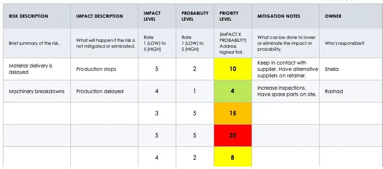
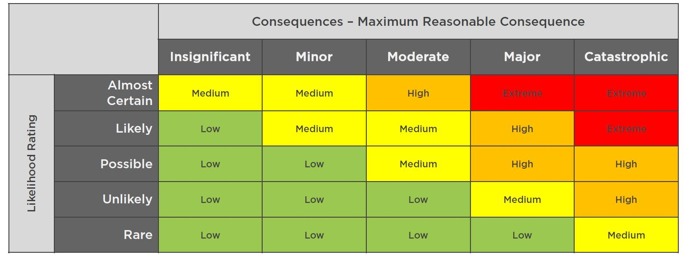

:orphan:
(risk-analysis-concepts-and-techniques)=

# Risk Analysis: Concepts and Techniques

In the current business environment, the importance of risk analysis is paramount for most organizations. As organizations aim to achieve their goals and undertake critical projects or change existing processes or systems, they inevitably face a multitude of uncertainties that have the potential to disrupt their plans. Risk analysis serves as a guiding light in this uncertain terrain, offering a systematic approach to identifying, assessing, and mitigating potential risks. Whether it's the threat of financial volatility, technological disruptions, regulatory changes, or unforeseen market shifts, a well-executed risk analysis empowers businesses to make informed decisions, fortify their strategies, and navigate challenges with resilience. This article delves into the realm of risk analysis, exploring its significance, methodologies, and the pivotal role it plays in shaping effective risk management strategies and the strength of an organization’s risk posture.

## Understanding Risk Analysis

Risk analysis is a methodical procedure involving the identification, assessment, and comprehension of potential uncertainties or hazards that might affect an organization's goals, projects, or operations. This encompasses evaluating the likelihood of these risks occurring and their resulting consequences. This structured approach provides organizations with insights into the challenges they may encounter, empowering them to formulate strategies for risk management, mitigation, or avoidance.

By offering a comprehensive perspective of risks linked to specific actions, risk analysis supports informed decision-making, facilitating more effective choices in line with organizational objectives. Its core objective revolves around identifying possible adverse effects on an organization before initiating significant projects or modifying crucial objectives that could yield negative consequences. This central goal involves measuring the extent of risk within the organization, devising risk management or reduction strategies, and establishing proficient approaches for addressing these identified risks.

## The Importance of Risk Analysis

Risk analysis provides a structured approach to assessing uncertainties, enabling organizations to anticipate, evaluate, and mitigate challenges; this is critical for a number of reasons, including:

-   **Informed Decision-Making:** It provides valuable insights into potential challenges and uncertainties associated with various actions or projects.
-   **Risk Mitigation:** By identifying and assessing potential risks, organizations can develop strategies to mitigate or manage these risks effectively.
-   **Resource Allocation:** Risk analysis enables organizations to allocate resources efficiently by prioritizing risks based on their potential impact and likelihood of occurrence.
-   **Business Continuity:** Understanding risks allows organizations to develop contingency plans and response strategies.
-   **Stakeholder Confidence:** Stakeholders, including investors, customers, and partners, expect organizations to be proactive in managing risks.
-   **Regulatory Compliance:** Many industries are subject to regulatory requirements that mandate risk assessment and management.
-   **Long-Term Sustainability:** Identifying and addressing risks contributes to the longevity of an organization.
-   **Innovation:** Risk analysis encourages organizations to explore innovative solutions and strategies that can mitigate potential risks.
-   **Strategic Planning:** Incorporating risk analysis into strategic planning allows organizations to identify potential roadblocks and adjust their strategies accordingly.
-   **Enhanced Communication:** A structured risk analysis process fosters communication and collaboration within an organization.

A proactive and systematic approach to risk analysis enables organizations to better navigate uncertainties, make informed choices, and ultimately enhance their resilience and success in a rapidly changing environment.

## Components of the Risk Analysis Process

### Risk Register and Heat Map:

A key aspect of any risk analysis is in measuring, understanding and documenting the likelihood of an event occurring, along with its severity. A risk register, risk matrix (or heat map) are tools commonly used in risk management to assess and communicate potential risks within an organization. Here's a brief explanation of each:

**Risk Register:** A risk register is a comprehensive document that captures and organizes information about identified risks. It typically includes details such as the nature of the risk, its potential impact, likelihood of occurrence, mitigation strategies, responsible parties, and current status. The risk register serves as a central repository of risk-related information, aiding in tracking and managing risks throughout the project or organizational context. An example of a standard risk register is shown below.

**Risk Matrix/Heat Map:** A risk matrix (or heat map) is a graphical representation that categorizes risks based on their likelihood of occurrence and potential impact. It typically uses a two-dimensional grid, with one axis representing the likelihood and the other axis representing the impact or consequence. Each risk is placed within the matrix at the intersection of its likelihood and impact scores. Risks with higher potential impact and likelihood are represented with hot colours, such as red or orange, while risks with lower potential impact and likelihood are shown with cool colours, such as green or blue. This visualization helps prioritize risks, with higher-priority risks often located in the higher likelihood and higher impact regions of the matrix. A sample heat map is shown below.

In summary, a risk register is a detailed document that captures various information about risks, a risk matrix categorizes risks based on likelihood and impact, and a heat map uses color-coding to visually highlight the severity of risks. These tools collectively aid organizations in understanding, assessing, and managing risks effectively.

### Risk Control Assessment (RCA) and Risk Control Self-Assessment (RCSA)

A risk control assessment and risk control self-assessment are risk management processes with distinct approaches and participants. A risk control assessment, led by experts, centrally evaluates risk controls across the organization. In contrast, risk control self-assessment involves operational teams and individuals assessing controls within their areas, promoting operational-level ownership. Both methods enhance risk management by ensuring effective controls aligned with objectives. Below is a summary of each process:

**Risk Control Assessment (RCA):** A risk control assessment is a systematic evaluation of the effectiveness of an organization's risk control measures and strategies. It is typically conducted by a designated team or department within the organization, often involving risk management professionals, internal auditors, or experts in the specific domain. The assessment aims to determine whether the existing risk controls are adequate, properly implemented, and capable of mitigating or managing identified risks. The assessment process may include reviewing policies, procedures, systems, and controls to ensure they align with the organization's risk management objectives.

**Risk Control Self-Assessment (RCSA):** A risk control self-assessment engages individuals and teams responsible for diverse organizational operations. It involves collective identification and evaluation of risks, associated controls, prioritization of objectives, assessment of high-risk business areas, self-evaluation of control adequacy, development of risk treatment action plans, and consistent reporting across all levels. The RCSA involves operational managers, employees, and stakeholders in assessing controls within their areas. This process fosters operational-level ownership, accountability, and insights for improvements. The RCSA process generally follows a workflow which includes the following critical steps:

-   **Identification of Participants:** Identify individuals, departments, and teams closely engaged in the assessed processes and activities. They are well-positioned to offer insights into the effectiveness of risk controls within their operational areas.
-   **Risk Identification:** Identify and list the potential risks associated with the processes or activities under evaluation, which should encompass a wide range of possibilities that could impact the organization's objectives.
-   **Risk Assessment:** For each identified risk, prioritise the risk based on their potential severity participants must evaluate the likelihood of occurrence and potential impact on a predefined scale. This assessment helps prioritize risks based on their potential severity.
-   **Control Evaluation:** Participants assess the effectiveness of existing risk controls in place to mitigate or manage each identified risk. They evaluate the controls' strengths, weaknesses, and whether they are properly implemented and monitored.
-   **Risk Scenarios:** Create hypothetical risk scenarios to understand how identified risks might materialize and impact the organization. This step provides a practical context for evaluating the sufficiency of current controls.
-   **Mitigation Recommendations:** Participants suggest improvements and enhancements to existing controls or propose new measures that could better address identified risks. These recommendations aim to strengthen the overall risk management framework.
-   **Documentation:** Record the findings, assessments, and recommendations in a structured manner. This documentation serves as a reference for future assessments and helps track the organization's progress in enhancing risk controls.
-   **Review and Validation:** The assessments and recommendations are reviewed by management or designated risk experts to ensure consistency, accuracy, and alignment with the organization's risk management objectives.
-   **Action Plan:** Develop an action plan based on the recommended improvements. Assign responsibilities, set timelines, and allocate resources for implementing the suggested enhancements to the risk controls.
-   **Monitoring and Follow-Up:** Continuously monitor the implementation of the action plan and the effectiveness of the improved risk controls. Conduct periodic reviews to assess progress and address any emerging risks or changes in the business environment.

The RCSA process encourages a bottom-up approach to risk management, fostering a culture of accountability and collaboration throughout the organization. It enhances the organization's ability to identify, assess, and manage risks effectively by leveraging the expertise and insights of those directly involved in day-to-day operations.

## Risk Awareness

A key aspect of any risk assessment process is in being aware of and understanding the types of risks which exist in the business environment, including inherent risks and residual risks, control risk and risk appetite. A comprehensive grasp of these concepts is essential for organizations striving to navigate uncertainty while making strategic decisions. By unravelling the layers of inherent risk, which embodies the potential hazards in a given scenario, and residual risk, which remains after mitigation efforts, organizations gain a holistic perspective on risk exposure. Coupled with an assessment of control risk, which gauges the efficacy of risk mitigation measures, and a clear definition of risk appetite, which outlines an organization's threshold for risk-taking, risk awareness becomes the cornerstone for informed decision-making in a volatile world. We explore risk awareness in greater detail below:

### Inherent Risk

**Inherent risk** denotes the risk level tied to an activity, process, or scenario prior to risk mitigation actions. It highlights the natural vulnerability of an endeavour to potential adverse outcomes, factoring in complexities, external uncertainties, and industry specifics. Unlike risk reduction efforts, it assesses the riskiness of a situation in its unaltered state, offering a foundation to gauge potential risks before applying risk management measures. Recognizing inherent risk is a crucial step in the risk assessment process, as it serves as a baseline assessment, helping organizations understand the potential magnitude of risks they face before implementing any risk management strategies or controls. Recognizing inherent risk is pivotal in risk assessment, guiding allocation of attention, resources, and mitigation strategies to avert potential drawbacks.

### Residual Risk

**Residual risk** pertains to the risk that remains after reducing natural or inherent risks through control measures. It signifies the level of risk existing post-implementation of risk mitigation strategies. This residual risk accounts for situations where initial risks (inherent risk) persist despite mitigation efforts. It considers control effectiveness and acknowledges any potential limitations, gaps, or uncertainties that endure. Essentially, it encapsulates the uncertainty and potential harm that an organization or individual must handle despite proactive mitigation. This underscores that not all risks can be entirely eradicated, and some residual risk might persist even with robust risk management practices. Evaluating residual risk is a critical aspect of risk management, ensuring that organizations are making informed decisions on tolerable remaining risks and optimal resource allocation.

### Control Risk

**Control risk** refers to the likelihood that an organization's internal controls or risk management measures will fail to effectively mitigate or manage identified risks. It assesses the potential that the controls in place may not operate as intended or might be circumvented, resulting in the realization of adverse events or negative consequences. Control risk involves comprehending diverse control measures, encompassing their technical, non-technical, or administrative nature, as well as avenues of implementation, such as people, processes, policies, and technology. Within this framework, an extensive examination of multifaceted risk control approaches emerges. Elevated control risk corresponds to escalated odds of control breakdown, magnifying the probability of adverse outcomes. Evaluating control risk helps organizations identify areas where control weaknesses exist, enabling them to allocate resources to strengthen controls and enhance risk management strategies.

### Risk Appetite

**Risk appetite** refers to the level of risk that an organization is willing and prepared to accept in pursuit of its objectives. It encompasses the degree of risk an organization is willing to tolerate while undertaking various endeavours, projects, and decisions. This willingness spans a spectrum, from risk-averse entities prioritizing stability to risk-seeking counterparts embracing higher uncertainty for potential rewards. Some organizations opt for a balanced approach, while others lean toward extremes. An organization's risk appetite, shaped by factors like strategic goals, values, resources, and industry context, directs its risk-taking behaviours, shaping its overall risk management strategy.

Defining risk appetite aids organizations in finding the right equilibrium between unrestrained innovation and excessive caution. It clarifies the permissible risk level and encourages uniformity in approach across the organization. Establishing acceptable risk levels also ensures resource allocation is not squandered on further mitigating risks already at acceptable levels. In cases where an organization employs standard metrics to assess risk impact and likelihood, these metrics help define the upper limit of tolerable risk before action is necessary to reduce that risk.

## Regulations Impacting Risk Posture

**Risk posture** refers to an organization's overall stance or position regarding risk management. It encompasses the organization's attitude towards risk, its strategies for identifying and assessing risks, its risk appetite, and the extent to which it has implemented controls and mitigation measures. A strong risk posture indicates that an organization is proactive in recognizing and addressing risks, aligning its risk management practices with its objectives and values. On the other hand, a weak risk posture implies a lack of preparedness and inadequate risk management practices, potentially exposing the organization to greater vulnerabilities and negative outcomes. An effective risk posture requires a comprehensive understanding of the organization's risk landscape and the implementation of appropriate measures to manage and mitigate risks in line with its goals.

These regulations can vary across industries and regions, encompassing areas such as data privacy, financial reporting, environmental compliance, and more. Below, we outline several impactful regulatory examples for organizations:

-   **Gramm-Leach-Bliley Act (GLBA):** GLBA, also known as the Financial Modernization Act of 1999, is a U.S. federal law focused on enhancing consumer financial privacy and specifies that financial institutions, including tax agents, mortgage brokers, banks and credit unions, **must secure any and all personally identifiable information**. It mandates financial institutions to disclose privacy policies to customers, offering opt-out choices for sharing non-public personal information with non-affiliated third parties. The law requires safeguards for customer information security and aims to prevent unauthorized access and use of personal financial data. Key provisions include the **Safeguards Rule**, which mandates security initiatives, and the Financial Privacy Rule, requiring privacy notices during the establishment of relationships and annually. Additionally, it enforces **pretexting protection** against unauthorized access to personal data. This legislation strengthens data protection and awareness within financial institutions.
-   **Health Insurance Portability and Accountability Act (HIPAA):** HIPAA, also known as the Kennedy-Kassebaum Act, was enacted in 1996. The law's pertinent aspect, Title II, includes the **Privacy Rule**, defining patient medical records and protected health information (PHI), and the **Security Rule**, outlining security measures for electronic protected health information (EPHI). While these regulations can be intricate and require in-depth understanding, they are crucial for businesses dealing with health records, financial data, or international operations. Violating HIPAA rules can result in criminal prosecution due to rigid sentencing guidelines. In essence, HIPAA safeguards personal health data through standards, restricts PHI use, and mandates safeguards, cultivating patient privacy and trust within healthcare.
-   **Health Information Technology for Economic and Clinical Health (HITECH) Act:** The HITECH Act, enacted in 2009 as part of the American Recovery and Reinvestment Act, enhances healthcare technology adoption while strengthening security and privacy of personal health information. It encourages meaningful use of electronic health records through incentives for providers. It enforces HIPAA more strictly, imposing penalties for breaches even without proof of harm, and extends coverage to business associates. As a covered entity you must get assurance from any business associate with whom you share EHR or ePHI that they will protect the data. The act shortens the protection duration of protected health information (PHI) to 50 years. It enforces breach notifications and reporting requirements, with penalties up to \$1.5 million for non-compliance. Patients must be notified of any breach that compromises security. If 500 or more patients are impacted, Health and Human Services (HHS) must also be notified. The HITECH Act emphasizes both technology adoption and data security to enhance privacy and protection of personal health information.
-   **Sarbanes-Oxley Act (SOX):** The SOX Act, also known as "The Public Company Accounting Reform and Investor Protection Act of 2002," is a U.S. federal law enacted in 2002 with the primary goal of enhancing corporate governance, financial transparency, and accountability. It was a response to financial scandals, seeking to safeguard investors and rebuild trust. The law mandates rigorous reporting and internal control standards for public companies, focusing on financial accuracy, corporate ethics, and auditor independence. Executives and auditors are held accountable for financial disclosures, and penalties are imposed for non-compliance. CEOs and CFOs are required to certify financial reports and can be held responsible for protecting IT systems used in financial reporting. The Act emphasizes maintaining data integrity and confidentiality, tracking security breaches and their resolutions, maintaining event logs for independent audits, and documenting compliance for the prior 90 days. SOX aims to bolster confidence in financial markets by ensuring accurate reporting and ethical behaviour within organizations.
-   **General Data Protection Regulation (GDPR):** The GDPR originated in the European Union (EU) in May 2018 and is a privacy and security law that imposes obligations on organizations globally if they target or collect data related to EU individuals. It grants individuals, known as data subjects, control over their data processing. The GDPR covers various data types, such as names, locations, patient records, email addresses, and photos, encompassing any data that can identify a living person. It establishes stringent rules for data collection, consent, transparency, breach notification, and individual rights, applying to both EU and non-EU organizations to ensure enhanced data privacy and security standards.

Regulations play a pivotal role in shaping an organization's risk posture by imposing specific requirements and guidelines that dictate how risks should be identified, assessed, managed, and reported. Organizations must navigate the intricate landscape of regulatory frameworks to ensure they align their risk management practices with legal mandates. Non-compliance not only exposes organizations to legal penalties but also amplifies their risk exposure. Therefore, an organization's risk posture is significantly influenced by its ability to adapt to evolving regulations, integrate them into their risk management strategies, and maintain a proactive and compliant stance in the face of changing compliance landscapes.

# Final Words

In the complex landscape of today's business environment, the significance of risk analysis cannot be overstated. Through meticulous examination and understanding of potential uncertainties, organizations can make informed decisions that align with their objectives and values. Tools like risk registers and heat maps provide visual insights that enable effective risk identification and prioritization, aiding in resource allocation and decision-making. Meanwhile, Risk Control Self-Assessments empower organizations to harness the collective expertise of their teams, fostering a culture of ownership and accountability for risk management. Coupled with a heightened risk awareness and a vigilant eye on evolving regulations, organizations are poised to fortify their risk posture and navigate challenges proactively. As regulations continually evolve, compliance becomes an integral aspect of risk analysis, ensuring organizations maintain not only their competitive edge but also their ethical and legal integrity. By embracing these components collectively, organizations are better equipped to anticipate, manage, and adapt to the ever-changing landscape of risks, safeguarding their sustainability and success.