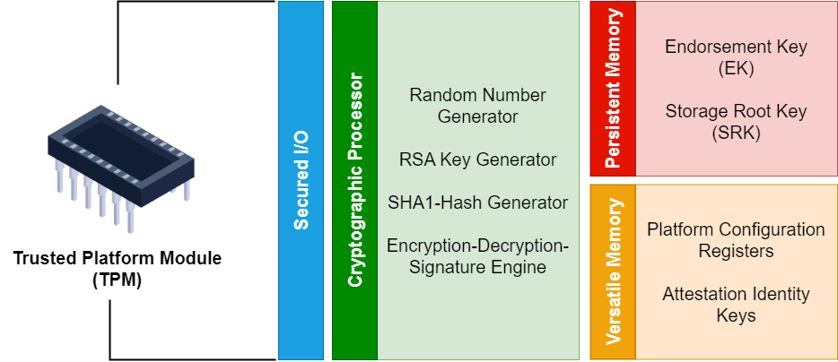

:orphan:
(tpms)=

# Trusted Platform Modules (TPMs)

Trusted Platform Modules (TPMs) have recently become a hot talking point since Windows 11 mandated their presence on a system as an installation criterion. In fact, TPMs have been around for many years, but as security (and cryptography as part of security) becomes ever more important they have moved from being a “nice to have” to a “must have” item. 

TPMs are a hardware-based security solution that provides a robust foundation for securing devices, cryptographic operations, and authentication processes. They are similar to (but not the same as) HSMs, so don’t mix up the two! 

## Understanding Trusted Platform Modules (TPMs)

At its core, a Trusted Platform Module (TPM) is a dedicated microcontroller integrated into a computer's motherboard or added as a separate hardware component. Its primary purpose is to ensure the security of cryptographic keys, facilitate secure boot processes, and provide a hardware root of trust for various operations. TPMs adhere to the specifications set forth by the Trusted Computing Group (TCG), an industry consortium that establishes open standards for secure computing environments. As many would-be Windows 11 upgraders have recently found, most modern processors have a TPM built in, and many motherboards have a slot for one (which may or may not have come from the factory with a TPM chip installed). Many people were surprised to find that they had a TPM, although it wasn’t actually enabled! 

## Key Functions and Features of TPMs

So what does a TPM actually do? At a high level, it provides:

- **Secures Cryptographic Operations:** One of the most critical functions of a TPM is its ability to generate, store, and manage cryptographic keys securely. These keys are used for encryption, digital signatures, and other security-related operations. The private keys never leave the TPM (ie. They are not present on the disk) ensuring that they are well-protected from external threats.

- **Secure Boot and Measured Boot:** TPMs play a pivotal role in ensuring the integrity of the boot process. During a secure boot, the TPM measures the components of the boot sequence and creates a digital "hash" of each component. This "measurement" is stored within the TPM and can be compared against known good values to detect any unauthorized modifications to the boot process.

- **Platform Attestation:** TPMs enable a process known as "attestation," wherein a system can prove its integrity to a third party. This is particularly useful in scenarios like remote device verification for secure network access. The TPM generates a digital certificate that vouches for the system's state, ensuring that it has not been tampered with.

- **Secure Storage:** TPMs offer a secure storage area called the "endorsement key," which can be used to securely store credentials, passwords, or other sensitive information. This storage is resistant to physical attacks and unauthorized access attempts.

- **Credential Protection:** TPMs enhance the security of credentials and passwords by ensuring that these sensitive pieces of information are stored in a tamper-resistant environment. This makes it significantly harder for attackers to steal or misuse these credentials.

  

## Real-World Applications of TPMs

In a more practical sense, you may well have used a TPM (quite possibly without knowing it!), for:

1. **Full Disk Encryption:** TPMs are often used to enhance the security of full disk encryption solutions. The TPM stores encryption keys, ensuring that data remains encrypted and inaccessible if the system is tampered with or stolen. If you’ve encrypted your drive with Bitlocker, your TPM was used for this process if you had one installed.

2. **Device Authentication:** TPMs play a vital role in device authentication. When a device connects to a network or service, the TPM can prove the authenticity and integrity of the device, preventing unauthorized access.

3. **Digital Rights Management (DRM):** TPMs are used in DRM systems to securely store keys and enforce content protection measures. This prevents unauthorized distribution or copying of digital content. Like many features of the TPM, this can take place without the user ever really knowing. 

   

## Challenges and Considerations

While TPMs provide a powerful set of security features, their effectiveness relies on proper integration, management, and user education. Implementing TPMs requires consideration of compatibility with existing hardware and software, as well as policies for key management and recovery. Furthermore, TPMs should be used in conjunction with other security measures to provide a comprehensive defence against a wide range of threats. From the perspective of security specialists, it’s critical to ensure that new machines have a TPM installed and enabled. 

## Example of  TPM Application - Remote Device Verification

Many organisations now provide remote access to their workers, these might be company-owned or BYOD-type devices. To ensure the security of network connections, an organization can leverage TPMs. When an employee's device attempts to connect to the corporate network, the TPM generates a digital certificate that attests to the device's integrity. This certificate is then used to verify that the device has not been compromised and is eligible for network access. This process adds an extra layer of trust and assurance to remote connections, preventing unauthorized or compromised devices from gaining access to sensitive resources.

## Example of  TPM Application - Secure Boot

Some of the most difficult kinds of malware to detect are those that embed themselves as part of the boot process. Since they get up and running before any security software does, it can be challenging (and perhaps impossible) to detect their presence. Bootkit and Rootkit attacks such as these can be mitigated by leveraging TPMs.

When the system starts, the TPM performs a measured boot process. It records the digital hash values of each component involved in the boot sequence, including the BIOS (or more likely UEFI), bootloader, and OS kernel. These hash values are stored securely within the TPM. Later, during subsequent boots, the TPM performs the same measurements and compares the hash values to the stored values. If any component has been altered, the hash values will not match, indicating potential tampering. Assuming a vendor has provided baseline values, a system defender can compare the values to the known good configuration from the factory – even if this isn't the case, they can at least compare to their own previous results. The TPM ensures that the system only boots if the components of the boot process are in their expected, unaltered state. 

 

## Trusted Platform Modules (TPMs) Hardware Security Modules (HSMs)

Hardware Security Modules (HSMs) and Trusted Platform Modules (TPMs) are two distinct hardware-based security solutions that serve similar purposes in safeguarding sensitive data and enhancing cybersecurity. While both are designed to provide cryptographic operations and secure storage, they cater to different use cases and environments.

HSMs are specialized hardware devices designed to manage and safeguard cryptographic keys and operations. HSMs can take the form of a USB device, all the way up to a dedicated device in a server rack. HSMs are typically expensive and feature extensive tamper protection - they are commonly used in high-security environments where the protection of cryptographic keys and the execution of cryptographic operations are paramount. HSMs are capable of performing various cryptographic tasks, such as key generation, encryption, and digital signatures, while ensuring the highest level of key security. HSMs are often utilized in financial institutions, online payment systems, digital signing services, and other contexts where stringent security measures are essential.

On the other hand, TPMs are integrated microcontrollers typically embedded within computer motherboards or added as separate components. They focus on providing a hardware-based root of trust, secure boot processes, and integrity verification at a price point and with a function set which is appropriate for a wide range of computing systems. They are commonly used in a laptops, desktops, servers, and Internet of Things (IoT) devices. TPMs are essential for enhancing device security, enabling secure authentication, and providing a foundation for secure cryptographic operations.

# Final words

Trusted Platform Modules (TPMs) play a crucial role in implementing secure boot mechanisms that protect against bootkit and rootkit attacks. By measuring and verifying critical boot components, TPMs establish a trusted foundation for the operating system to build upon. This example underscores the practical application of TPMs in bolstering the security of critical processes and emphasizes their significance in modern cybersecurity strategies. As technology evolves and threats persist, TPMs remain an essential tool for ensuring the integrity and trustworthiness of computing systems.

 

 
